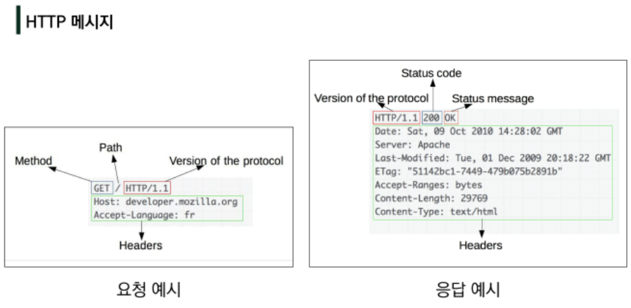
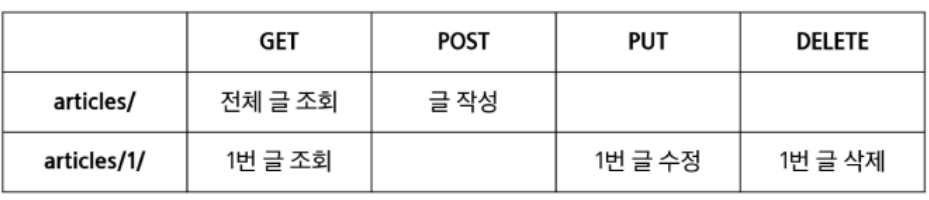

# Rest API

**HTTP**

* HyperText Transfer Protocol
* 웹 상에서 컨텐츠를 전송하기 위한 약속
* HTML 문서와 같은 리소스들을 가져올 수 있도록 하는 프로토콜(규칙, 약속)
* 웹에서 이루어지는 모든 데이터 교환의 기초
  * 요청 (request)
  * 응답 (response)
* 기본 특성
  * Stateless (상태를 기억하지 않음)
  * Connectionless (연결을 지속하지 않는다)
* 쿠키와 세션을 통해 서버 상태를 요청과 연결하도록 함
* HTTP 메세지

**HTTP request methods**

* 자원에 대한 행위(수행하고자 하는 동작)을 정의
* 주어진 리소스(자원)에 수행하길 원하는 행동을 나타냄
* HTTP Method 예시
  * GET(조회), POST(작성), PUT(수정), DELETE(삭제)

**HTTP response status codes**

* 특정 HTTP 요청이 성공적으로 완료되었는지 여부를 나타냄
* 응답은 5개의 그룹으로 나뉘어짐
  1. Informational responses (1xx)
  2. Successful responses (2xx)
  3. Redirection messages (3xx)
  4. Client **error** responses (4xx)
     * 내가(요청하는 사람이) 잘못했어...!
  5. Server error responses (5xx)
     * back-end 잘못이야!!!

**웹에서의 리소스 식별**

* HTTP 요청의 대상을 리소스(resource, 자원)라고 함
* 리소스는 문서, 사진 또는 기타 어떤 것이든 될 수 있음
* 각 리소스는 리소스 식별을 위해 HTPP 전체에서 사용되는 URI (Uniform Resource Identifier)로 식별됨

**URL, URN**

* URL (Uniform Resource Locator)
  * 통합 자원 위치
  * 네트워크 상에 자원이 어디 있는지 알려주기 위한 약속
  * 과거에는 실제 자원의 위치를 나타냈지만 현재는 추상화된 의미론적 구성
  * '웹 주소', '링크'
* URN (Uniform Resource Name)
  * 통합 자원 이름
  * URL과 달리 자원의 위치에 영향을 받지 않는 유일한 이름 역할을 함
  * ISBN(국제표준도서변호) : 이 책만이 가지고 있는 고유한 번호

**URI**

* Uniform Resource Identifier
  * 통합 자원 식별자
  * 인터넷의 자원을 식별하는 유일한 주소 (정보의 자원을 표현)
  * 인터넷에서 자원을 식별하거나 이름을 지정하는데 사용되는 간단한 문자열
  * 하위 개념
    * URL, URN
* URI는 크게 URL, URN으로 나눌 수 있지만, URN을 사용하는 비중은 매우 적으므로 일반적으로 URL은 URI와 같은 의미처럼 사용하기도 함

**URI의 구조**:star:

* Scheme
  * 브라우저가 사용해야 하는 프로토콜
  * `http(s), data, file, ftp, mailto`
* Host (Domain name)
  * 요청을 받는 웹 서버의 이름
  * IP address를 직접 사용할 수도 있지만, 실 사용시 불편하므로 웹에서 그리 자주 사용되지는 않음 (숫자를 일일히 외우기 힘드므로)
* Port
  * 웹 서버 상의 리소스에 접근하는데 사용되는 기술적인 문(gate)
  * HTTP 프로토콜의 표준 포트
    * HTTP 80
    * HTTPS 443
* Path
  * 웹 서버 상의 리소스 경로
  * 초기에는 실제 파일이 위치한 물리적인 위치를 나타냈지만, 오늘날을 물리적인 실제 위치가 아닌 추상화 형태의 구조로 표현

* Query (Identifier)
  * Query String Parameters
  * 웹 서버에 제공되는 추가적인 매개 변수
  * &로 구분되는 key-value 목록
  * `?` 뒤에 붙음
* Fragment
  * Anchor
  * 자원 안에서의 북마크의 한 종류를 나타냄
  * 브라우저에게 해당 문서(HTML)의 특정 부분을 보여주기 위한 방법
  * 브라우저에게 알려주는 요소이기 때문에 fragment identifier(부분 식별자)라고 부르며, `#` 뒤의 부분은 요청이 서버에 보내지지 않음

# RESTful API

**API**

* Application Programming Interface
* 프로그래밍 언어가 제공하는 기능을 수행할 수 있게 만든 인터페이스
  * 애플리케이션과 프로그래밍으로 소통하는 방법
  * CLI는 명령줄, GUI는 그래픽(아이콘), API는 프로그래밍을 통해 특정한 기능 수행
* Web API
  * 웹 어플리케이션 개발에서 다른 서비스에 요청을 보내고 응답을 받기 위해 정의된 명세
  * 현재 웹 개발은 모든 것을 직접 개발하기보다 여러 Open API를 활용하는 추세
* 응답 데이터 타입
  * HTML, XML, JSON (요즘은 거의 대부분 JSON을 사용한다..)
* 대표적인 API 서비스 목록
  * Youtube API, Naver Papago API, Kakao Map API ...

**REST**

* REpresentational State Transfer
* API Server를 개발하기 위한 일종의 소프트웨어 설계 *방법론* (규약, 약속은 아님)
* 네트워크 구조(Network Architecture) 원리의 모음
  * 자원을 정의하고 자원에 대한 주소를 지정하는 전반적인 방법
* REST 원리를 따르는 시스템을 RESTful 이란 용어로 지칭함
* 자원을 정의하는 방법에 대한 고민
  * 정의된 자원을 어디에 위치시킬 것인가
* REST의 자원과 주소의 지정 방법
  1. 자원
     * URI
  2. 행위
     * HTTP Method
  3. 표현
     * 자원과 행위를 통해 궁극적으로 표현되는 (추상화된) 결과물
     * JSON으로 표현된 데이터를 제공

**JSON**

* JSON(JavaScript Object Notation)
  * JSON is a ligthweight data-interchange format
  * JavaScript의 표기법을 따른 **단순 문자열** (Javascript이랑 관계가 없음)
* 특징
  * 사람이 읽거나 쓰기 쉽고 기계가 파싱(해석, 분석)하고 만들어내기 쉬움
  * 파이썬의 dictionary, 자바스크립트의 object처럼 C계열의 언어가 갖고 있는 자료구조로 쉽게 변화할 수 있는 key-value 형태의 구조를 갖고 있음

**REST**

* REST의 핵심 규칙
  1. 정보는 URI로 표현
  2. 자원에 대한 행위는 HTTP Method로 표현 (GET, POST, PUT, DELETE)
* 설계 방법론을 지키지 않는다고 해가 되는 것은 없으나, 지켰을 때 얻는 것이 훨씬 많음

**RESTful API**

* REST 원리를 따라 설계한 API
* RESTful services, 혹은 simply REST services 라고도 부름
* 프로그래밍을 통해 클라이언트의 요청에 **JSON을 응답하는 서버를 구성**

**Response**

* HTML
  * HTML을 응답하는 서버
* JsonResponse
  * JsonResponse 객체를 활용한 JSON 데이터 응답
  * JsonResponse objects
    * JSON-encoded response를 만드는 HttpResponse의 서브 클래스
    * "safe" parameter
      * True (default)
      * dict 이외의 객체를 직렬화 (Serialization) 하려면 False로 설정해야 함

**Serialization**

* 직렬화
* 데이터 구조나 객체 상태를 동일하거나 다른 컴퓨터 환경에 저장하고, 나중에 재구성할 수 있는 포맷으로 변환하는 과정
* Serializers in Django
  * Queryset 및 Model Instance와 같은 복잡한 데이터를 JSON, XML 등의 유형으로 쉽게 변환할 수 있는 Python data type으로 만들어줌

**Django REST Framework (DRF)**

* Django REST framework(DRF) 라이브러리를 사용한 JSON 응답
* `pip install djangorstframework` & `INSTALLED_APPS = ['rest_framework',]` 등록

**Single Model**

* DRF with Single Model
  * 단일 모델의 data를 직렬화(serialization)하여 JSON으로 변환하는 방법에 대한 학습
  * 단일 모델을 두고 CRUD 로직을 수행 가능하도록 설계
  * API 개발을 위한 핵심 기능을 제공하는 도구 활용
    * DRF built-in form
    * Postman (*요청과 응답을 브라우저를 대체하여 확인해볼 수 있음!*)
      * API 구축 및 사용을 위해 여러 도구를 제공하는 API 플랫폼

* `ModelSerializer`
  * 모델 필드에 해당하는 필드가 있는 Serializer 클래스를 자동으로 만들 수 있는 shortcut
  * 아래 핵심 기능을 제공
    * 모델 정보에 맞춰 자동으로 필드 생성
    * serializer에 대한 유효성 검사기를 자동으로 생성
    * `.create() & .update()`의 간단한 기본 구현이 포함됨
  * Model의 필드를 어떻게 **직렬화**할 지 설정하는 것이 핵심
  * 이 과정은 Django에서 Model의 필드를 설정하는 것과 동일함

* `many` argument
  * `many=True`
    * "Serializing multiple objects"
    * 단일 인스턴스 대신 QuerySet 등을 직렬화하기 위해서는 serializer를 인스턴스화 할 때 `many=True`를 키워드 인자로 전달해야 함
* Build RESTful API

* GET
  * `api_view` decorator
    * 기본적으로 GET 메서드만 허용되며 다른 메서드 요청에 대해서는 405 Method Not Allowed로 응답
    * view 함수가 응답해야 하는 HTTP 메서드의 목록을 리스트의 인자로 받음
    * DRF에서는 선택이 아닌 **필수적으로 작성**해야 해당 view 함수가 정상적으로 동작함