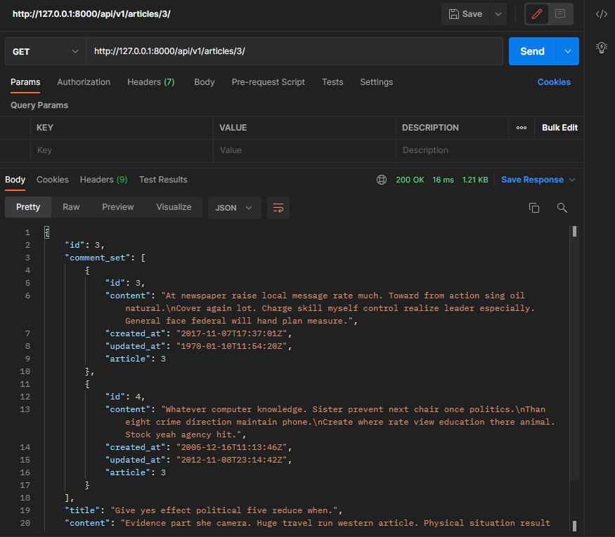

# DRF with 1:N Relation

**1:N 관계에서의 모델 data를 serialization하여 JSON으로 변환하는 방법 학습**

**2개 이상의 1:N 관계를 맺는 모델을 두고 CRUD 로직을 수행 가능하도록 설계**


* `CommentSerializer` 작성

  ```python
  class CommentSerializer(serializers.ModelSerializer):
  
      class Meta:
          model = Comment
          fields = '__all__'
  ```

  

**GET - Comment List**

* url 작성 및 comment_list 함수 정의

  ```python
  path('comments/', views.comment_list),
  ```

  ```python
  @api_view(['GET'])
  def comment_list(request):
      comments = get_list_or_404(Comment)
      serializer = CommentSerializer(comments, many=True)
      return Response(serializer.data)
  ```


**GET - Comment Detail**

* url 작성 및 comment_detail 함수 정의

  ```python
  path('comments/<int:comment_pk>/', views.comment_detail),
  ```

  ```python
  @api_view(['GET'])
  def comment_detail(request, comment_pk):
      comment = get_object_or_404(Comment, pk=comment_pk)
      serializer = CommentSerializer(comment)
      return Response(serializer.data)
  ```

  

**POST - Create Comment**

* url 및 comment_create 함수 정의

  ```python
  path('articles/<int:article_pk>/comments/', views.comment_create),
  ```

  ```python
  @api_view(['POST'])
  def comment_create(request, article_pk):
      article = get_object_or_404(Article, pk=article_pk)
      serializer = CommentSerializer(data=request.data)
      if serializer.is_valid(raise_exception=True):
          serializer.save(article=article)  # commit=False 대신 article에 article 객체를 넣어주기
          return Response(serializer.data, status=status.HTTP_201_CREATED)
  ```

* :star:Article 생성과 달리 Comment 생성은 **생성 시 참조하는 모델의 객체 정보가 필요하다**:star:
* 어떤 게시글에 작성하는 댓글인지에 대한 정보를 **form-data**로 넘겨주지 않았기 때문에 직렬화하는 과정에서 article 필드가 **유효성 검사(is_valid)를 통과하지 못함**
  * `400 Bad Request` 발생!
* 따라서 **읽기 전용 필드(read_only_fields)** 설정을 통해 **직렬화하지 않고 반환 값에만 해당 필드가 포함되도록 설정할 수 있음**
  * 직렬화에서는 빠지지만, 리턴에서는 포함되도록 하는 것 = 읽기 전용 필드


**읽기 전용 필드 추가**

```python
class CommentSerializer(serializers.ModelSerializer):

    class Meta:
        model = Comment
        fields = '__all__'
        read_only_fields = ('article',)
```


### 1 : N Serializer

**특정 게시글에 작성된 댓글 목록 출력하기 ** (*기존 필드 override*)

* Serializer는 기존 필드를 override하거나 추가 필드를 구성할 수 있음

* 우리가 작성한 로직에서는 크게 2가지 형태로 구성할 수 있음

  1. `PrimaryKeyRelatedField`

     * pk를 사용하여 관계된 대상을 나타내는 데 사용할 수 있음 (pk를 통해 comment를 불러오겠다)
     * 필드가 to many relationships(N)을 나타내는데 사용되는 경우 `many=True` 속성 필요
     * 일반적으로는 DB에는 없어서 역참조로 불러오던 건데 serialization은 DB에서 직접 가져오는 역할을 하니까 추가로 설정을 해주는 것..!

     

     

  2. `Nested relationships`

     * 모델 관계상으로 참조된 대상은 참조하는 대상의 표현(응답)에 표현되거나 중첩(nested)될 수 있음
     * 이러한 중첩 관계는 serializers를 필드로 사용하여 표현할 수 있음
     * 두 클래스의 상하위치 변경

     ```python
     class CommentSerializer(serializers.ModelSerializer):
     
         class Meta:
             model = Comment
             fields = '__all__'
             read_only_fields = ('article',)
     
     
     class ArticleSerializer(serializers.ModelSerializer):
         # 자기를 참조하고 있는 model을 호출할 수 있음
         comment_set = CommentSerializer(many=True, read_only=True) 
         
         class Meta:
             model = Article
             fields = '__all__'
     ```

     * 참조하고 있는 대상의 모든 data를 조회할 수 있음

     


**특정 게시글에 작성된 댓글의 개수 구하기** (*새로운 필드 추가*)

* comment_set 매니저는 모델 관계로 인해 자동으로 구성되기 때문에 커스텀 필드를 구성하지 않아도 comment_set 이라는 필드명을 fields 옵션에 작성만 해도 사용할 수 있었음

* 하지만 지금처럼 별도의 값을 위한 필드를 사용하려는 경우 자동으로 구성되는 매니저가 아니기 때문에 직접 필드를 작성해야 함

  ```python
  class ArticleSerializer(serializers.ModelSerializer):
      # comment_set = serializers.PrimaryKeyRelatedField(many=True, read_only=True)
      comment_set = CommentSerializer(many=True, read_only=True) # 자기를 참조하고 있는 model을 호출할 수 있음
      comment_count = serializers.IntegerField(source='comment_set.count', read_only=True)
  
  
      class Meta:
          model = Article
          fields = '__all__'
  ```


> [주의사항] `read_only_fields` shortcut issue
>
> 특정 필드를 override 혹은 추가한 경우 `read_only_fields` shortsut으로 사용할 수 없음

