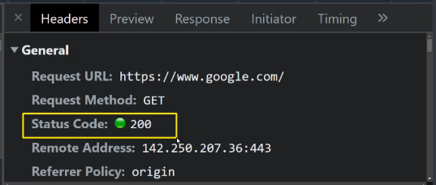

## Server

* **web server**
  * request가 왔을 때, **web page**를 response의 body에 담아서 보냄
  * 화면에 그리는 데에 필요한 재료를 response의 body에 담아 보냄
* **API server**
  * request가 왔을 때, **요청한 것에 대한 처리를 하고, 그 결과**를 response의 body에 담아서 보냄
  * 처리한 결과를 response의 body에 JSON 데이터 타입으로 (key-value) 담아 보냄

**HTTP**

* 클라이언트와 서버가 서로 어떤 형식으로 데이터를 보내줄건지를 약속한 것 (프로토콜)
* 대표적인 프로토콜
  * FTP, SSH, TELNET, SMTP, **HTTP**, **HTTPS**
    * HTTP vs HTTPS 차이점??? S = Secure의 약자 `보안이 조금 더 강화되었다`

* 클라이언트와 서버가 서로 데이터를 주고 받으려면 프로토콜이 필요하다.

* 웹 개발에서는 `HTTP, HTTPS`가 중요하다
* 기본 특성
  * 비연결성 (Connectless)
    * 클라이언트와 서버가 한 번 응답을 주고 받으면, **연결을 끊는다**.
  * 무상태 (Stateless)
    * Connectless에 의해 발생한 것, 서버가 클라이언트를 기억하지 못함
    * **식별 불가능**
    * 매번 요청할 때마다, 내가 누군지를 서버에게 알려주어야 함
      * 너무 불편해 :angry:
      * **쿠키와 세션** 등장!!!!
      * 쿠키 - 클라이언트! 너가 기억해서 나한테(서버) 들고와
        * 쿠키 문제점) 쿠키를 굉장히 쉽게 뺏긴다.. 민감한 정보 다뺏겨 힝 (보안 취약)
        * 그래서 세션이 등장
      * 세션 - 그 민감한 정보, 내가(서버) 기억해줄게

**HTTP Method**

* 클라이언트가 서버에게 request할 때
* R (조회) `GET`
* C (생성) `POST`
* U (수정) `PUT`
* D (삭제) `DELETE`

**HTTP Message**

* **Request**는 **Head**와 **Body**로 나뉘어져 있다

  * Head: 요청에 대한 부가정보가 들어있다 (method)
    * Head 안에 `key-value` 쌍으로 각각의 정보를 저장하고 있는 것을 Header라고 하며, 여러개 있으면 Headers라고 한다

  * Body: 실제 데이터가 들어있다
    * `GET과 DELETE`는 Body가 필요 없다!
      * 즉, Head는 항상 차있어야 하는 반면에, Body의 경우 Method 에 따라 차있을수도, 없을수도 있다. 

* **Response**는 **Head**와 **Body**로 나뉘어져 있다

  * Head: 헤더 안에 **상태 코드**(Status Code)가 들어가있다

    * 각각의 **상태 코드**는 그에 대응되는 **상태 메세지**를 가지고 있다
    * 1xx ~ 5xx 로 총 다섯개의 그룹으로 나누어져 있고, 각각의 그룹이 어떠한 상태를 의미하는지는 알고 있어야 한다:star:
      * `2xx, 4xx, 5xx` 중요!!
      * `1xx` : 서버가 클라이언트한테 정보성 응답을 주는 경우
        * `100` : Continue (드루와)
      * `2xx` : 일반적인, 정상적인 상황
        * `200` : OK (오키 굿)
        * `201` : Created (클라이언트 요청대로 resource가 서버한테 잘 생성되었다)
      * `3xx` : 요청을 처리하려면 클라이언트가 추가적으로 처리해야 할 것을 요청
        * `301` : Moved Permanently
        * `304` : Not Modified (그거 이미 나한테 요청한 적 있어 너 주머니 함 봐바; 브라우저 캐싱)
      * `4xx` : 클라이언트 잘못
        * `400` : Bad Request (요청은 제대로 했는데, 형식이나 내부 정보가 잘못된거 같아 ...)
        * `401` : Unauthorized (요청 전에 인증부터 하고 와)
        * `403` : Forbidden (인증은 했는데 권한이 없네)
        * `404` : Not Found (아예 잘못된 곳에 요청했잖아ㅏ 나한테 그런 resource 없어)
        * `429` : Too Many Requests (짧은 시간안에 너무 많이 요청한것 같은데 ..)
      * `5xx` : 서버 잘못
        * `500` : Internal Server Error
        * `503` : Service Unavailable (갑자기 너무 많은 요청들이 한번에 들어왔을 때.. 티켓팅.. 수강신청 ...으악 ... 트래픽 폭주 ...)

    

    * 귀여운거
      * https://http.cat/
      * https://httpstatusdogs.com/

  * Body

**웹에서의 리소스 식별**

* resource : 서버에 존재하는 정보, 자원, data
* URL(Uniform Resource Locator)
  * 각각의 리소스가 네트워크 상에 어디에 위치해 있는 정보
* URI

### RESTful API

**API**

* Web API : 프론트엔드와 백엔드가 어떻게 데이터를 주고 받을지에 대해 정한 프로토콜
* 약속을 조금 더 멋지게 해볼까?
  * **REST API** (표현적인 상태 이전)
    * Web API 가이드를 해보자 싶어서 나온 가이드라인 중 하나 (얘도 프로토콜이지만 웬만하면 지켜랏...)
    * `web`을 하나의 거대한 프로그램으로 보았을 때, web의 매 순간의 상태를 내가 이전받아서 보는 것
* RESTful Method :star:
  1. URL은 리소스를 나타내기 위해서만 사용하고, 리소스에 대한 처리는 메서드로 표현한다
     * **정보의 자원을 표현하는 URI**와 **자원에 대한 행위를 표현하는 HTTP Method** 가 중요하다!!!
  2. Document는 단수명사로, Collection은 복수 명사로 표현한다
     * 각각의 article은 document이고, 얘네가 모여 있으면  collection

Response(serializer.data)나 (data=request.data) 에서 우리가 원하는 정보가 .data라는 attribute에 들어있다는건 약간은 암기사항인거죠? yes .. !