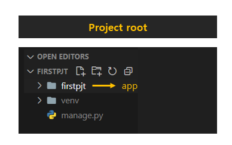
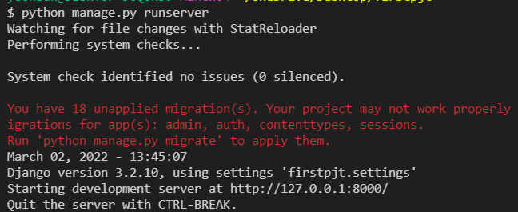

> Django

* Django를 배우게 되면 실제로 동작하는 웹 페이지를 만들 수 있다!
* 파이썬 무료 오픈소스 웹 application framework = Django

> Framework?

* 웹 서비스를 만드는 데 필요한 도구들의 모임 => **도구함**
* HTML, CSS, JS, DB, server, 보안, 회원가입, 로그인 .... 
  * 이러한 모든 기능들을 하나하나 python으로 구현 가능하나, 너무 오래걸림
  * 전세계 개발자들이 각각의 기능을 이쁜 구조로 만들어서 뭉쳐놓은 것
  * 너무 편해...! :thumbsup: 

> Framework Architecture

* **MTV pattern**
  * Model => Database
  * Template => HTML (웹페이지)
  * View => 조작, 가공

* 127.0.0.1 (localhost) = 내 컴퓨터