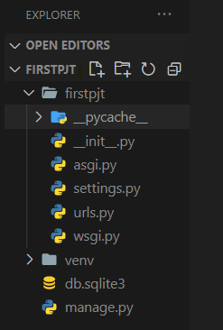
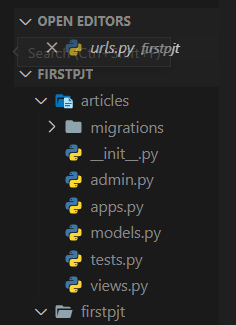
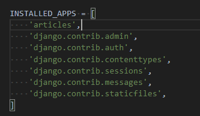
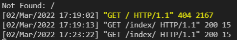

> Django

* Django를 배우게 되면 실제로 동작하는 웹 페이지를 만들 수 있다!
* 파이썬 무료 오픈소스 웹 application framework = Django

> Framework?

* 웹 서비스를 만드는 데 필요한 도구들의 모임 => **도구함**
* HTML, CSS, JS, DB, server, 보안, 회원가입, 로그인 .... 
  * 이러한 모든 기능들을 하나하나 python으로 구현 가능하나, 너무 오래걸림
  * 전세계 개발자들이 각각의 기능을 이쁜 구조로 만들어서 뭉쳐놓은 것
  * 너무 편해...! :thumbsup: 

> Framework Architecture

* **MTV pattern**
  * Model => Database
  * Template => HTML (웹페이지)
  * View => 조작, 가공


* 127.0.0.1 (localhost) = 내 컴퓨터

********

(오후 복습)



* `settings.py`, `urls.py`, `manage.py` 가 중요해~

> urls.py

* 사이트의 url과 적절한 views의 연결을 지정 (*꼭 views가 아닐수도...*)

  ```python
  # admin/ 들어가서 ~~를 실행해
  urlpatterns = [
      path('admin/', admin.site.urls),
  ]
  ```

> settings.py

* 애플리케이션의 모든 설정을 포함

> manage.py

* django 프로젝트와 다양한 방법으로 상호작용 하는 커맨드라인 유틸리티


```python
# git bash
python manage.py startapp articles
```



* TDD 뭔지 한번 검색해보기~!
* `models.py`, `views.py` 중요


> 내가 등록한 앱을 추가하기!

* `settings.py` 의 `INSTALLED_APPS`에서 등록




> 요청과 응답

* 모든 view는 함수 형태로 적는다 :star:



* 404, 200 : 상태코드
  * 클라이언트 = 유저
  * 404 = 잘못된 접근, 200 = 정상 접근

> templates

* templates 파일 경로의 기본 값은 **app 폴더 안의 templates 폴더**로 지정되어 있음

* ```html
  <!-- articles/templates/articles/index.html -->
  ```

* articles 안에 template 폴더를 생성한 후, 그 폴더 내에 articles와 동일한 이름으로 파일을 생성한 뒤, index.html 파일 생성!