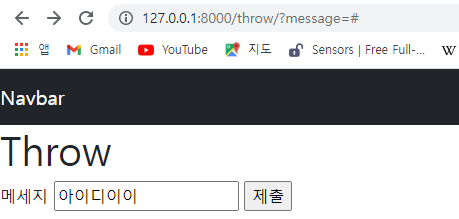
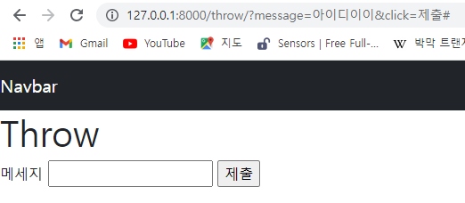

> view

* template에게 응답을 맡김

> DTL Syntax (1 - 3 - 2 - 4 순서로 공부하면 좋다)

1. Variable
2. Filters
3. Tags
4. Comments

> Variable

* `{{ variable }}` 

* `render()`의 세번째 인자로 `{'key': value}` 와 같이 딕셔너리 형태로 넘겨줌

> Filters

* `{{ variable|filter }}`
* filter를 사용할 때에는 django 공식 문서를 띄워두고 사용하자!
  * [django documentation](https://docs.djangoproject.com/en/3.2/)

> Tags

* ``
* 일부 태그는 시작과 종료 태그가 필요
  * ``
* [built-in tags](https://docs.djangoproject.com/ko/3.2/ref/templates/builtins/#built-in-template-tags-and-filters)

> Comments

* `{# 한줄 주석 #}`
* ` 여러줄 주석 `

> 코드 작성 순서

1. urls.py
2. views.py
3. templates

> HTML form

* 핵심 속성(attribute)
  * action : 입력 데이터가 전송될 URL 지정
  * method : 입력 데이터 전달 방식 지정
    * method에는 GET방식과 POST 방식이 있다

> HTML input elem

* 사용자로부터 데이터를 입력받기 위해 사용
* 핵심 속성 : name
  * GET 방식에선 URL에서 `?key=value&key=value` 형식으로 데이터를 전달함

> HTML label elem

* 사용자 인터페이스 항목에 대한 설명을 나타냄
* label을 input 요소와 연결하기

> HTML for attribute

* for 속성의 값과 일치하는 id를 가진 문서의 첫 번째 요소를 제어

> HTML id attribute

* 전체 문서에서 고유(must be unique)해야 하는 식별자 정의

> HTTP request method 종류

* GET, POST, PUT, DELETE ...

> HTTP request method - "GET"

* 서버로부터 정보를 조회하는 데 사용
* 데이터를 가져올 때만 사용해야 함
* 데이터를 서버로 전송할 때 body(;POST 방식)가 아닌 **Query String** Parameters를 통해 전송
* 우리는 서버에 요청을 하면 *HTML 문서 파일 한 장*을 받는데, 이 때 사용하는 요청의 방식이 GET
  * default가 GET방식!

