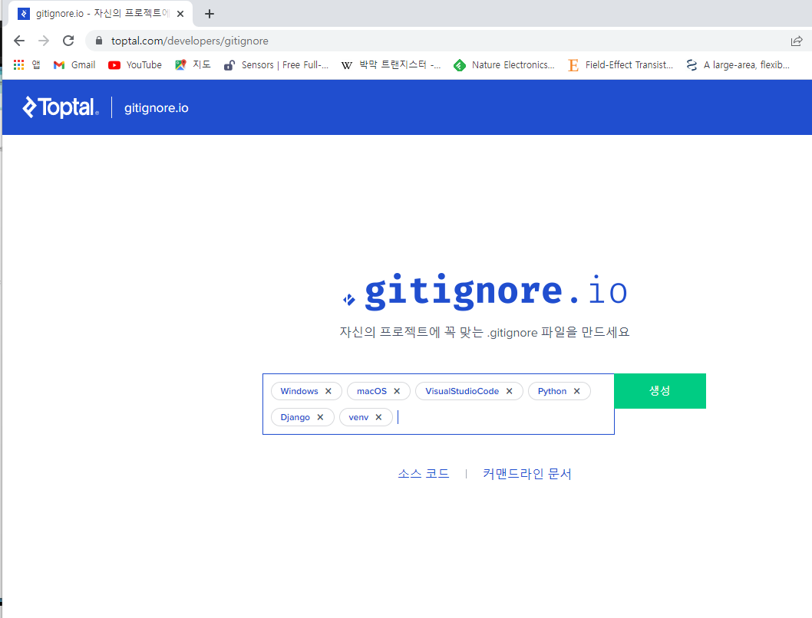

> Namespace

1. 서로 다른 app의 같은 이름을 가진 url name은 이름공간을 설정해서 구분
2. templates, static 등 django는 정해진 경로 하나로 모아서 보기 때문에 중간에 폴더를 임의로 만들어 줌으로써 이름공간을 설정

* urls.py에서 path 설정하기 전에 appname을 지정해준다!
  * `app_name = 'name'`  이 형식으로 지정해줄 것 :star:

* 여러 app 에는 중복되는 url이 있을 가능성이 높으므로, templates 안에 app name과 동일한 폴더를 하나 더 만들어 주어 namespace를 설정해야 한다~!!!


> Static files

* 서버 측에서 미리 준비해 둔 고정된 파일
* 이는 자원가 접근 가능한 주소가 정적으로 연결된 관계
  * 사진 파일 = 자원, 파일 경로 = 웹 주소


* 배포 단계로 가는 경우, DEBUG 모드를 꺼야한다 (settings.py)

  ```python
  # SECURITY WARNING: don't run with debug turned on in production!
  DEBUG = True #=> 이상태로 배포하면 내 정보 다 유출된다!




* .gitignore 에 복붙해서 만들기 