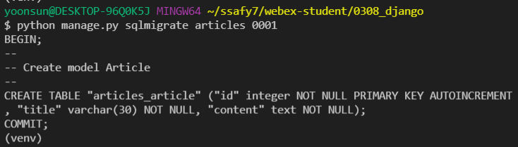

# Django Model

> Django의 구조

* MTV (**M**odel **T**emplate **V**iew)

> Model

* Database 관련된 곳

* SQL: DB를 다루는 언어 => 따로 작성이 필요
* ORM: 파이썬 문법만 가지고 DB를 다룰 수 있도록 SQL을 한 겹 감싸둔 것(JAVA에도 있음)
* Migrations: model 조작 시 model의 history
* Database API
* CRUD: Create Read Update Delete (생성, 읽기, 수정, 삭제) 
  * *모든 프로그램의 가장 기본적인 기능*

* Admin Site


> Model

* 단일한 데이터에 대한 정보를 가짐 (Django에서 사용할 데이터 구조를 미리 잡아두는 곳)
  * 사용자가 저장하는 데이터들의 필수적인 필드들과 동작들을 포함
* model을 통해 데이터에 접근하고 관리할 수 있다:star::star::star:
  * Django 데이터를 구조화하고 조작(CRUD)하기 위한 도구

> Database

* 체계화된 데이터의 모임
* Query (쿼리를 날린다... 데이터베이스로)
  * 데이터를 조회하기 위한 명령어 (SQL로 날림; Query문을 쓰는 것)
  * 조건에 맞는 데이터를 추출하거나 조작하는 명령어
  * "Query를 날린다" = 데이터를 조작한다

* DB의 기본 구조
  * 스키마(Schema): DB에서 자료의 구조, 표현방법, 관계 등을 정의한 구조
  * 테이블
    * 열 (column) : 필드(field) or 속성
    * 행(row): 레코드(record, 데이터 한줄 한줄을 의미) or 튜플; 데이터 추가하면 row가 늘어나겠지
  * 기본키(PK, Primary Key)
    * 각각의 데이터를 구분할 수 있는 고유값(key),, 주민등록번호같이
    * table 내에서 PK가 다르다면 무조건 다른 데이터인 것!
    * 중복 불가~

> ORM

* Object-Relational-Mapping; 객체관계매핑
  * DB를 Model 객체로 접근하겠다!
* 객체 지향 프로그래밍 언어를 사용하여 호환되지 않는 유형의 시스템 간(Django-SQL)에 데이터를 변환하는 프로그래밍 기술
* DB
  * 테이블이 짜여져 있는 것
    * 데이터 간의 관계가 정해져서 사용되는 것 = SQL (보통의 data)
  * 테이블이 짜여져 있지 않아 상대적으로 자유롭게 사용되는 것 = NO-SQL
* 장점
  * SQL을 잘 알지 못해도 DB 조작이 가능
  * SQL의 절차적 접근이 아닌 객체 지향적 접근으로 인한 높은 생산성
* 단점
  * ORM만으로 완전한 서비스를 구현하기 어려운 경우가 있음
  * 효율성이 조금 떨어짐
* 현대 웹 프레임워크의 요점은 웹 개발의 속도를 높이는 것 (**생산성**)
* DB를 객체로 조작하기 위해 ORM을 조작한다 = DB 잘 모르는데 SQL도 잘 몰라서 ORM을 쓸거다 히히..


> Field Options

* null: DB 저장 시 null 값을 저장할지 말지를 결정하는 옵션
  * default값이 False이므로, 기본적으로 null값이 저장되는 것을 허용하지 않음
* blank: 빈값으로 두어도 될지 여부를 선택하는 옵션

* `CharField(max_length=)` : 최대 글자 수 지정이 필수!
* `TextField()` : 최대 글자 수 지정 필요 없음


> model 조작(생성, 수정, 삭제)을 했다면

* 

* 반드시 migration을 생성하고,  `python manage.py makemigrations`
* 실제 database를 migration에 반영(적용) 해야 한다.  `python manage.py migrate`
* 

* `python manage.py sqlmigrate <appname> <migration number>`
  * 각각의 sql이 어떻게 적용되었는지를 볼 수 있음
* 
* 실제로 적용이 되었는지 확인하고 싶은 경우 `showmigrations`

* 

* `auto_now_add=True`
* `auto_add=True`
* 
  * #1. 이전 데이터들한테 추가할 값을 제공해줄게!
  * #2. 문제있어? 하지마봐 내가 다시한번 잘 적어볼게! = migration 안만들어짐

* 
  * ENTER!

* 
  * django의 모든 기능을 사용할 수 있는 shell 등장! (ORM도 쓸 수 있음)

* 
  * <QuerySet []> : 파이썬의 리스트와 거의 비슷하게 기능 사용 가능!

* 

* 

### CRUD

> **Create** 세가지 방법

1. 인스턴스 생성 후 인스턴스 변수 설정

   ```python
   article=Article()
   article.title="~"
   article.save()
   ```

   

2. 초기값과 함께 인스턴스 생성

   ```python
   article=Article(title="~", content="text")
   article.save()
   ```

   

3. QuerySet API - create() 사용

   ```python
   Article.objects.create(title="~", content="text")
   # save() 가 필요 없다 !!
   ```


> **Read** 세가지 방법

1. ```python
   articles = Article.objects.all()
   ```

2. ```python
   # 하나의 data가 가지고 있는 특정 조건을 통해 하나의 data를 불러오는 경우
   article = Article.objects.get(~)
   ```

3. ```python
   # 특정 조건을 만족하는 모든 data를 불러오는 경우
   articles = Article.objects.filter(~)

* 

* shell에서 나가고 싶은 경우 `exit()` 

* 
  * requirements.txt에 없는 패키지를 install 한 뒤 requirements에 넣고 싶은 경우
  * django_extensions가 설치된 것을 확인할 수 있음
  * **settings.py 의 INSTALLED APPS에 등록해준 뒤 사용**

* 
  * QuerySet => DB로부터 건네받은 객체의 목록

* 