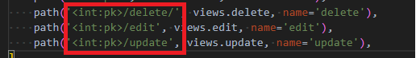
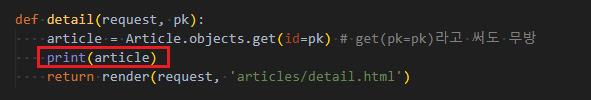
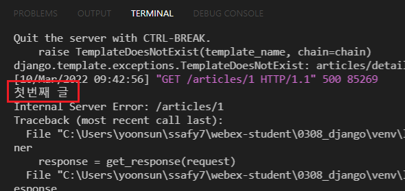
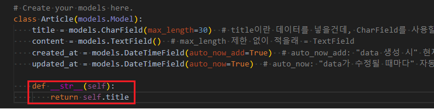
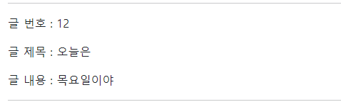
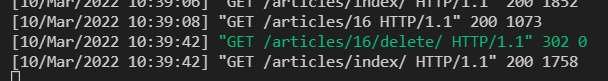
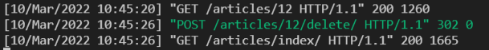
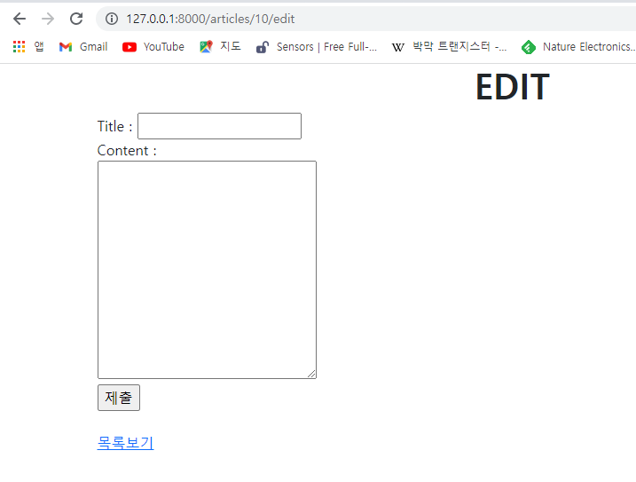
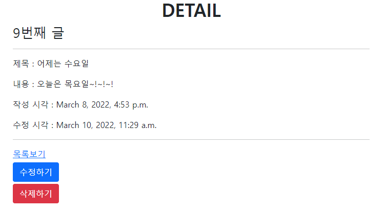
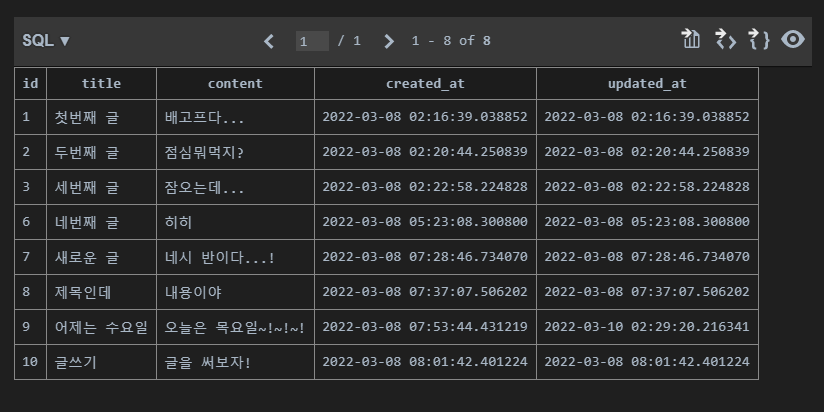

> PK

* PK는 한개일수도, 여러개일 수도 있다

> migration

* 데이터베이스에 대한 설계도
* `makemigrations`
* `migrate`
* `sqlmigrate`
* `showmigrations`

> page

* list page
* detail page : 클릭 시 상세 내용을 볼 수 있도록 만들어 둔 페이지

> variable routing

* 특정 부분을 변수처리 해서 많이 만들고 싶은 경우
* 비슷한 url 에서 많은 url을 생성할 수 있다
* 
* 
* 
  * (urls.py) variable routing을 사용하여 path에서 특정 pk를 만난 경우 특정 pk에 대한 경로를 설정해줄 수 있다
  * (views.py) `article = Article.objects.get(id=pk)`를 작성해준 뒤 `print(article)`을 찍고 `python manage.py runserver`를 해주고 terminal을 확인해주면, 세번째 이미지와 같이 `첫번째 글` 이라고 나오는 것을 볼 수 있다
  * 이렇게 확인할 수 있는 이유는 `models.py`에서 title을 str 으로 읽을 수 있도록 함수를 정의해주었기 때문! (아래 이미지 참고)
  * 


> 제목을 클릭했을 때 내용을 볼 수 있도록 수정해보기

* 현재는 아래의 이미지와 같이, `글 번호, 글 제목, 글 내용`이 한꺼번에 표시된다.



* `글 제목`을 클릭했을 때 `글 내용` 을 볼 수 있는 상세 페이지로 이동할 수 있도록 index template를 수정해보자

```html
<p>글 번호 : {{ article.id }}</p>
    <a href="">글 제목 : {{ article.title }}</a>
```


> **D** (CRUD의 D)

* 게시판에서 글을 **썼다면**, **삭제**할 수 있는 기능 또한 필수!!

* delete/ (어떤 글을 삭제할지가 필요해)
  * #번 글을 삭제해 : variable routing을 해주어야 함

* ```python
  def delete(request, pk):
      # 1. pk에 해당하는 글을 DB에서 가져오기
      article = Article.objects.get(id=pk)
      # 2. 해당 글을 삭제하기
      article.delete()
      # 3. index 페이지로 이동하기
      return redirect('articles:index')
  ```

* 

  * 해당 index 번호 detail로 들어감
  * delete 함
  * index로 다시 돌아감

* **다만, 글을 작성할 때를 제외하고는 POST 방식을 사용해야 함**

* detail.html에서 수정

* ```html
  <form action="" method="post">
    
    <button class="btn btn-danger">삭제하기</button>
  </form>
  ```

* 

  * post 방식으로 삭제가 잘 됨을 확인! (초록색)
  * 다만, url에 `/articles/17/delete/` 와 같이 GET방식으로도 여전히 삭제가 가능하다

* **request POST로 들어오면 삭제하고, request GET으로 들어오면 삭제하지 말도록 설정하자!**

* views.py의 `def delete`를 수정해주면 됨

  ```python
  def delete(request, pk):
      # 1. pk에 해당하는 글을 DB에서 가져오기
      article = Article.objects.get(id=pk)
      # request POST 방식인 경우,
      if request.method == 'POST':
          # 2. 해당 글을 삭제해줘
          article.delete()
          # 3. 그리고 index로 넘어가줘
          return redirect('articles:index')
      # request GET 방식인 경우에는 해당글을 삭제하지 못하게 할거야
      else:
          return redirect('articles:detail', article.pk)
  ```

> **U** (CRUD의 U)

* url 추가

  `path('<int:pk>/update/', views.update, name='update'),`

* edit.html 생성
  * new.html과 같은 form을 가지고 있음! 일단 복붙해서 형식을 그대로 가져오자
  * 그러나 문제점은... 아래의 그림과 같이 EDIT page인데 원래의 title 및 content가 무엇이었는지 써있지 않다면 곤란하겠지!



* 따라서, **이전에 써두었던 context를 가져와야 한다**

  * Title : input tag 안에 value 속성을 사용하여 `value="{{ article.title }}"`로 원래의 title을 가져온다
  * Textarea : input tag와 달리 value 속성을 따로 사용해 줄 수 있는 것이 아니므로, 여는태그와 닫는 태그 사이 (내용 작성해주는 부분)에 `{{ article.content }}`를 작성해줌으로써 원래의 content를 가져온다

  ```html
  <form action="#" method="POST">
      
      <label for="title">Title : </label>
      <input type="text" name="title" id="title" value="{{ article.title }}">
      <br>
      <label for="content">Content : </label><br>
      <textarea name="content" id="content" cols="30" rows="10">{{ aritlce.content }}</textarea>
      <br>
      <input type="submit">
    </form>
  ```

* title 및 content 수정을 완료했다면, **다시 제출 버튼을 눌러주고, 어디로 보내줄 지 url 설정**해주기
  * `path('<int:pk>/update', views.update, name='update'),`

* views.py에 def update 추가

  ```python
  def update(request, pk):
      # 1. 수정해 줄 article 가져오기
      article = Article.objects.get(id=pk)
      # 2. request로부터 사용자가 입력한 데이터를 가져오기
      article.title = request.POST.get('title') # 괄호 안의 key는 edit.html에서 name 따라 적는것
      article.content = request.POST.get('content')
      # 아래 두줄 따로 적어주지 않고 위에 두줄처럼 첨부터 적어줄 수 있음
      # article.title = title
      # article.content = content
  
      # 3. article 수정하기
      article.save()
      # 4. article을 상세페이지로 보내주기
      return redirect('articles:detail', article.pk)
  ```

* edit.html의 form action # 변경 해주기

  ```html
  <form action="" method="POST">
  ```



* update 하고 난 뒤 결과물!
* 수정 시각 또한 자동으로 변경됨을 볼 수 있음


> SQLite



* vscode extension 설치한 뒤에는 table 형식으로 볼 수 있음
* 다만, created_at 과 updated_at 시간대가 UTC 형식으로 표현됨
  * settings.py의 TIME_ZONE 설정은 **django pjt가 어떤 시간대로 보여줄지만 정해주는 것**이므로 sqlite table에서는 항상 utc 시간대로 표현된다