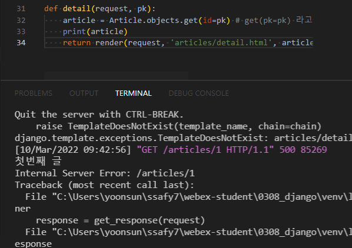

> PK

* PK는 한개일수도, 여러개일 수도 있다

> migration

* 데이터베이스에 대한 설계도
* `makemigrations`
* `migrate`
* `sqlmigrate`
* `showmigrations`

> page

* list page
* detail page : 클릭 시 상세 내용을 볼 수 있도록 만들어 둔 페이지

> variable routing

* 특정 부분을 변수처리 해서 많이 만들고 싶은 경우
* 비슷한 url 에서 많은 url을 생성할 수 있다





글 제목을 클릭했을 때 글 내용을 볼 수 있도록 수정 : index template에서 수정

```html
<p>글 번호 : {{ article.id }}</p>
    <a href="">글 제목 : {{ article.title }}</a>
```


> 삭제 기능 만들자!

* delete/ (어떤 글을 삭제할지가 필요해)
  * #번 글을 삭제해 : variable routing을 해주어야 함

* ```python
  def delete(request, pk):
      # 1. pk에 해당하는 글을 DB에서 가져오기
      article = Article.objects.get(id=pk)
      # 2. 해당 글을 삭제하기
      article.delete()
      # 3. index 페이지로 이동하기
      return redirect('articles:index')
  ```

* 

  * 해당 index 번호 detail로 들어감
  * delete 함
  * index로 다시 돌아감

* **다만, 글을 작성할 때를 제외하고는 POST 방식을 사용해야 함**

* detail.html에서 수정

* ```html
  <form action="" method="post">
    
    <button class="btn btn-danger">삭제하기</button>
  </form>
  ```

* 

  * post 방식으로 삭제가 잘 됨을 확인! (초록색)
  * 다만, url에 `/articles/17/delete/` 와 같이 GET방식으로도 여전히 삭제가 가능하다

* **request POST로 들어오면 삭제하고, request GET으로 들어오면 삭제하지 말도록 설정하자!**

* views.py의 `def delete`를 수정해주면 됨

  ```python
  def delete(request, pk):
      # 1. pk에 해당하는 글을 DB에서 가져오기
      article = Article.objects.get(id=pk)
      # request POST 방식인 경우,
      if request.method == 'POST':
          # 2. 해당 글을 삭제해줘
          article.delete()
          # 3. 그리고 index로 넘어가줘
          return redirect('articles:index')
      # request GET 방식인 경우에는 해당글을 삭제하지 못하게 할거야
      else:
          return redirect('articles:detail', article.pk)
  ```

  