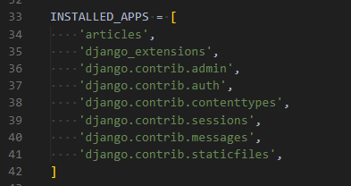
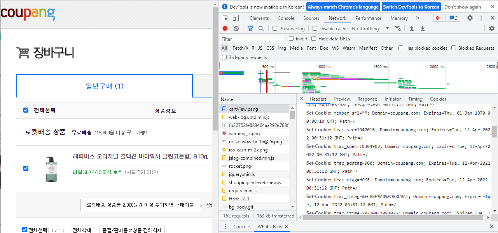
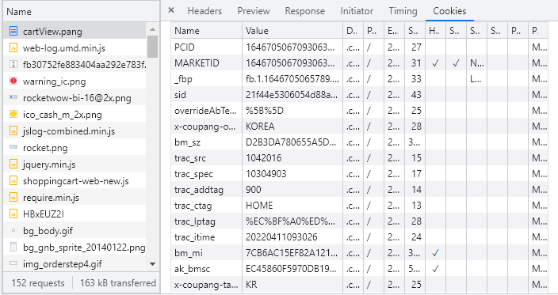
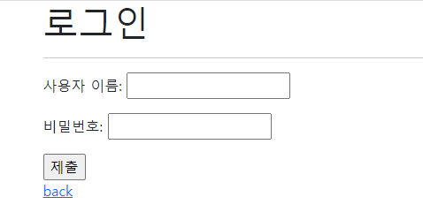
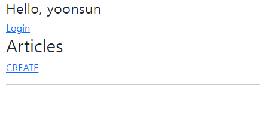
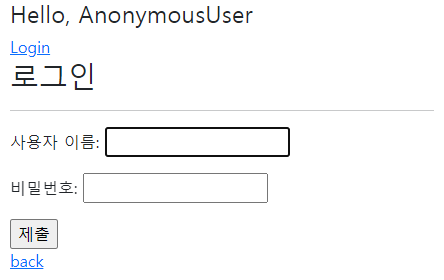

# Authentication system

> 인증 권한 필수 시스템



```python
'django.contrib.auth',
'django.contrib.contenttypes',
```


> Authentication & Authorization

* Authentication (인증)
  * 신원 확인
  * 사용자가 자신이 누군지 확인하는 것
* Authorization (권한)
  * 권한 부여
  * 인증된 사용자가 수행할 수 있는 작업을 결정


> 두번째 앱(accounts) 생성하기

`python manage.py startapp accounts`


> HTTP

* Hyper Text Transfer Protocol
  * HTML 문서와  같은 리소스들을 가져올 수 있도록 해주는 프로토콜
  * 클라이언트-서버 프로토콜 이기도 함
* **비연결지향(connectionless)**
  * 서버는 요청에 대한 응답을 보낸 후 연결을 끊음
* **무상태(stateless)**
  * 연결을 끊는 순간 클라이언트와 서버 간의 통신이 끝나며 상태 정보가 유지되지 않음
  * 클라이언트와 서버가 주고 받는 메세지들은 서로 완전히 독립적임

* 클라이언트와 서버의 지속적인 관계를 유지하려면 **쿠키**와 **세션**이 필요함


> 쿠키 (Cookie)

* **서버**가 **사용자의 웹 브라우저**에 전송하는 작은 데이터 조각
* 사용자의 컴퓨터에 배치되는 작은 기록 정보 파일
  * 브라우저(클라이언트)는 쿠키를 로컬에 key-value 데이터 형식으로 저장
  * 쿠키를 저장해 두었다가, 동일 서버에 재 요청 시 저장된 쿠키를 함께 전송

* 소프트웨어는 아니므로 프로그램처럼 실행될 수 없음
* HTTP 쿠키는 **상태가 있는 세션**을 만들어줌
* 쿠키는 두 요청이 동일한 브라우저에서 들어왔는지 아닌지를 판단할 때 주로 사용
  * 이를 이용해 사용자의 로그인 상태를 유지할 수 있음
  * 상태가 없는 HTTP 프로토콜에서 상태 정보를 기억시켜주기 때문
* 웹 페이지에 접속 시 요청 웹 페이지를 받을 때 쿠키를 저장하고, 클라이언트가 같은 서버에 재 요청 시 요청과 함께 쿠키도 함께 전송

> 쿠키의 사용 목적

1. **세션 관리 (session management)**
   * 로그인, 아이디 자동 완성, 공지 하루 안보기, 팝업 체크, 장바구니 등의 정보 관리
2. 개인화 (personalization)
   * 사용자 선호, 테마 등의 설정
3. 트래킹 (tracking)
   * 사용자 행동을 기록 및 분석





* key-value 형태로 cookie 저장
* request cookie, response cookie 로 나뉨

* 장바구니에서 **제품을 삭제** 하는 것은, **쿠키를 삭제** 하는 것과 동일한 것이다!
  * 난 더이상 이 제품이 필요없어!


> 세션 (session)

* 사이트와 특정 브라우저 사이의 상태(state)를 유지시키는 것
* 클라이언트가 서버에 접속하면 서버가 특정 **session id**를 발급하고, 클라이언트는 발급 받은 session id를 쿠키에 저장
  * 쿠키는 요청 때마다 서버에 함께 전송되므로 서버에서 session id를 확인해 알맞은 로직을 처리함
* ID는 세션을 구별하기 위해 필요하며, 쿠키에는 ID만 저장함

* **로그아웃** = **세션 삭제**

> 쿠키의 수명

* 쿠키의 수명은 두 가지 방법으로 정의할 수 있음

1. Session cookies
   * 현재 세션이 종료되면 삭제됨
   * 브라우저가 "현재 세션(current session)"이 종료되는 시기를 정의
2. Persistent cookies (Permanent cookies)
   * Expires 속성에 지정된 날짜 혹은 Max-Age 속성에 지정된 기간이 지나면 삭제

> Session in Django

* Django의 세션은 미들웨어를 통해 구현됨
* Django는 database-backed sessions 저장 방식을 기본 값으로 사용
* Django는 특정 session id를 포함하는 쿠키를 사용해서 각각의 브라우저와 사이트가 연결된 세션을 알아냄
  * 세션 정보는 django db의 `django_session` 테이블에 저장됨
* 모든 것을 세션으로 사용하려 하면 서버에 부하가 걸릴 수 있음 !


> 로그인

* 로그인은 **session을 CREATE하는 로직과 동일함**
* AuthenticationForm
  * 사용자 로그인을 위한 form
  * request를 첫번째 인자로 취함

```python
from django.http import HttpRequest
from django.shortcuts import render
from django.contrib.auth.forms import AuthenticationForm

# Create your views here.
def login(request):
    # POST 요청인 경우 = 로그인 진행 (DB 조작)
    if request.method == 'POST':
        pass
    # GET 요청인 경우 = 로그인 페이지 응답
    else:
        # 장고가 제공해주는것 import 해오기
        form = AuthenticationForm()
    context = {
        'form': form,
    }
    return render(request, 'accounts/login.html', context)
```

```html



  <h1>로그인</h1>
  <hr>
  <form action="" method="POST">
    
    {{ form.as_p }}
    <input type="submit">
  </form>
  <a href="">back</a>

```



> login 함수

* `login(request, user, backend=None)`

  * 현재 세션에 연결하려는 인증 된 사용자가 있는 경우 login 함수 필요
  * HttpRequest 객체와 User 객체가 필요

  `로그인 한 경우`

  

  `로그아웃 한 경우`



* template에 `{{ user }}`만 넣어주어도 자동으로 유저를 알아보고 응답해줄 수 있는 이유는 `TEMPLATES`의 `OPTIONS`에서 `context_processors` 항목들이 존재하기 때문이다 !


> logout 함수

* `logout(request)`
  * HttpRequest 객체를 인자로 받고 반환 값이 없음
  * 사용자가 로그인하지 않은 경우 오류를 발생시키지 않음
  * 현재 요청에 대한 session data를 DB에서 완전히 삭제 후, 클라이언트의 쿠키에서도 session id가 삭제됨
  * 이는 다른 사람이 동일한 웹 브라우저를 사용하여 로그인하고, **이전 사용자의 세션 데이터에 액세스하는 것을 방지하기 위함**


> 로그인 사용자에 대한 접근 제한

* 엑세스 제한 2가지 방법
  1. The raw way
     * `is_authenticated` attribute
     * `login_required` decorator

* `is_authenticated` attribute
  * user model의 속성 중 하나
  * 모든 user 인스턴스에 대해 항상 True인 읽기 전용 속성 (AnonymousUser에 대해서는 항상 False
  * 사용자가 인증 되었는지 여부를 알 수 있는 방법

* `login_required` decorator
  * 사용자가 로그인되어있지 않으면, `settings.LOGIN_URL`에 설정된 문자열 기반 절대 경로로 redirect함

