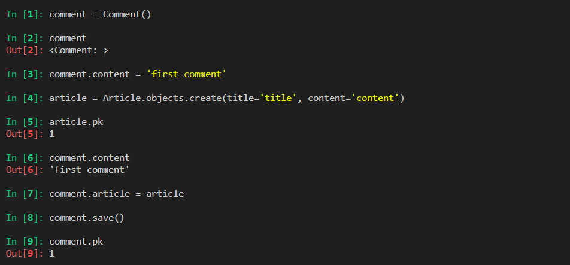
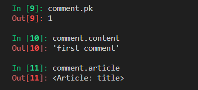
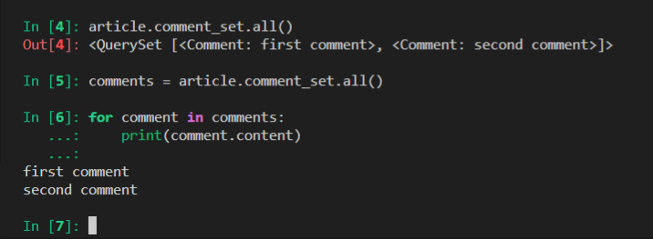
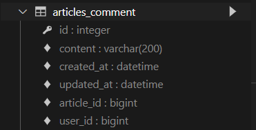

> Foreign Key

* 외래 키
* 관계형 데이터베이스에서 한 테이블의 필드 중 다른 테이블의 행을 식별할 수 있는 키
* 참조하는 테이블에서 속성(필드)에 해당하고, 이는 참조되는 테이블의 기본 키(Primary Key)를 가리킴
* 참조하는 테이블의 외래 키는 참조되는 테이블 행 1개에 대응됨
* 참조 하는 테이블 // 참조 되는 테이블
  * 1 : N 관계를 하는 데이터베이스에서, 외래키는 N 쪽이 가지고 있다!

> Foreign key

* 키를 사용하여 부모 테이블의 **유일한 값**을 참조
* 외래 키의 값이 반드시 부모 테이블의 기본 키일 필요는 없지만 유일한 값이어야 함

> ForeignKey field

* A many-to-one relationship
* 2개의 위치 인자가 바로 필요
* migrate 작업 시 필드 이름에 _id를 추가하여 데이터베이스 열 이름을 만듦

> ForeignKey arguments - `on_delete`

* 외래 키가 참조하는 객체가 사라졌을 때 외래 키를 가진 객체를 어떻게 처리할 지를 정의
* Database Integrity(데이터 무결성)을 위해서 매우 중요한 설정
* on_delete 옵션에 사용 가능한 값들
  * **CASCADE** : 부모 객체(참조된 객체)가 삭제됐을 때 이를 참조하는 객체도 삭제
  * PROTECT
  * SET_NULL
  * SET_DEFAULT
  * SET()
  * DO_NOTHING
  * RESTRICT

> 데이터 무결성

* 데이터의 정확성과 일관성을 유지하고 보증하는 것을 가리키며, 데이터베이스나 RDBMS 시스템의 중요한 기능임
* 무결성 제한의 유형
  * 개체 무결성
  * 참조 무결성 :star:
  * 범위(도메인) 무결성

> 데이터베이스의 ForeignKey 표현

* 만약 ForeignKey 인스턴스를 `abcd`로 생성했다면 `abcd_id`로 만들어짐
* 그러나 명시적인 모델 관계 파악을 위해 참조하는 클래스 이름의 소문자(단수형)로 작성하는 것이 바람직함!!!

>  댓글 하나 완성함~~

참조하는 객체를 한번에 리턴 가능함

> 1: N 관계 related manager

* 역참조 (`comment_set`) **문법 파괴 필요**
  * Article(1) -> Comment(N)
  * `article.comment` 형태로는 사용할 수 없고, `article.comment_set` manager 가 생성됨
  * 게시글에 몇 개의 댓글이 작성 되었는지 Django ORM이 보장할 수 없기 때문
    * article은 comment가 있을 수도 있고, 없을 수도 있음
    * 실제로 Article 클래스에는 Comment 와의 어떠한 관계도 작성되어 있지 않음
* 참조 (`article`)
  * Comment(N) -> Article(1)
  * 댓글의 경우 어떠한 댓글이든 반드시 자신이 참조하고 있는 게시글이 있으므로, `comment.article`과 같이 접근할 수 있음
  * 실제 ForeignKey 또한 Comment 클래스에서 작성됨

역참조 시 `comment_set` 이라는 새로운 매니저를 불러오는 것일 뿐, 그 뒤로 쿼리셋은 똑같음

## Customizing authentication in Django

**Substituting a custom User model**

> User 모델 대체하기

* 일부 프로젝트에서는 django의 내장 User 모델이 제공하는 인증 요구사항이 적절하지 않을 수 있음
  * username 대신 email을 식별 토큰으로 사용하는 것이 더 적합한 사이트
* Django는 User를 참조하는데 사용하는 `AUTH_USER_MODEL` 값을 제공하여, default user model을 재정의(override) 할 수 있도록 함
* Django는 새 프로젝트를 시작하는 경우 기본 사용자 모델이 충분하더라도, **커스텀 유저 모델을 설정하는 것을 강력하게 권장(highly recommended)** :star:무조건 하세요 :star:
  * 단, **프로젝트의 모든 migrations 혹은 첫 migrate를 실행하기 전**에 이 작업을 마쳐야 한다

> AUTH_USER_MODEL

* User를 나타내는데 사용하는 모델
* 프로젝트가 **진행되는 동안 변경할 수 없음**
* 프로젝트 시작 시 설정하기 위한 것이며, 참조하는 모델은 첫번째 마이그레이션에서 사용할 수 있어야 함
* 기본 값: '`auth.User`' (auth 앱의 User 모델)

> Custom User 모델 정의하기

* 관리자 권한과 함께 완전한 기능을 갖춘 User 모델을 구현하는 기본 클래스인 AbstractUser를 상속받아 새로운 User 모델 작성

**대체하는 방법 까먹은 경우???**

https://docs.djangoproject.com/en/4.0/topics/auth/customizing/#substituting-a-custom-user-model

장고 공식문서 보고 그대로 따라하기 :smile:

> get_user_model()

* 현재 프로젝트에서 활성화된 사용자 모델( **active user model**)을 반환 :star:
  * user 모델을 커스터마이징한 상황에서는 Custrom User 모델을 반환

* 이 때문에 Django는 User 클래스를 직접 참조하는 대신 `django.contrib.auth get_user_model()`을 사용해서 참조해야 한다!

### Model Relationship

**1 : N 관계 설정**

> User - Article (1 : N)

* 사용자(1)는 여러 개의 게시글(N)을 작성할 수 있다
* 외래키는 Article (N인 대상)이 들고 있어야 한다

> User  모델 참조하기

1. `settings.AUTH_USER_MODEL` (str 반환)
   * User 모델에 대한 외래 키 또는 다대다 관계를 정의할 때 사용해야 함
   * **models.py에서 User 모델**을 참조할 때 사용
2. `get_user_model()` (객체 반환)
   * 현재 활성화(active)ehls User 모델을 반환
     * 커스터마이징한 User 모델이 있을 경우에는 Custom User 모델, 그렇지 않으면 User를 반환
     * User를 직접 참조하지 않는 이유
   * **models.py가 아닌 다른 모든 곳**에서 유저 모델을 참조할 때 사용

> User - Comment (1 : N)

* 댓글 FK는 2개

**댓글 수정 기능** 은 JS를 배우고 나서 구현하는 것이 쉽다!

*****

> Form (장고에서 다루는 form 은 두가지 종류가 존재)

* 언바운드폼
  * 속이 채워지지 않은 폼
* 바운드폼
  * 속이 채워진 폼