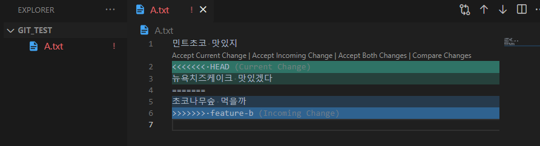

> add 취소하기

`git restore --staged {file}`

> working directory 변경사항 취소하기

**내 시간도 취소될 수 있다! 조심해**

마지막 커밋 이후의 모든 변경 사항들을 이전 상태로 돌리는 명령어

`git restore {file}`

> commit 되돌리기

`git reset --hard {c_id}`

* `--hard` option을 주고, `commit id`를 써준다

> .gitignore

* 원하지 않는 파일 제외하기

### 브랜치 Branch

**특정 커밋을 가리키는 '포인터'**

* 브랜치를 삭제한다 하더라도, 이전에 만들어둔 commit은 삭제되지 않는다!

> 협업의 시작 (collaboration)

