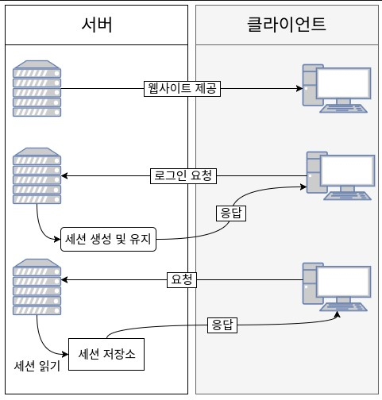
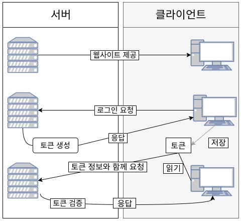

> 세션 인증 vs 토큰 인증

**인증 (Authentication)**
*사용자가 누구인지 확인하는 절차로, 회원가입 및 로그인 과정이 해당된다*

**인가 (Authorization)**
*사용자가 요청(request)하는 동작을 할 수 있는 권한이 있는지 확인하는 절차*

**인증 방식은 크게 두 가지로, `세션 기반 인증`과 `토큰 기반 인증`이 있다. 두 방식의 차이는 `인증 확인 증거를 어디에 저장하냐`에 있다. `세션 기반 인증`은 `DB 서버`에, `토큰 기반 인증`은 `클라이언트 측`에 저장한다**

* 세션 기반 인증

   * 사용자의 정보를 서버측에서 기억하고 있는 인증 방식
   * 사용자가 인증을 완료하면, 서버는 인증 정보를 세션이라고 하는 별도의 공간에 저장하는데, 보통은 메모리 또는 DB에 저장한다
   * 장점
     * 정보가 서버에 저장되므로 토큰 기반 인증에 비해 위변조 혹은 손상 우려가 없다
   * 단점
     * 서비스의 규모가 커질수록 무리를 줄 수 있다
     * 서비스의 규모가 커지면서 사용자가 늘어나게 되면 더 많은 트래픽을 처리하기 위한 조치가 필요하다. 보통은 서버를 확장하거나, 세션을 분산시키는 등의 조치가 있는데, 세션을 사용할 경우 조치가 매우 복잡해진다는 단점이 있다.

* 토큰 기반 인증

   * 대다수의 웹 어플리케이션에서 사용하는 방식으로 `JWT (JSON Web Token)`을 사용
     * 서버는 아이디, 비밀번호 등으로 인증을 완료한 사용자에게 토큰을 발급한다
     * 클라이언트는 토큰을 별도의 공간에 저장한 후, 서버에 요청(request)할 때 헤더에 토큰을 함께 보낸다
     * 서버는 해당 JWT의 유효성을 검사하고 인가한다
   * 클라이언트 측에서 JWT를 저장하는 공간은 대표적으로 localStorage, Cookie 등이 있다
   * 장점
     * JWT는 클라이언트 측에서 저장하므로 서버 메모리 또는 DB에 부담을 주지 않으며, 서버는 완전히 무상태성(Stateless)으로 남게 된다
     * 클라이언트와 서버가 독립되어 관리되어지므로 확장성(Scalability)을 확보할 수 있다
   * 단점
     * JWT가 브라우저에 그대로 노출되어있으므로 위변조, 손상의 위험이 크다 (XSS 공격)
     * 한번 발급된 토큰은 임의로 만료시킬 수 없다. 따라서 토큰이 공격자(해커)에게 탈취되었다면, 공격자는 토큰이 만료될 때까지 계속 공격할 수 있으므로 위험 확률이 크다.