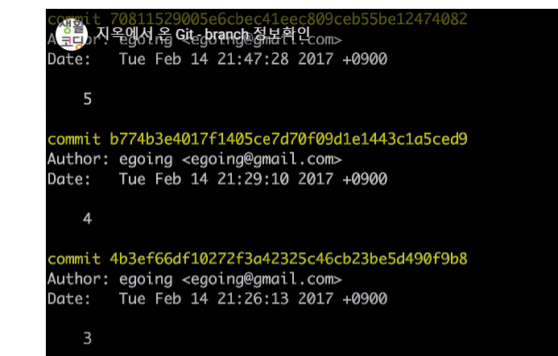
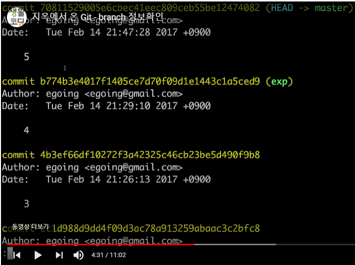
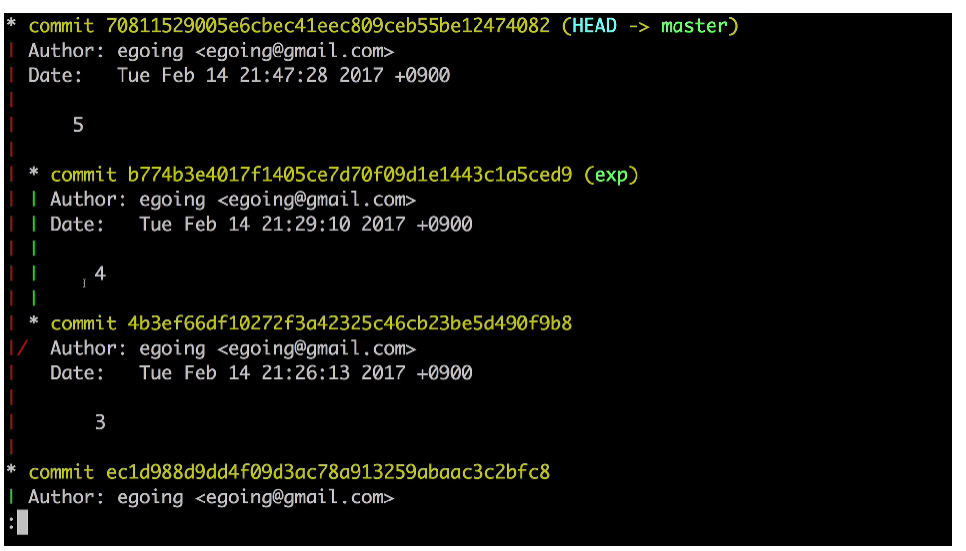
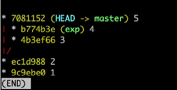
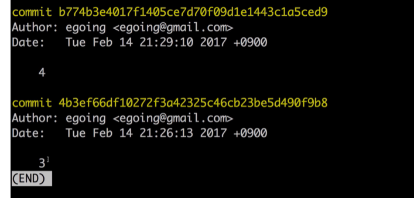
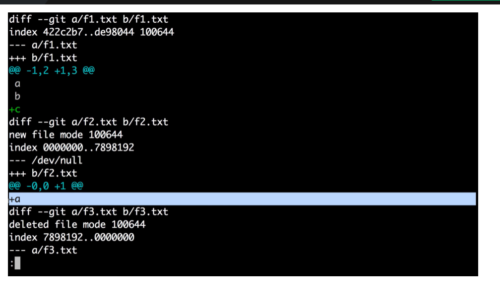

## version control system

* version management, **not by changing the file name**
* CVS, SVN, **GIT**

## backup recovery collaboration

git은 매우매우매우매우 어렵다!

기능이 덮어지고 보태지면서 ... 매우 까다로워짐

### branch

`git log --branches --decorate`

`git log --branches --decorate --graph`

master branch와 exp branch의 공통 조상은 2이다 (지금 cursor에 가려져서 안보임)

`git log --branches --decorate --graph --oneline`

`git log master..exp`

`git diff master..exp`

## git flow

1. 깃을 사용하는 방법
2. 깃을 **잘** 사용하는 방법: `git flow`를 사용하는 방법

브랜치 에픽, 커밋할때 이슈번호

브랜치를 스토리단위로 했을 때는 커밋을 어떻게 하셨을까요?

​	커밋 할때에도 스토리 번호로 하신것같아요