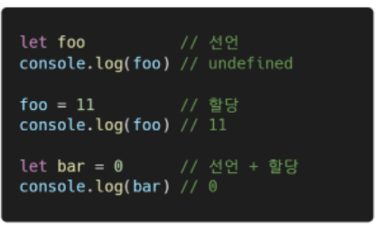
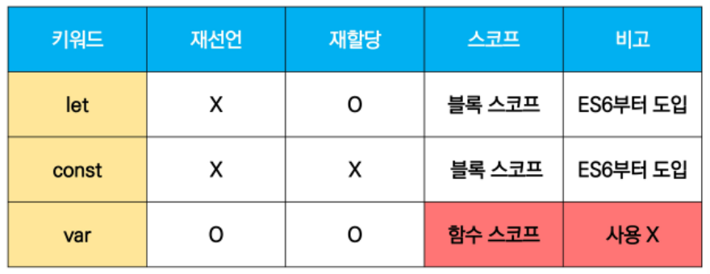
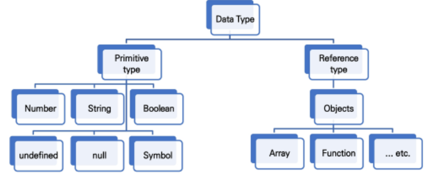

# Javascript

**JavaScript의 필요성**

* 브라우저 화면을 동적으로 만들기 위함
* 브라우저를 조작할 수 있는 **유일한 언어**

**브라우저에서 할 수 있는 일**

* DOM(Document Object Model) 조작
  * 문서(HTML) 조작
  * DOM - 해석
    * 파싱 (Parsing)
      * 구문 분석, 해석
      * 브라우저가 문자열을 해석하여 DOM Tree로 만드는 과정
* BOM(Browser Object Model) 조작
  * navigator, screen, location, frames, history, XHR
  * 자바스크립트가 브라우저와 소통하기 위한 모델
* JavaScript Core(ECMAScript)
  * Data Structure(Object, Array), Conditional Expression, Iteration
  * 브라우저(BOM & DOM)을 조작하기 위한 명령어 약속(언어)

> 브라우저(BOM) 과 그 내부의 문서(DOM)를 조작하기 위해 ECMAScrip(JS)를 학습

### 변수와 식별자

**식별자**

* 식별자는 변수를 구분할 수 있는 변수명을 말함
* 식별자는 반드시 문자, 달러 또는 밑줄로 시작
* 대소문자로 구분하며, 클래스명 외에는 모두 소문자로 시작
* 예약어(`for, if, function`) 사용 불가능

**식별자 작성 스타일**

* 카멜 스타일
  * 변수, 객체, 함수에 사용
* 파스칼 케이스
  * 클래스, 생성자에 사용
* 대문자 스네이크 케이스
  * 상수(constants)에 사용
  * 상수: 개발자의 의도와 상관 없이 **변경될 가능성이 없는 값을 의미**

**변수 선언 키워드**:star:

* let (**재할당 가능**)
  * 재할당 할 예정인 변수 선언 시 사용
  * 변수 재선언 불가능
  * 블록 스코프
* const (**재할당 불가능**)
  * 재할당 할 예정이 없는 변수 선언 시 사용
  * 변수 재선언 불가능
  * 블록 스코프
* var (*사용하지 않음*)
  * var로 선언한 변수는 재선언 및 재할당 모두 가능
  * ES6 이전에 변수를 선언할 때 사용되던 키워드
  * 호이스팅 되는 특성으로 인해 예기치 못한 문제 발생 가능
    * 호이스팅 (hoisting)
      * 변수를 선언 이전에 참조할 수 있는 현상
      * 변수 선언 이전의 위치에서 접근 시 undefined를 반환
  * 함수 스코프

* 선언(declaration)
  * 변수를 생성하는 행위 또는 시점
* 할당(assignment)
  * 선언된 변수에 값을 저장하는 행위 또는 시점
* 초기화(initialization)
  * 선언된 변수에 처음으로 값을 저장하는 행위 또는 시점

* *블록 스코프*
  * `if, for, 함수` 등의 중괄호 내부를 가리킴
  * 블로 스코프를 가지는 변수는 블록 바깥에서 접근 불가능

> let, const, var 비교 :star:

**데이터 타입 종류**

* 자바스크립트의 모든 값은 특정한 데이터 타입을 가짐
* 크게 원시 타입(primitive type)과 참조 타입(reference type)으로 분류됨
  * 원시타입
    * 객체(object)가 아닌 기본 타입
    * 변수에 해당 타입의 값이 담김
    * 다른 변수에 복사할 때 실제 값이 복사됨
  * 참조타입
    * 객체(object) 타입의 자료형
    * 변수에 해당 객체의 참조 값이 담김
    * 다른 변수에 복사할 때 참조 값이 복사됨

* 원시 타입
  * 숫자(Number) 타입
    * NAN(Not A Number) 
  * 문자열(String) 타입
    * 따옴표 대신 backtick으로 표현
    * ${expression} 형태로 표현
  * undefined
    * 변수의 값이 없음을 나타내는 데이터 타입
    * 변수 선언 이후 직접 값을 할당하지 않으면, 자동으로 undefined가 할당됨
  * null
    * 변수의 값이 없음을 **의도적**으로 표현할 때 사용하는 데이터 타입
    * `null`타입과 `typeof` 연산자
      * `typeof` 연산자 : 자료형 평가를 위한 연산자, 결과는 객체(object)로 표현됨
  * Boolean
    * 논리적 참 또는 거짓을 나타내는 타입
    * true 또는 false로 표현

**연산자**

* 할당 연산자
  * 오른쪽 피연산자의 평가 결과를 왼쪽 피연산자에 할당하는 연산자

* `=, ==, ===` 존재
* `=, ===` 이거 두가지 사용하시오..

**반복문**

* `while`
* `for`
* `for ... in`
  * 주로 객체(object)의 속성들을 순회할 때 사용
  * 배열도 순회 가능하지만 인덱스 순으로 순회한다는 보장이 없으므로 권장하지 않음
* `for ... of`
  * **반복 가능한(iterable) 객체를 순회**하며 값을 꺼낼 때 사용
    * 반복 가능한 객체 = `array, map, set, string ...`

> for in의 대상은 object이고, for of의 대상은 array이다

### 언제 let을 쓰고, 언제 const를 써야하는지???

* **let**
  * **재할당 할 예정인** 변수 선언 시 사용
* **const**
  * **재할당 할 예정이 없는** 변수 선언 시 사용

* 내가 재할당 할지 말지 어떻게 알아ㅏㅏ그니까 일단은 **const** 쓰고, 나중에 재할당 하는게 맞다 싶으면 그때 **let**으로 바꿔랏