# function in JavaScript

* 참조 타입 중 하나로써 function 타입에 속함
* JS에서 함수를 정의하는 방법은 주로 2가지
  * 함수 선언식
  * 함수 표현식

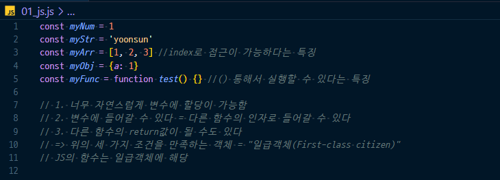

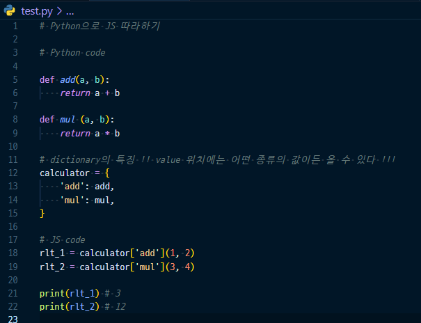

* 익명함수 (람다함수) 사용한 경우

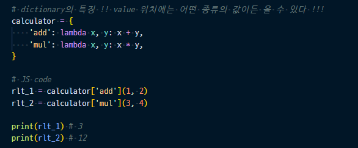

* 함수 선언식 (function statement, declaration)
* 함수 표현식

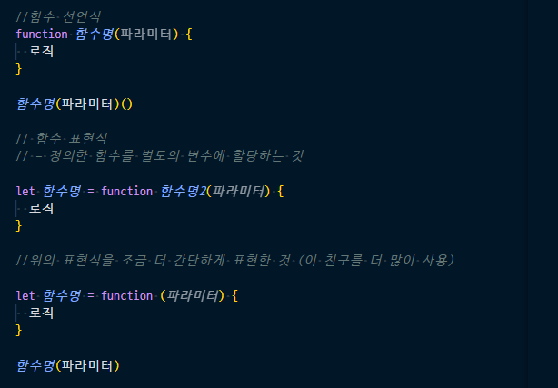

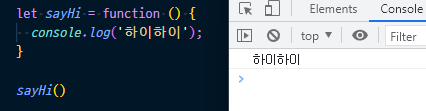

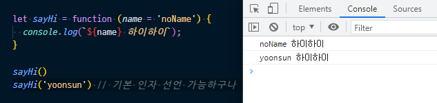

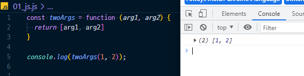

* 매개변수와 인자의 개수 불일치를 허용한다 :star:
  * 인자의 개수가 더 많은 경우/적은 경우/없는 경우 다 상관없음

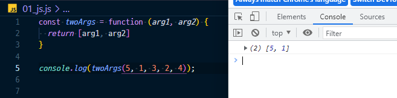

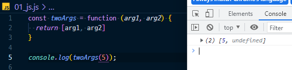

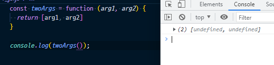

* 근데.. 매개변수와 인자 개수가 불일치하는 경우에.. 나머지 인자들을 배열로 받아서 보여주면 안될까??
  * `...` 연산자 사용! (**rest parameter**)

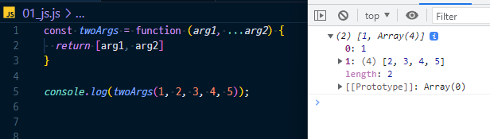

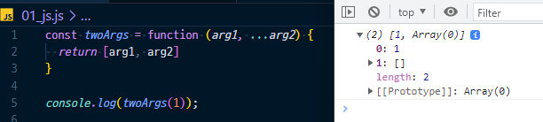

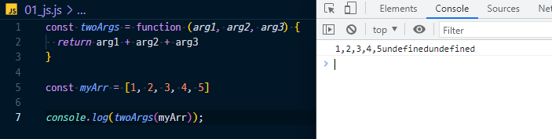

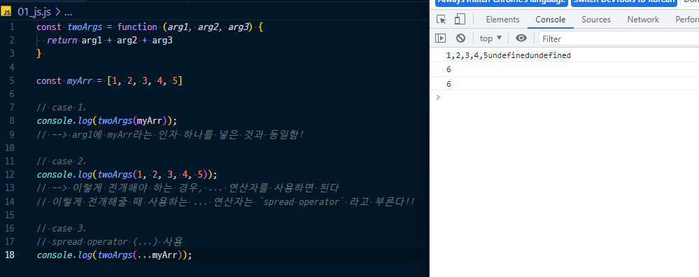

* `...` operator (어느 위치에 붙냐에 따라 이름이 달라진다) :star:
  * rest operator
  * spread operator

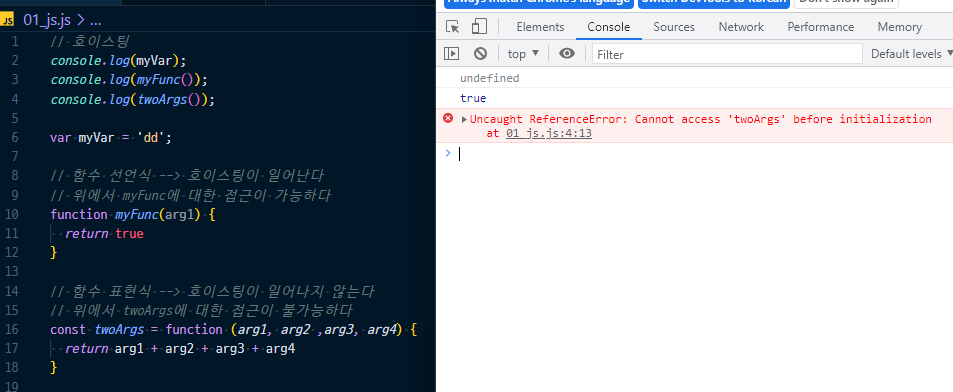

**Arrow Function**

* 함수를 비교적 간결하게 정의할 수 있는 문법
* function 키워드 생략 가능

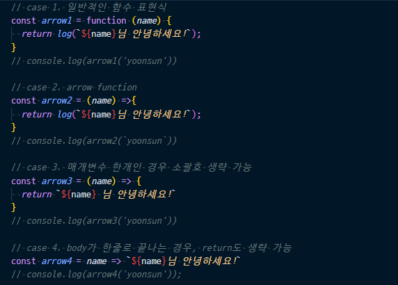

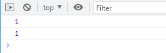

* 함수 호출의 위치가 중요한 것이 아니라, 함수 선언의 위치가 중요하다

**문자열(String)**

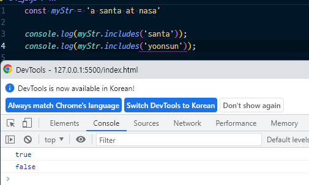

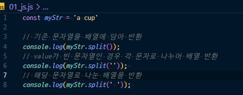

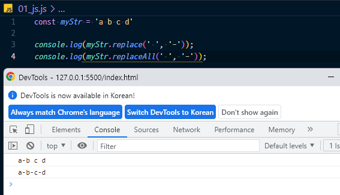

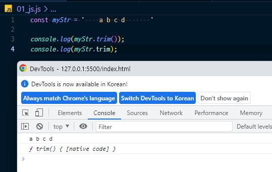

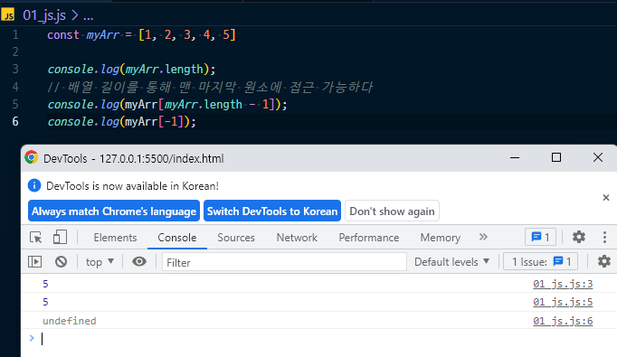

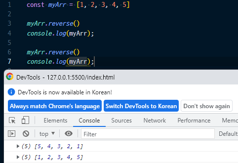

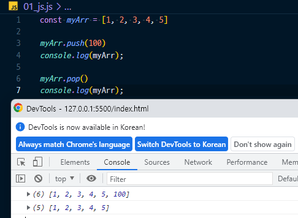

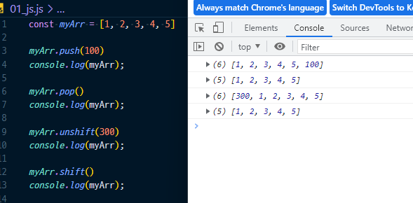

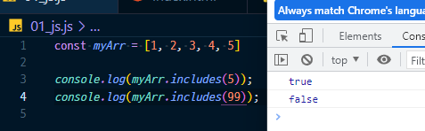

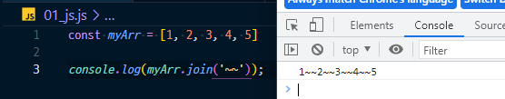

* spread operator(`...`)를 사용하여 shallow copy에 활용 가능

  * deep copy 불가
  * 1차원 배열인 경우 deep copy가 일어나는 것 처럼 보일 수 있겠지만 함정이라는 것!
  * 2차원 배열인 경우로 확인해보기

  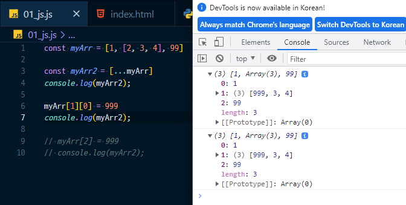

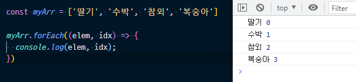

**`forEach` practice**

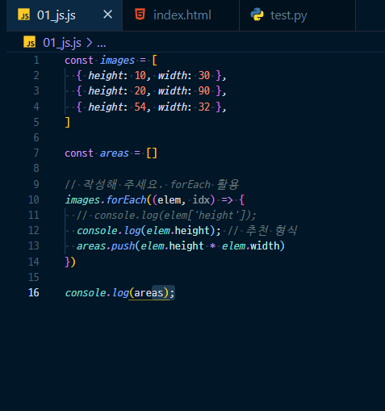