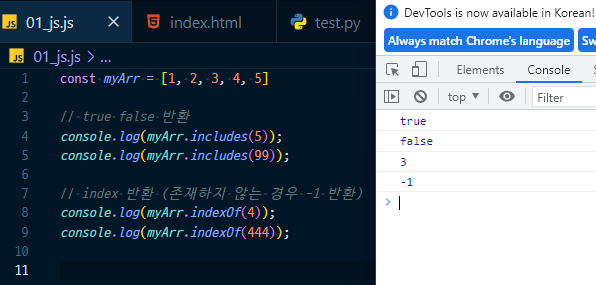
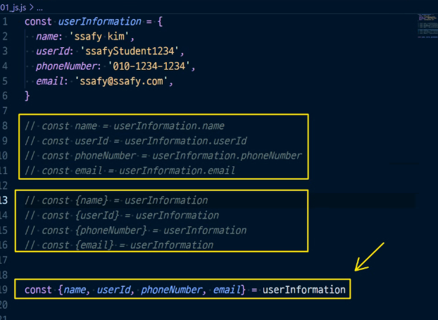
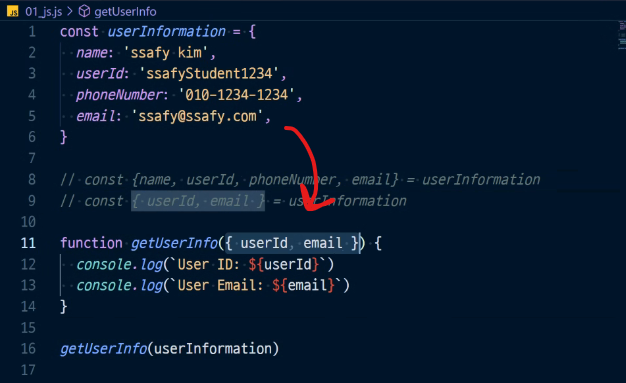
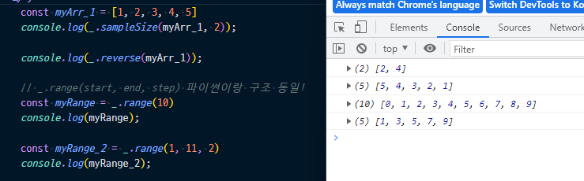

# function in JavaScript

* 참조 타입 중 하나로써 function 타입에 속함
* JS에서 함수를 정의하는 방법은 주로 2가지
  * 함수 선언식
  * 함수 표현식

* 익명함수 (람다함수) 사용한 경우

* 함수 선언식 (function statement, declaration)
* 함수 표현식

* 매개변수와 인자의 개수 불일치를 허용한다 :star:
  * 인자의 개수가 더 많은 경우/적은 경우/없는 경우 다 상관없음

* 근데.. 매개변수와 인자 개수가 불일치하는 경우에.. 나머지 인자들을 배열로 받아서 보여주면 안될까??
  * `...` 연산자 사용! (**rest parameter**)

* `...` operator (어느 위치에 붙냐에 따라 이름이 달라진다) :star:
  * rest operator
  * spread operator

**Arrow Function**

* 함수를 비교적 간결하게 정의할 수 있는 문법
* function 키워드 생략 가능

* 함수 호출의 위치가 중요한 것이 아니라, 함수 선언의 위치가 중요하다

**문자열(String)**

* spread operator(`...`)를 사용하여 shallow copy에 활용 가능

  * deep copy 불가
  * 1차원 배열인 경우 deep copy가 일어나는 것 처럼 보일 수 있겠지만 함정이라는 것!
  * 2차원 배열인 경우로 확인해보기

  

**`forEach` practice**

* `some` method
  * 배열의 요소 중 **하나라도 true 이면 true를 반환**

* `every` method
  * 배열의 **모든 요소가 true이면 true를 반환**

### 객체(Objects)

**객체의 정의와 특징**

* 객체는 속성(property의 집합)이며,  중괄호 내부에 `key`와 `value`의 쌍으로 표현
* `key`는 문자열 타입만 가능
* `value`는 모든 타입(함수 포함) 가능
* 객체 요소 접근은 점 또는 대괄호로 가능

* 세번째 반환값이 `NaN` 인 이유!
  * 메서드가 아닌 객체에서 바로 쓰는 this는 window를 의미한다

**JSON**

* JS에서는 JSON을 조작하기 위한 두 가지 내장 메서드를 제공
  * `JSON.parse()`
    * JSON => 자바스크립트 객체
  * `JSON.stringify()`
    * 자바스크립트 객체 => JSON

**lodash**

* A modern JavaScript utility library
  * 모듈성, 성능 및 추가 기능을 제공하는 JavaScript 유틸리티 라이브러리
  * array, object 등 자료구조를 다룰 때 사용하는 유용하고 간편한 유틸리티 함수들을 제공

* deep copy

