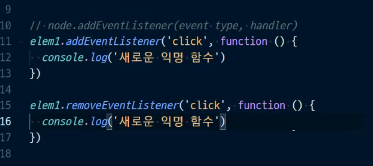

* vanilla JavaScript
  * 튜닝의 끝은 순.. 정 ..!

 

**DOM**

* 웹 페이지에 나타나는 HTML 문서 전체를 각각에 대해 **객체**로 나타낸 것 :star:
  * **객체**이므로 단순한 속성 접근, 메소드 활용이 가능
  * 주요 객체: window객체, document 객체

* 익명함수를 통해 event를 삭제할 수 없다
  * 말 그대로 이름이 없는 함수이므로 `addEventListener` 의 익명함수와, `removeEventListener`의 익명함수는 엄연히 다른 함수이기 때문이다!!!