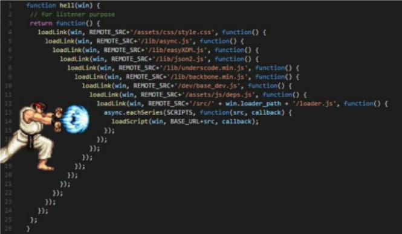

# AJAX

* Asynchronous JavaScript And XML (비동기식 JS와 XML)
* 서버와 통신하기 위해 XMLHttpRequest 객체를 활용
* JSON, XML, HTML 그리고 일반 텍스트 형식 등을 포함한 다양한 포맷을 주고 받을 수 있음
  * AJAX의 X가 XML을 의미하긴 하지만, 요즘은 더 가벼운 용량과 JS의 일부라는 장점 때문에 JSON을 더 많이 사용함

* 특징
  * 페이지 전체를 reload(새로고침)를 하지 않고서도 수행되는 **비동기성**
  * AJAX의 주요 두 가지 특징을 통해 아래의 작업이 가능함
    1. 페이지 **새로 고침 없이** 서버에 요청
       * 검색창 검색 시 나오는 연관검색어, google maps
    2. 서버로부터 데이터를 받고 작업을 수행

**XMLHttpRequest 객체**

* 서버와 상호작용하기 위해 사용되며, 전체 페이지의 새로고침 없이 데이터 받아올 수 있음
* 사용자의 작업을 방해하지 않으면서 페이지 일부를 업데이트 할 수 있음
* 주로 AJAX 프로그래밍에 사용
* 이름과 달리 XML 뿐만 아니라 모든 종류의 데이터를 받아올 수 있음
* 생성자
  * `XMLHttpRequest`

**Asynchronous JavaScript**

* 동기식(Synchronous)
  * 순차적, 직렬적 task 수행
  * 요청을 보낸 후 응답을 받아야만 다음 동작이 이루어짐 (blocking)
  * 버튼 클릭 후 alert 메세지의 확인 버튼을 누를 때까지 문장이 만들어 지지 않음
    * alert 이후 코드는 alert의 처리가 끝날 때까지 실행되지 않음

* 비동기식(Asynchronous)
  * 병렬적 task 수행
  * 요청을 보낸 후 응답을 기다리지 않고 다음 동작이 이루어짐 (non-blocking)
  * 요청을 보낸 후 응답을 기다리지 않고 다음 코드가 실행됨
    * JS는 왜 기다려주지 않는 방식으로 동작하는거지??
      * **JS는 single(1) threaded(꾼)!** 

**왜 비동기(Asynchronous)를 사용하는가?**

* "사용자 경험"
  * 매우 큰 데이터를 동반하는 앱이 있다고 가정
  * 동기식 코드라면 데이터를 모두 불러온 뒤 앱이 실행됨
    * 데이터를 모두 불러올 때까지 앱이 모두 멈춘 것처럼 보임
    * 코드 실행을 차단하여 화면이 멈추고 응답하지 않는 것 같은 사용자 경험을 제공
  * 비동기식 코드라면 **데이터를 요청하고 응답받는 동안**, **앱 실행을 함께 진행**함
    * 데이터를 불러오는 동안 지속적으로 응답하는 화면을 보여줌으로써 **더욱 쾌적한 사용자 경험을 제공**
  * 때문에 많은 웹 API 기능은 현재 비동기 코드를 사용하여 실행됨

**Threads**

* 프로그램이 작업을 완료하기 위해 사용할 수 있는 단일 프로세스
* 각 thread는 한번에 하나의 작업만 수행할 수 있음
* ex) Task A => Task B => Task C
  * 다음 작업을 시작하려면 반드시 앞의 작업이 완료되어야 함
  * 컴퓨터 CPU는 여러 코어를 가지고 있으므로 한 번에 여러가지 일을 처리할 수 있음

**JavaScript는 single threaded 이다**

* 컴퓨터가 어려 개의 CPU를 가지고 있어도 main thread라 불리는 단일 스레드에서만 작업 수행
* 즉, 이벤트를 처리하는 call stack이 하나인 언어라는 뜻
* 이 문제를 해결하기 위해 JS는
  1. 즉시 처리하지 못하는 이벤트들을 **다른 곳(Web API)**으로 보내서 처리하도록 하고
  2. 처리된 이벤트들은 처리된 순서대로 **대기실(Task queue)**에 줄을 세워두고
  3. Call Stack이 비면 **담당자(Event Loop)**가 대기 줄에서 가장 오래된(제일 앞의) 이벤트를 Call Stack으로 보냄

**Concurrency model**

* Event loop을 기반으로 하는 동시성 모델(Concurrency model)

1. Call Stack
   * 요청이 들어올 때마다 해당 요청을 순차적으로 처리하는 Stack(LIFO) 형태의 자료 구조
2. web API (Browser API)
   * JS 엔진이 아닌 브라우저 영역에서 제공하는 API
   * setTimeout(), DOM events, AJAX로 데이터를 가져오는 시간이 소요되는 일들을 처리
     * 언제 끝날지 모르는 애들은 Web API가 담당한다!
3. Task Queue
4. Event Loop

**순차적인 비동기 처리하기**

* Web API로 들어오는 순서는 중요하지 않고, 어떤 이벤트가 먼저 처리되느냐가 중요!!!
* 이를 해결하기 위해 순차적인 비동기 처리를 위한 2가지 작성 방식

1. Async callbacks
   * 백그라운드에서 실행을 시작할 함수를 호출할 때 인자로 지정된 함수
2. promise-style :star:
   * Modern Web APIs에서의 새로운 코드 스타일
   * XMLHttpRequest 객체를 사용하는 구조보다 조금 더 현대적인 버전

**Callback Function = 인자로 넘기는 함수, 지금하라는거 아니야! 있다가 해**

* 다른 함수에 인자로 전달되는 함수
* 외부 함수 내에서 호출되어 일종의 루틴 또는 작업을 완료함
* 동기식, 비동기식 모두 사용됨
* 비동기 작업이 완료된 후 코드 실행을 계속하는 데 사용되는 경우를 비동기 콜백(asynchronous callback)이라고 함

**JavaScript의 함수는 일급객체이다**

* 일급객체(일급함수)
  * 다른 객체들에 적용할 수 있는 연산을 모두 지원하는 객체(함수)
* 일급객체의 조건
  * 인자로 넘길 수 있어야 함
  * 함수의 리턴 값으로 사용 가능해야 함
  * 변수에 할당할 수 있어야 함

**Async callbacks** (no중요)

* 백그라운드에서 코드 실행을 시작할 함수를 호출할 때 인자로 지정된 함수
* 백그라운드 코드 실행이 끝나면 callback 함수를 호출하여 작업이 완료되었음을 알리거나, 다음 작업을 실행하게 할 수 있음
* callback 함수를 다른 함수의 인수로 전달할 때, 함수의 참조를 인수로 전달할 뿐이지 즉시 실행되지 않고, 함수의 body에서 "called back"됨. 정의된 함수는 때가 되면 callback 함수를 실행하는 역할을 함

**왜 callback 함수를 사용해야 하는가?** (no중요)

* callback 함수는 명시적인 호출이 아닌 특정 루틴 혹은 action에 의해 호출되는 함수
* Django의 경우 **"요청이 들어오면"**, event의 경우 **"특정 이벤트가 발생하면"**이라는 조건으로 함수를 호출할 수 있었던 건 'Callback function' 개념 때문에 가능
* 비동기 로직을 수행할 때 callback 함수는 필수
  * 명시적 호출이 아니라, 다른 함수의 매개변수로 전달하여 해당 함수 내에서 특정 시점에 호출

**callback Hell...** 에..네..르..기...파...!

* request를 이어서 하고싶은데 들여쓰기가 점점 미쳐버리는것이다..

**callback Hell 해결방법**

* Promise callbacks (Promise 콜백 방식 사용)

**Promise object**

* 비동기 작업의 최종 완료 또는 실패를 나타내는 객체

  * 미래의 완료 또는 실패와 그 결과 값을 나타냄
  * 미래의 어떤 상황에 대한 약속

* 성공(이행)에 대한 약속

  * `.then(callback)`
    * 이전 작업(promise)이 성공했을 때(이행했을 때) 수행할 작업을 나타내는 callback 함수
    * 그리고 각 callback 함수는 이전 작업의 성공 결과를 인자로 전달받음
    * 따라서 성공했을 때의 코드를 callback 함수 안에 작성

* 실패(거절)에 대한 약속

  * `.catch(callback)`
    * `.then`이 하나라도 실패하면(거부되면) 동작
    * 이전 작업의 실패로 인해 생성된 error 객체는 catch 블록 안에서 사용할 수 있음

  

**Promise methods**

* Promise는 **객체**인데 3가지의 상태를 가지고 동작을 한다
  1. pending 상태 (모든 객체의 시작 상태)
  2. fulfilled 상태 (성공 시 fulfilled 상태)
  3. rejected 상태 (실패하면 rejected 상태)

* 각각의 `.then()` 블록은 서로 다른 promise를 반환
  * 즉, `.then()`을 여러 개 사용(chaining)하여 연쇄적인 작업을 수행할 수 있음
  * 결국 여러 비동기 작업을 차례대로 수행할 수 있다는 뜻
* `.then()`과 `.catch()` 메서드는 모두 promise를 반환하므로 chaining 가능
* 주의할 점!
  * **반환 값이 반드시 있어야 함**
  * 없다면 callback 함수가 이전의 promise 결과를 받을 수 없음

* `.finally(callback)`
  * promise 객체를 반환
  * 결과와 상관 없이 무조건 지정된 callback 함수가 실행
  * 어떠한 인자도 전달받지 않음
    * promise가 성공되었는지 거절되었는지 판단할 수 없기 때문
  * 무조건 실행되어야 하는 절에서 활용
    * `.then()`과 `.catch()` 블록에서의 코드 중복을 방지

**Axios**

* "Promise based HTTP client for the browser and Node.js"
* 브라우저를 위한 Promise 기반의 클라이언트
* 원래는 "XHR"이라는 브라우저 내장 객체를 활용해 AJAX 요청을 처리하는데, 이보다 편리한 AJAX 요청이 가능하도록 도움을 줌