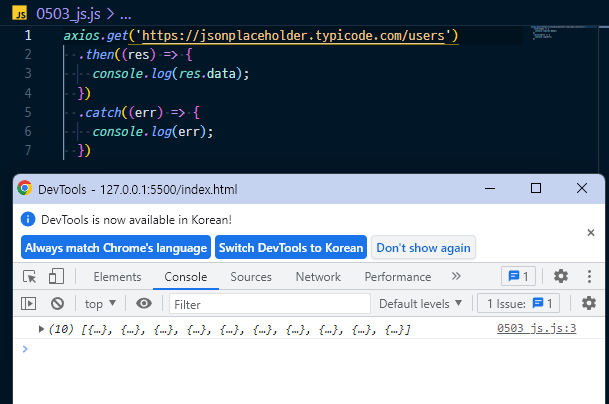
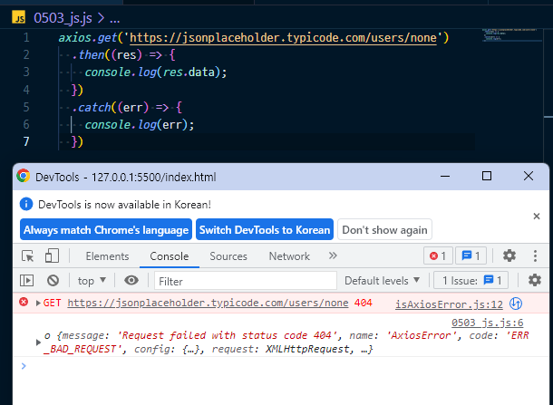

* 성공

* 실패

> Summary

1. promise 객체를 리턴하는 경우
   * 리턴하는 promise 객체와 동일한 작업 성공 결과와 상태를 갖게 됨
2. promise 객체가 아닌 값을 리턴하는 경우
   * 숫자, 문자열, 객체 ... => fulfilled 상태를 가짐 (성공으로 인식)
   * 즉, then 뒤에 then chaining 가능
3. promise 객체가 아무런 값도 리턴하지 않는 경우
   * undefined가 리턴됨 => fulfilled 상태를 가짐 (성공으로 인식)

