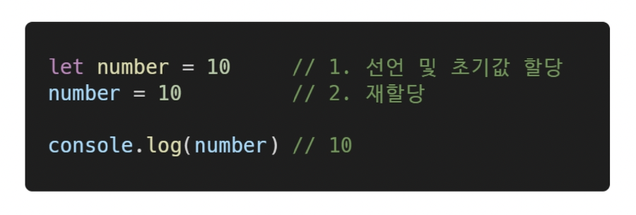
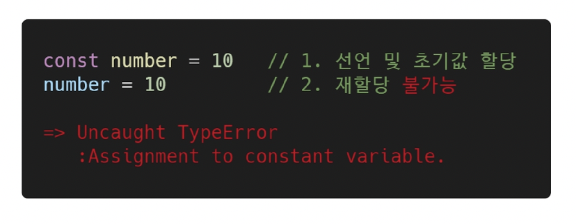
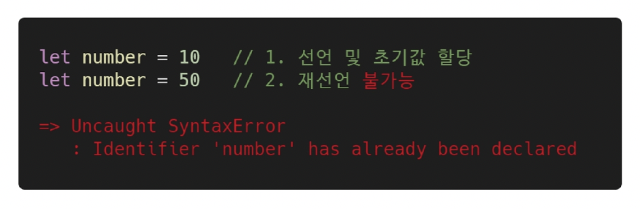
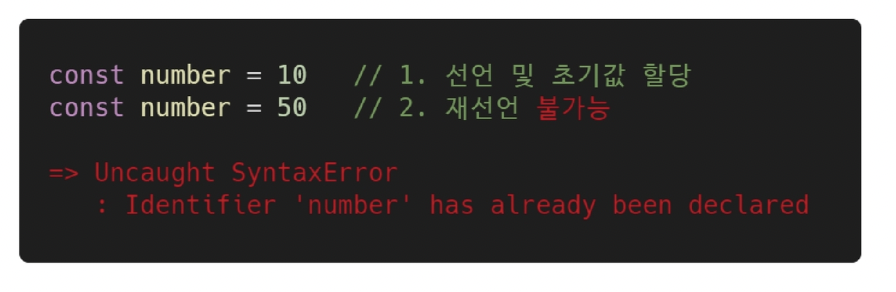
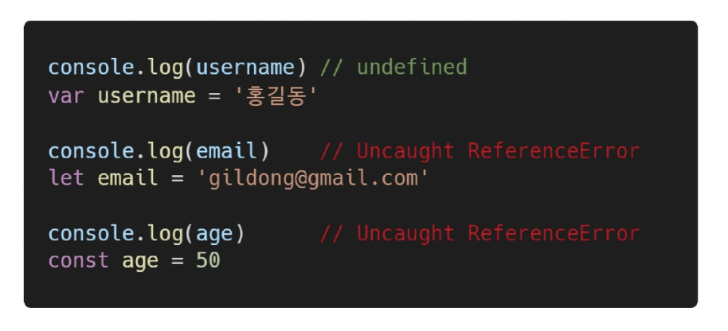

# JS

## intro

* 서버 ---> (응답) ---> 브라우저
* js의 필요성
  * 브라우저 화면을 동적으로 만들기 위함
  * 브라우저를 조작할 수 있는 유일한 언어 :star:
* 브라우저에서 할 수 있는 일
  * DOM(Document Object Model) 조작
    * 문서(HTML) 조작; 문서를 프로그램으로 조작할 수 있음
    * DOM - 해석
      * 파싱 (parsing); 구문 분석, 해석
    * DOM - 조작
  * BOM(Browser Object Model) 조작
    * 브라우저에 대한 제어권까지 얻어버림..!
  * JavaScript Core (ECMAScript)
    * 브라우저(DOM & BOM)을 조작하기 위한 명령어 약속(언어)
* summary: **브라우저(BOM)과 그 내부의 문서(DOM)를 조작하기 위해 JS를 학습**

******

## 변수와 식별자

**식별자 정의와 특징**

* 식별자는 변수를 구분할 수 있는 변수명을 뜻함
* $ 또는 _ 로 시작
* 대소문자 구분하며, 클래스명 외에는 모두 소문자로 시작
* 예약어 사용 불가 (for, if, function ...)
* 식별자 작성 스타일
  * 카멜 케이스(camelCase)
    * 변수, 객체, 함수에 사용
  * 파스칼 케이스(PascalCase)
    * 클래스, 생성자에 사용
  * 대문자 스네이크 케이스(SNAKE_CASE)
    * 상수(const)에 사용

**변수 선언 키워드 (let, const)**

*JS에서는 선언과 할당을 분리해서 또는 동시에 할 수 있다*

* 선언(declaration): 변수를 생성하는 행위 또는 시점
* 할당(assignment): 선언된 변수에 값을 저장하는 행위 또는 시점
* 초기화(initialization): 선언된 변수에 처음으로 값을 저장하는 행위 또는 시점

재할당 여부 (**let** vs **const**)

*재할당이란? 값을 바꿔주는 것이 아니라, **= 이라는 기호를 다시 쓸 수 있냐 마냐**가 중요한 것!!!!!!!!!*

* let (재할당 가능)

  

* const (재할당 불가능)

  

재선언 여부 (**let** vs **const**)

* let, const (둘 다 재선언 불가능)

  

  

* 블록 스코프 (block scope)
  * If, for, 함수 등의 중괄호 내부를 의미
  * 블록 스코프를 가지는 변수는 **블록 바깥에서 접근 불가능**

* var

  * var로 선언한 변수는 재선언 및 재할당 모두 가능

  * ES6 이전에 변수 선언 시 사용

  * 지금은 사용을 지양함

  * **호이스팅**; 감아 올리기 --> var 사용 시 발생하는 문제

    * 변수를 선언 이전에 참조할 수 있는 현상
    * 변수 선언 이전의 위치에서 접근 시 undefined를 반환

    

