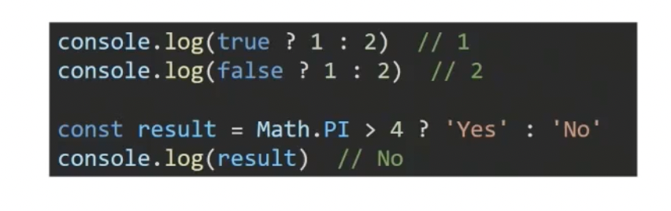

# JS review

* 데이터 타입 종류
  * JS 모든 값은 특정한 데이터 타입을 가짐
  * 크게 원시 타입(primitive type)과 참조 타입(reference type)으로 분류됨
    * 원시 타입(primitive type)
      * 객체가 아닌 기본 타입
      * 변수에 해당 타입의 값이 담김
      * 다른 변수에 복사할 때 실제 값이 복사됨
    * 참조 타입(reference type)
      * 객체 타입의 자료형
      * 변수에 해당 객체의 참조 값이 담김
      * 다른 변수에 복사할 때 참조 값이 복사됨

* 원시 타입
  * 숫자(number) 타입
    * 정수, 실수 구분이 없음
    * 부동소수점 형식을 따름
    * NaN (Not-A-Number)
    * **Number 타입은 0, -0, NaN을 제외한 모든 경우 참으로 형변환 된다**
  * 문자열(string) 타입
    * 템플릿 리터럴
      * 따옴표 대신 backtick을 사용
      * ${expression} 형태로 사용
  * undefined
    * 변수 선언 시 아무 값도 할당하지 않으면 자바스크립트가 자동으로 할당
  * null
    * 변수의 값이 없음을 **의도적으로 표현**할 때 사용
  * Boolean 타입
    * true, false (소문자 주의)


*****

## 연산자

* 할당 연산자

  * 오른쪽에 있는 피연산자의 평가 결과를 왼쪽 피연산자에 할당하는 연산자

* 비교 연산자

  * 피연산자들(숫자, 문자, boolean 등)을 비교하고 결과값을 boolean으로 반환하는 연산자

  ```javascript
  // 아스키코드(정확히 말하면 유니코드)를 비교!
  'a' > 'z' // false
  'a' < 'z' // true
  ```

* 동등 비교 연산자 (==)

  * 웬만하면 쓰지 말아라..
  * *javascript sponge bob*

* 일치 비교 연산자 (===)

  * 두 피연산자가 같은 값으로 평가되는지 비교 후 boolean 값을 반환
  * **엄격한 비교가 이루어지며, 암묵적 타입 변환이 발생하지 않음**
    * 두 비교 대상의 **타입과 값 모두** 같은지 비교하는 방식

* 논리 연산자

  * 세가지 논리 연산자로 구성

    * and 연산은 `&&` 연산자를 사용

    * or 연산은 `||` 연산자를 사용

    * not 연산은 `!` 연산자를 사용

      ```javascript
      !true => false
      !!true => true
      ```

  * 단축 평가 지원

    ```javascript
    false && true => false
    true || false => true
    ```

* 삼항 연산자 (Ternary Operator)

  * 세 개의 피연산자를 사용하여 조건에 따라 값을 반환하는 연산자
  * 가장 왼쪽의 조건식이 참이면 콜론(:) 앞의 값을 사용하고 그렇지 않으면 콜론(:) 뒤의 값을 사용
  * 삼항 연산자의 결과 값이기 때문에 변수에 할당 가능
  * *한 줄에 표기하는 것을 권장*

  

