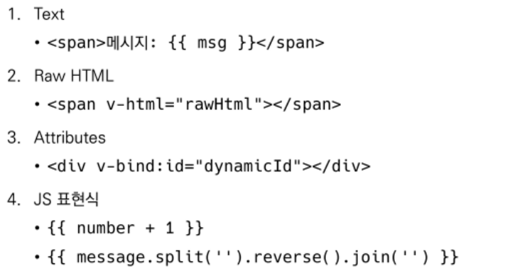
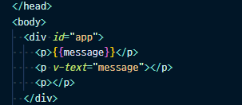
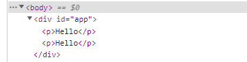

# Vue.js

FE Development

* HTML/CSS, JS를 활용해서 데이터를 볼 수 있게 만들어 줌
  * 이 작업을 통해 사용자(User)는 데이터와 상호작용(Interaction) 할 수 있음
* 대표적인 프론트엔드 프레임워크
  * Vue.js, React, Angular

SPA

* Single Page Application (단일 페이지 애플리케이션)
* 현재 페이지를 동적으로 렌더링함으로써 사용자와 소통하는 웹 애플리케이션

* 단일 페이지로 구성되며 서버로부터 최초에만 페이지를 다운로드하고, 이후에는 동적으로 DOM을 구성
  * 처음 페이지를 받은 이후부터는 서버로부터 새로운 전체 페이지를 불러오는 것이 아닌, 현재 페이지 중 필요한 부분만 동적으로 다시 작성함
* 연속되는 페이지 간의 사용자 경험(UX)을 향상
  * 모바일 사용량이 증가하고 있는 현재 트래픽의 감소와 속도, 사용성, 반응성의 향상은 매우 중요하기 때문
* 동작 원리의 일부가 CSR(Client Side Rendering)의 구조를 따름

CSR

* Client Side Rendering
* 서버에서 화면을 구성하는 SSR 방식과 달리 클라이언트에서 화면을 구성
* 최초 요청 시 HTML, CSS, JS 등 데이터를 제외한 각종 리소스를 응답받고 이후 클라이언트에서는 필요한 데이터만 요청해 JS로 DOM을 렌더링하는 방식

* 장점
  1. 서버와 클라이언트 간 트래픽 감소
     * 웹 애플리케이션에 필요한 모든 정적 리소스를 최초에 한 번 다운로드 후 필요한 데이터만 갱신
  2. 사용자 경험 향상
     * 전체 페이지를 다시 렌더링하지 않고 변경되는 부분만을 갱신하기 때문
* 단점
  1. SSR에 비해 전체 페이지 최종 렌더링 시점이 느림
  2. SEO(검색 엔진 최적화)에 어려움이 있음 (최초 문서에 데이터 마크업이 없기 때문)

SSR

* Server Side Rendering
* 서버에서 클라이언트에게 보여줄 페이지를 모두 구성하여 전달하는 방식
* JS 웹 프레임워크 이전에 사용되던 전통적인 렌더링 방식
  * 전통적이라고 안쓰는거 아님... 잘 쓰고 있음
* 장점
  1. 초기 구동 속도가 빠름
     * 클라이언트가 빠르게 컨텐츠를 볼 수 있음
  2. SEO(검색 엔진 최적화)에 적합
     * DOM에 이미 모든 데이터가 작성되어있기 때문
* 단점
  1. 모든 요청마다 새로운 페이지를 구성하여 전달
     * 반복되는 전체 새로고침으로 인해 사용자 경험이 떨어짐 
     * 상대적으로 트래픽이 많아 서버 부담이 클 수 있음

*그래서 SSR과 CSR을 같이 쓴다*

SSR & CSR

* 두 방식의 차이는 최종 HTML 생성 주체가 누구인가에 따라 결정
* 즉, 실제 브라우저에 그려질(렌더링) HTML을 서버가 만든다면 SSR/클라이언트가 만든다면 CSR
  * 비용적인 측면이라면.. CSR을 선택하겠어

* 단, 특정 요소만 JS(AJAX&DOM조작)를 활용 (CSR)
  * AJAX를 활용해 비동기 요청으로 필요한 데이터를 클라이언트에서 서버로 직접 요청을 보내 받아오고 JS를 활용해 DOM을 조작

### Concepts of Vue.js

**MVVM(Model View ViewModel) Pattern** in Vue.js

* View = HTML
* Model = {key: value}
* ViewModel = DOM과 DATA의 중개자

Django & Vue.js 코드 작성 순서

* Django
  * "데이터의 흐름"
  * url => views => template
* Vue.js
  * "Data가 변화하면 DOM이 변경"
    1. Data 로직 작성
    2. Dom 작성

### Basic syntax of Vue.js

* Option/DOM - `'el'`
* Option/Data - `'data'`
* Option/Data - `'methods'`
  * 화살표 함수를 메서드 정의할 때 사용하면 안 됨!!!
    * 화살표 함수 사용하면 안되는 경우
      1. data
      2. method 정의

Template Syntax

* Interpolation (보간법)

* 나는 이렇게 message를 불렀는데 (2가지 방법)

* 최종적으로 렌더링은 요렇게 된다!

