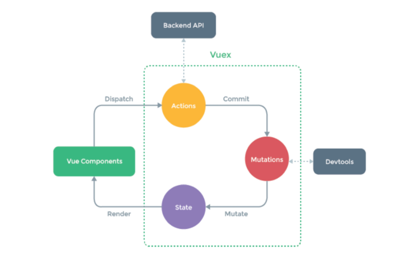
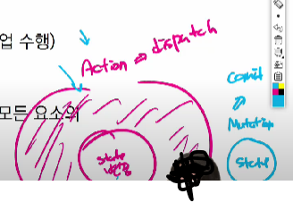
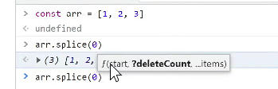
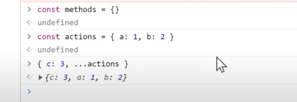
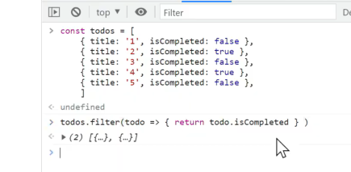
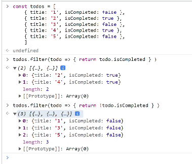
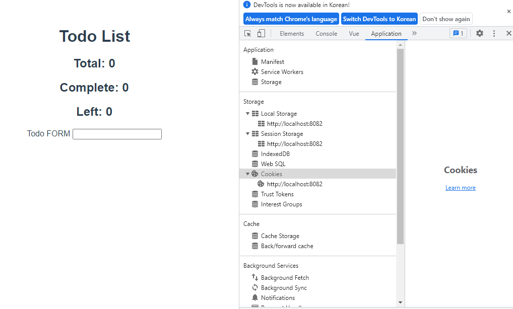

# Vuex

* "Statement management pattern + Library" for vue.js
  * 상태 관리 패턴 + 라이브러리
* 상태(state)를 전역 저장소로 관리할 수 있도록 지원하는 라이브러리
  * 애플리케이션의 모든 컴포넌트에 대한 **중앙 집중식 저장소** 역할

State

* state = data, 애플리케이션의 핵심이 되는 요소
* 상태 관리 패턴
  * 컴포넌트의 공유된 상태를 추출하고 이를 전역에서 관리하도록 함

기존 Pass props & Emit event

* 각 컴포넌트는 독립적으로 데이터를 관리
* 데이터는 단방향 흐름으로 부모에서 자식간의 전달만 가능하며, 반대의 경우는 이벤트를 트리거
  * state는 앱을 작동하는 원본 소스 (data)
  * view는 state의 선언적 매핑
  * action은 view에서 사용자 입력에 대해 반응적으로 state를 바꾸는 방법 (methods)
* 장점
  * 데이터의 흐름을 직관적으로 파악 가능
* 단점
  * 컴포넌트의 중첩이 깊어지는 경우 **동위 관계의 컴포넌트로의 데이터 전달이 불편**해짐

Vuex management pattern

* 중앙 저장소(store)에 state(=data)를 모아놓고 관리
* 규모가 큰 프로젝트에 매우 효율적
* 각 컴포넌트에서는 중앙 집중 저장소의 state 만 신경씀녀 됨
  * 동일한 state를 공유하는 다른 컴포넌트들도 동기화 됨

Vuex 핵심 컨셉

1. State (= data)
   * "중앙에서 관리하는 모든 상태 정보(data)"
     * vuex는 single state tree를 사용
     * 즉, 이 단일 객체는 모든 애플리케이션 상태를 포함하는 "원본 소스" 역할을 함
     * => 각 애플리케이션마다 하나의 저장소만을 가짐
2. Mutations (= data의 변경)
   * "실제로 state를 변경하는 유일한 방법"
   * mutation의 handler(핸들러 함수)는 반드시 동기적이어야 함
     * commit을 하는 부분이라 매우 위험함! (비동기적 요소가 있으면 안됨)
     * 비동기적 로직은 state가 변화하는 시점이 의도한 것과 달라질 수 있으며, 추적할 수 없음
   * Actions에서 commit() 메서드에 의해 호출됨
3. Actions (= mutation을 제외한 나머지 함수, 모든 행동들을 의미)
   * Mutation과 유사(=함수임)하지만 차이점이 있음
     * state 변경하는 대신 commit() 메서드로 호출해서 실행
     * 비동기 작업이 포함될 수 있음
   * context 객체 인자를 받음
     * state를 직접 변경하지 않음
   * 컴포넌트에서 dispatch() 메서드에 의해 호출됨
4. Getters (= computed)
   * state를 기반으로 추출해내는 값
     * data를 기반으로 추출해내는 값인 computed와 똑같다고 생각하면 됨
   * getters 자체가 state를 변경하지는 않음
     * state를 특정한 조건에 따라 구분만 함
5. 이외..
   * vue components (= 화면)

끝난 애들과 안끝난 애들을 가지고 있는 상황ㅇ...

기존 data 기반으로 추출해낸 것이지(or 계산해낸 것이지)

* 근데.. 지금 새로고침 할때마다 data가 사라지는 불편..함
  * 당연하지.. data 관리를 안해주는데...
  * 근데 내가 남의 todo까지 꼭 data 중앙서버 관리를 통해 다 관리를 해야 할까 ..?
  * 그냥 저장만 하고 싶은데...

* Local Storage
  * 영구 저장
  * 여기에다가 데이터를 저장할것임!
  * 사용자의 컴퓨터! 의 로컬 스토리지에! 저장하는거니까! 내 저장소에는 없는거지롱
* Session Storage
  * tab이 켜져 있는 동안만 data 유지됨