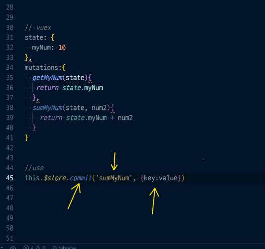
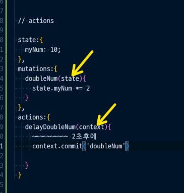
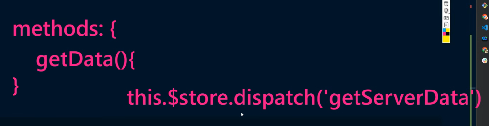
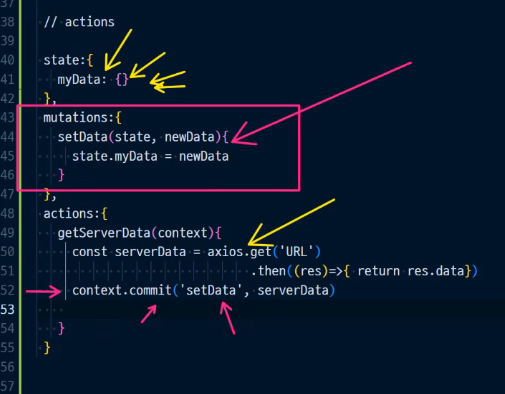

```javascript
// vue way
data: {
  message: 'hello'
}

// vuex way
state: {
  message: 'hello'
}

// use; vue
<p>{{ message }}</p>

// use; vuex
<p>this.$store.state.message</p>


// getters == computed
state {
  myNum: 10
},
getters: {
  getNum(state) {
    return state.myNum
  },
  doubleNum(state) {
    return state.myNum * 2
  },
}

<p>{{ this.$state.getters.getNum }}</p>
```






`this.$store.dispatch('delayDoubleNum')` => actions를 불러올 때

* step 1



* step 2




### Vuex를 쓰는 것이 무조건 좋은 것일까?

아니다! 다수의 component들이 접근해야 하는 data라면 vuex를 사용하는 것이 유리하겠지만, 그것이 아니라면(즉, 바로 접근할 수 있는 거리의 컴포넌트라면) vue를 사용하는 것이 훨씬 유리하다