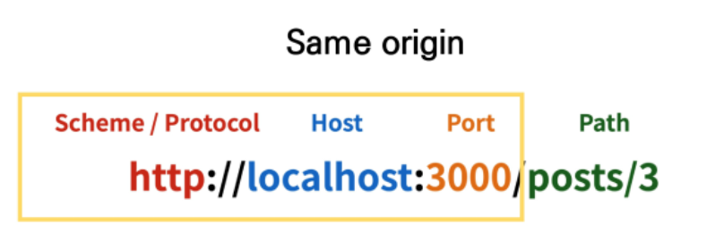
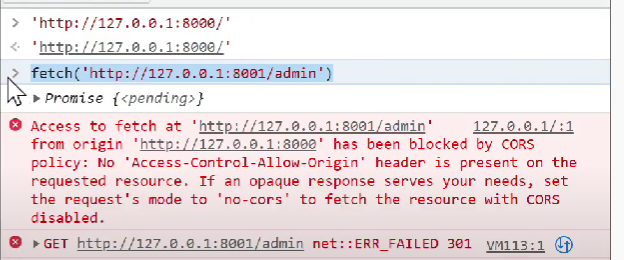
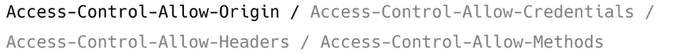
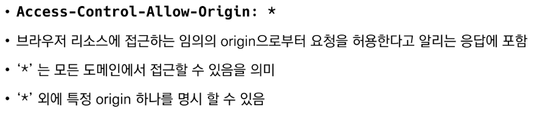
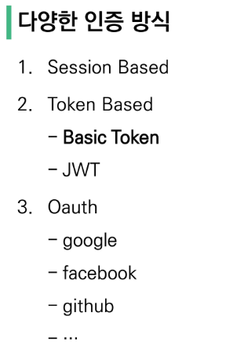
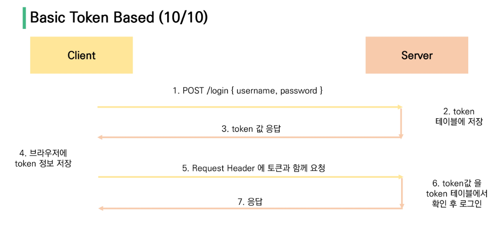

## Server & Client

* server는 **정보 제공**
  * DB와 통신하며 데이터를 CRUD
  * 요청을 보낸 Client에게 이러한 정보를 응답

* client는 **정보 요청 & 표현**
  * server에게 정보(데이터) 요청
  * 응답 받은 정보를 잘 가공하여 화면에 보여줌

## Start project Model + Serializer (실습)

## CORS

브라우저 정책..

* Same-Origin policy (SOP)

  * 동일 출처 정책
  * 특정 출처(origin)에서 불러온 문서나 스크립트가 다른 출처에서 가져온 리소스와 상호작용 하는 것을 제한하는 보안 방식
  * 잠재적으로 해로울 수 있는 문서를 분리함으로써 공격받을 수 있는 경로를 줄임

  

  * port number가 8000인 곳에서 8001인 곳으로 요청을 보내려고 하면 error가 발생!

* 교차 출처 리소스(자원) 공유

Cross-Origin Resource Sharing

* **추가 HTTP header를 사용**하여, 특정 출처에서 실행중인 웹 애플리케이션이 **다른 출처의 자원에 접근할 수 있는 권한을 부여하도록 브라우저에 알려주는 체제**
* 리소스가 자신의 출처(Domain, Protocal, Port)와 다를 때 교차 출처 HTTP 요청을 실행
* 보안 상의 이유로 브라우저는 교차 출처 HTTP 요청을 제한 (SOP)
  * 예를 들어 XMLHttpRequest는 SOP를 따름 
* 다른 출처의 리소스를 불러오면 그 출처에서 **올바른 CORS header를 포함한 응답을 반환**해야 함
  * 응답을 주는 server에서 문제를 해결해야 함!

Cross-Origin Resource Sharing Policy (CORS Policy)

* 교차 출처 리소스(자원) 공유 정책
* 다른 출처(origin)에서 온 리소스를 공유하는 것에 대한 정책
* <=> SOP

교차 출처 접근 허용하기

* CORS를 사용해 교차 출처 접근 허용하기
* CORS는 HTTP의 일부로, 어떤 호스트에서 자신의 컨텐츠를 불러갈 수 있는지 **서버에 지정할 수 있는 방법**

why CORS??

1. 브라우저 & 웹 애플리케이션 보호
   * 악의적인 사이트의 데이터를 가져오지 않도록 사전 차단
   * 응답으로 받는 자원에 대한 최소한의 검증
   * 서버는 정상적으로 응답하지만 브라우저에서 차단
2. Server의 자원 관리
   * 누가 해당 리소스에 접근할 수 있는지 관리 가능

how CORS??

* CORS 표준에 의해 추가된 HTTP Header를 통해 이를 통제
* CORS HTTP 응답 헤더 예시
  * 
  * `Access-Control-Allow-Origin` 응답 헤더
    * 이 응답이 주어진 출처(origin)로 부터 요청 코드와 공유될 수 있는지를 나타냄
    * 

`django-cors-headers` 라이브러리

* 응답에 CORS header를 추가해주는 라이브러리
* 다른 출처에서 보내는 django 애플리케이션에 대한 브라우저 내 요청을 허용함
* django app이 header 정보에 CORS를 설정한 상태로 응답을 줄 수 있게 도와주며, 이 설정을 통해 브라우저는 다른 origin에서 요청을 보내는 것이 가능해짐

## Authentication & Authorization

* authentication
  * 사원증 그 자체
  * django => 게시판 서비스 로그인
* authorization
  * 사용자에게 특정 리소스 또는 기능에 대한 액세스 권한을 부여하는 과정(절차)
  * 인증이 되어있더라도 모든 권한을 부여 받는 것은 아님
    * django에서 로그인(인증)을 했더라도 다른 사람의 글까지 수정/삭제가 가능(권한)하지 않음
  * django => 일반 유저 vs 관리자 유저

DRF Authentication

* Basic Token Authentication

* JWT
  * JSON Web Token
  * 기본 토큰 인증 체계와 달리 JWT 인증 확인은 데이터베이스를 사용해서 토큰의 유효성을 검사할 필요가 없음
  * 장점
    * 즉, JWT는 데이터베이스에서 유효성 검사가 필요 없음
    * JWT 자체가 인증에 필요한 정보를 모두 갖기 때문 (self-contained)
    * 이는 세션 혹은 기본 토큰을 기반으로 한 인증과의 핵심 차이점
  * 단점
    * 토큰 탈취시 서버 측에서 토큰 무효화가 불가능 (블랙리스팅 테이블 활용)
    * 매우 짧은 유효기간(5min)과 Refresh 토큰을 활용하여 구현
    * MSA(Micro Server Architecture) 구조에서 서버간 인증에 활용
    * One Source(JWT) Multi Use 가능