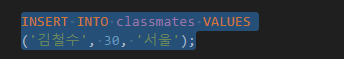
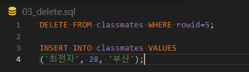

## DataBase

> 데이터베이스

* 체계화된 데이터의 모임
* 몇 개의 자료 파일을 조직적으로 통합하여 자료 항목의 중복을 없애고 자료를 구조화하여 기억시켜 놓은 자료의 집합체
* 장점들
  * 데이터 중복 최소화, 무결성, 일관성, 독립성 ...

> RDB (관계형 데이터베이스)

* Relational Database
* 키와 값들의 간단한 관계를 표 형태로 정리한 데이터베이스
* 관계형 모델에 기반
* 용어 정리
  * 스키마(schema) : 데이터베이스에 대한 전반적인 명세를 기술
  * 테이블(table) : column(컬럼/필드), row(레코드/값)을 사용하여 조직된 데이터 요소들의 집합
  * column : 고유한 데이터 형식이 지정됨
  * row : 실제 데이터가 저장되는 형태
  * 기본키(primary key, PK) : 각 행(레코드)의 고유 값, 반드시 설정해야 함

> RDBMS (관계형 데이터베이스 관리 시스템)

* MySQL, SQLite ...
* SQLite : 서버 형태가 아닌 파일 형식으로 응용 프로그램에 넣어서 사용하는 비교적 가벼운 데이터베이스
* Sqlite Data Type (동적 타입을 선호함)
  1. NULL (none 을 표현)
  2. INTEGER
  3. REAL
  4. TEXT
  5. BOLB (입력된 그대로 정확히 저장된 데이터)

* Sqlite Type Affinity
  1. INTEGER
  2. TEXT
  3. BLOB
  4. REAL
  5. NUMERIC

> SQL (Structured Query Language)

* 관계형 데이터베이스 관리시스템의 데이터 관리를 위해 설계된 특수 목적의 프로그래밍 언어
* 크게 3가지로 분류 가능
  * DDL - 데이터 정의 언어
  * DML - 데이터 조작 언어 (INSERT, SELECT, UPDATE, DELETE) **CRUD**를 위해 필수:star:
  * DCL - 데이터 제어 언어

* DML (Data Manipulation Language)

> 실습을 진행해보자 !

* .database 에서 '.'은 프로그램의 기능을 수행하는 것

* `CREATE TABLE` : 표 생성
* `DROP TABLE` : 표 삭제

> CREATE

* INSERT

  * "insert a single row into a table"
  * 특정 테이블에 레코드(행)를 삽입(생성)!
  * `INSERT INTO <table_name> (column1, column2, ...) VALUES (values1, values2, ...)`

  

  * 모든 열에 데이터가 있는 경우 column을 명시하지 않아도 됨

  * SQLite는 따로 PK 속성의 컬럼을 작성하지 않으면 값이 자동으로 증가하는 PK옵션을 가진 `rowid` 컬럼을 정의

    `SELECT rowid, * FROM classmates;`

* database은 기본적으로 빈값을 허용하지 않는다

  * `NOT NULL` 속성을 초반에 지정해주어야 함
  * table 지우고 새로 생성하기

  

  * `PRIMARY KEY`는 무조건 `INTEGER`로 지정해주어야 한다!!!!

* PK를 포함한 table을 새로 생성해준 뒤, 

​		이를 다시 run 하면 error 난다; 4개의 속성을 가지도록 작성해줘!

* 근데 매번 id를 써주는 것 너무 불편해...
  * `INSERT INTO classmates (name, age, address) VALUES ('홍길동', 30, '서울');`
  * 각 value에 맞는 column들을 명시적으로 작성하면 됨!

* 여러 data를 한번에 넣고 싶은 경우, 아래와 같이 작성하면 됨

### READ

> SELECT

* SELECT statement :star: (select문)

  * "query data from a table"
  * 테이블에서 데이터를 조회
  * SELECT 문은 SQLite에서 가장 복잡한 문이며 다양한 절(clause)와 함께 사용
    * ORDER BY, DISTINCT, WHERE, LIMIT, GROUP BY ...
  * SELECT와 함께 사용하는 clause
    * LIMIT ; OFFSET과 함께 사용되는 경우가 많음
    * WHERE ; 조건문! IF 문이라고 생각하면 됨
    * SELECT DISTINCT ; 조회 결과에서 중복 행을 제거

* `SELECT column1, column2, ... FROM tablename;`

  

* `SELECT column1, column2, ... FROM tablename LIMIT 숫자;`

* `SELECT column1, column2, ... FROM tablename LIMIT 숫자 OFFSET 숫자;`

  	

  * OFFSET
    * 동일 오브젝트 안에서 오브젝트 처음부터 주어진 요소나 지점까지의 변위차(위치 변화량)을 나타내는 정수형
    * 0부터 시작함 (list의 idx와 동일하게 생각하면 될 듯!)

> WHERE

* `SELECT column1, column2, ... FROM tablename WHERE 조건;`

  

* `SELECT DISTINCT column FROM tablename;`

  * 특정 컬럼을 중복값 없이 가져오기 (실습에서 4가지의 age pool을 가지고 있음을 확인!)

  

* `SELECT column1, column2, ... FROM tablename;`

> DELETE

* `DELETE FROM tablename WHERE 조건;` 조건을 통해 특정 레코드 삭제하기

  

* 

* SQLite는 이미 사용되었던 id 값을 **재활용**한다!!!!

* 이를 방지하기 위해 테이블 생성 단계에서 `AUTOINCREMENT` 속성을 사용해야 함

  `CREATE TABLE tablename ( id INTEGER PRIMARY KEY AUTOINCREMENT, ... )`

  * django에서는 기본값으로 사용되는 설정

> UPDATE

* **SET clause** 에서 테이블의 각 열에 대해 새로운 값을 설정

* `UPDATE tablename SET column1=value1, column2=value2, ... WHERE 조건;`

  * 중복 불가능한 값인 rowid에 접근하여 수정하자!

  

