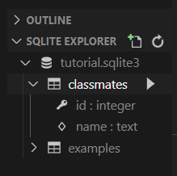

## DataBase

> 데이터베이스

* 체계화된 데이터의 모임
* 몇 개의 자료 파일을 조직적으로 통합하여 자료 항목의 중복을 없애고 자료를 구조화하여 기억시켜 놓은 자료의 집합체
* 장점들
  * 데이터 중복 최소화, 무결성, 일관성, 독립성 ...

> RDB (관계형 데이터베이스)

* Relational Database
* 키와 값들의 간단한 관계를 표 형태로 정리한 데이터베이스
* 관계형 모델에 기반
* 용어 정리
  * 스키마(schema) : 데이터베이스에 대한 전반적인 명세를 기술
  * 테이블(table) : column(컬럼/필드), row(레코드/값)을 사용하여 조직된 데이터 요소들의 집합
  * column : 고유한 데이터 형식이 지정됨
  * row : 실제 데이터가 저장되는 형태
  * 기본키(primary key, PK) : 각 행(레코드)의 고유 값, 반드시 설정해야 함

> RDBMS (관계형 데이터베이스 관리 시스템)

* MySQL, SQLite ...
* SQLite : 서버 형태가 아닌 파일 형식으로 응용 프로그램에 넣어서 사용하는 비교적 가벼운 데이터베이스
* Sqlite Data Type (동적 타입을 선호함)
  1. NULL (none 을 표현)
  2. INTEGER
  3. REAL
  4. TEXT
  5. BOLB (입력된 그대로 정확히 저장된 데이터)

* Sqlite Type Affinity
  1. INTEGER
  2. TEXT
  3. BLOB
  4. REAL
  5. NUMERIC

> SQL (Structured Query Language)

* 관계형 데이터베이스 관리시스템의 데이터 관리를 위해 설계된 특수 목적의 프로그래밍 언어
* 크게 3가지로 분류 가능
  * DDL - 데이터 정의 언어
  * DML - 데이터 조작 언어 (INSERT, SELECT, UPDATE, DELETE) **CRUD**를 위해 필수:star:
  * DCL - 데이터 제어 언어

* DML (Data Manipulation Language)

> 

* .database 에서 '.'은 프로그램의 기능을 수행하는 것

* `CREATE TABLE`
* `DROP TABLE`

> CREATE

* INSERT
  * "insert a single row into a table"
  * 특정 테이블에 레코드(행)를 삽입(생성)!
  * `INSERT INTO <table_name> (column1, column2, ...) VALUES (values1, values2, ...)`
  * 