> WHERE

* Table users 생성 (실행까지 해줘야 함)

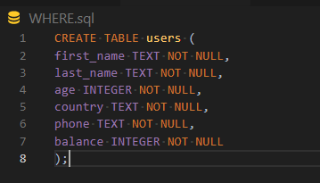

* csv 파일 정보를 테이블에 적용하기

  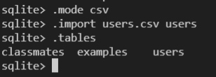

* WHERE를 활용해서 특정 조건에 해당하는 데이터 출력하기

  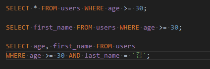

> Aggregate function

* 집계 함수
* 값 집합에 대한 계산을 수행하고 단일 값을 반환
  * **여러 행으로부터 하나의 결과값을 반환하는 함수**

* SELECT 구문에서만 사용됨

* COUNT, AVG, MAX, MIN, SUM .. (INTEGER일때만 사용 가능)

* `COUNT`

  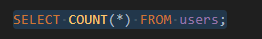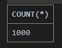

* `AVG`

  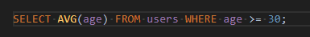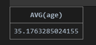

  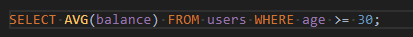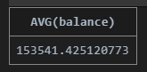

  

* `MAX/MIN`

  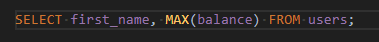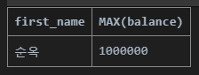

> LIKE

* LIKE operater
  * 패턴 일치를 기반으로 데이터를 조회하는 방법
  * SQLite는 패턴 구성을 위한 2개의 wildcards를 제공
  * 주로 특정한 패턴이 있는 문자열 혹은 파일을 찾거나, 긴 이름을 생략할 때 사용
  * 지정된 패턴 일치를 기반으로 데이터를 수집하는 데도 도움이 될 수 있음

* % (percent sign) : 이 자리에 문자열이 **있을 수도, 없을 수도** 있다
* _ (underscore) : **반드시** 이 자리에 한 개의 문자가 존재해야 한다

* wildcards 사용 예시

  `SELECT * FROM 테이블 WHERE 컬럼 LIKE '와일드카드패턴';`

* user 테이블에서 나이가 20대인 사람만 조회한다면?

  ` SELECT * FROM users WHERE age LIKE '2_';`

  * '2%'는 왜 안돼? : 2살도 되고, 200살도 되어버릴 수 있으므로 주의!!

* 지역번호가 02로 시작하는 사람들을 조회하는 경우?

  * **무조건 `02-` 까지 일치해야 함! 하이픈까지!**

  `SELECT * FROM users WHERE phone LIKE '02-%';`

* 이름의 마지막이 '준'으로 끝나는 경우?

  `SELECT * FROM users WHERE first_name LIKE '%준';`

  외자거나, 3자리 이상인 이름일 수 있으므로 % 사용하기

* 중간 번호가 5114인 사람만 조회한다면?

  `SELECT * FROM users WHERE phone LIKE '%-5114-%';`

  중간번호가 일치해야 하므로 하이픈을 포함한 `-5114-`가 일치해야 함

> ORDER BY clause

* ORDER BY
  * 조회 결과 집합을 정렬
  * SELECT 문에 추가하여 사용
  * 정렬 순서를 위한 2개의 keyword 제공
    * ASC - 오름차순 (default) ` SELECT * FROM table ORDER BY column ASC;`
    * DESC - 내림차순 ` SELECT * FROM table ORDER BY column DESC;`

* 나이순으로 오름차순 정렬하여 상위 10개만 조회한다면?
  * `SELECT * FROM users ORDER BY age ASC LIMIT 10;`

* 정렬 기준이 2개 이상인 경우??

  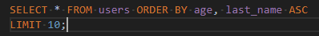

  * 처음 ORDER BY에 온 조건 기준으로 정렬을 해준 뒤, 그 다음에 오는 조건으로 정렬을 해준다