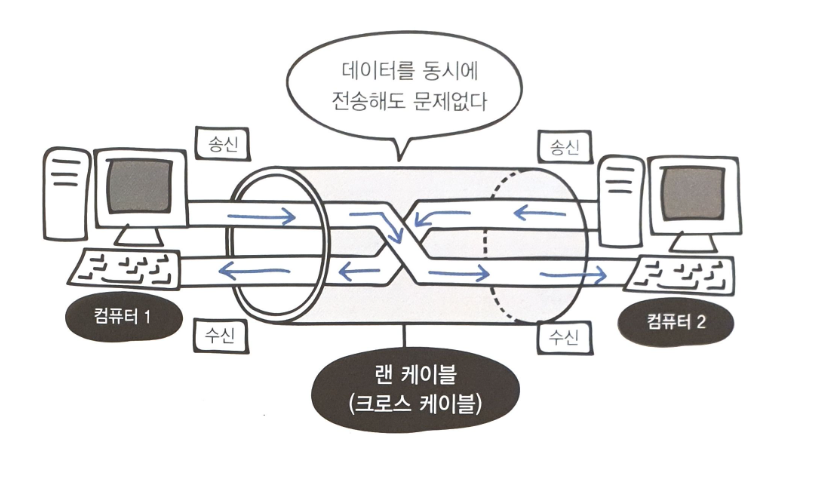
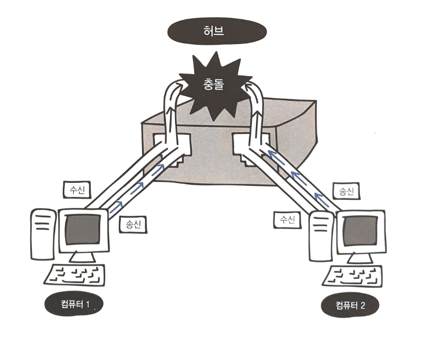
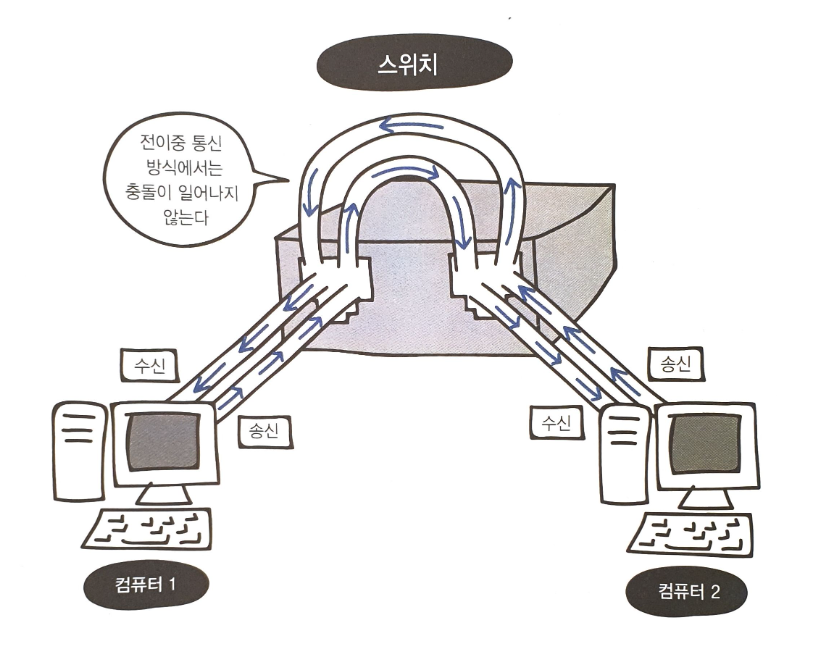
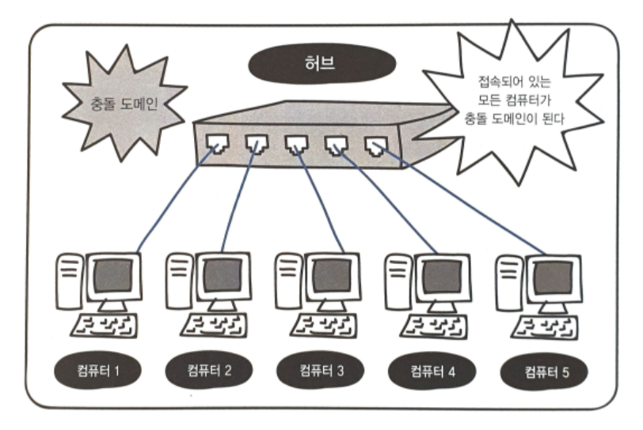
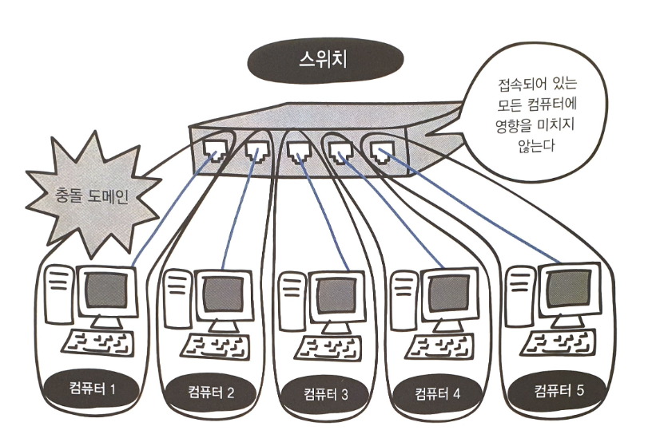
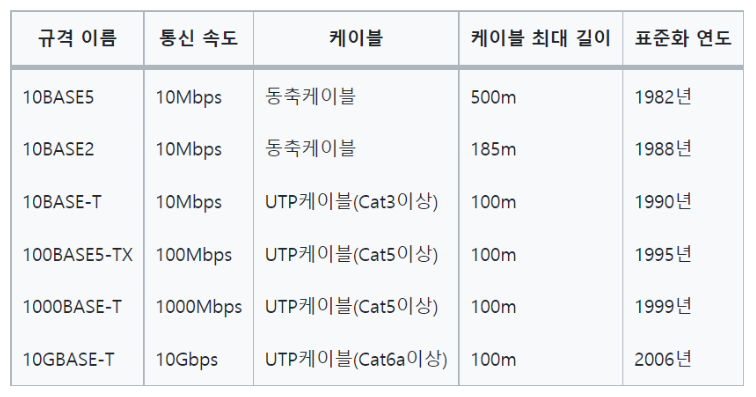

# 04 데이터 링크 계층 : 랜에서 데이터 전송하기

> LESSON 12_데이터 링크 계층의 역할과 이더넷

* **데이터 링크 계층** : 랜에서 데이터를 주고 받기 위해 필요한 기술

* 네트워크 장비 간에 신호를 주고받는 규칙을 정하는 계층, 랜에서 데이터를 정상적으로 주고 받기 위해서 필요함

  * 그 중에서 가장 많이 사용되는 규칙 = **이더넷(Ethernet)**

* 더미 허브에 연결되어 있는 모든 인터넷에 데이터가 송신되지 않도록, **목적지** 정보를 추가하여 보내어 목적지 이외의 컴퓨터가 데이터를 받더라도 무시하게 만듦

* 허브는 들어오는 데이터를 그대로 모든 포트에 보내기만 하기 때문에 더미 허브라고도 불림

* 즉, 컴퓨터 여러 대가 동시에 데이터를 보낸다면 데이터들끼리 서로 부딪히는 **충돌 현상**이 발생할 수 있음

* 이를 피하기 위해, **이더넷은 여러 컴퓨터가 동시에 데이터를 전송해도 충돌이 일어나지 않는 구조로 이루어져 있음**

* 어떻게 피하지?? => 데이터가 동시에 케이블을 지나가게 된다면 충돌이 일어나게 될 것. 따라서 **데이터를 보내는 시점을 늦추어 충돌을 피함**

* 이처럼 이더넷에서 시점을 늦추는 방법을 **CSMA/CD** 라고 함

  * (Carrier Sense Multiple Access with Collision Detection)

    - Carrier Sense= 데이터를 보내려고 하는 컴퓨터가 케이블에 신호가 흐르고 있는지 아닌지를 확인한다는 규칙
    - Multiple Access = 케이블에 데이터가 흐르고 있지 않다면 데이터를 보내도 좋다는 규칙
    - Collision Detection= 충돌이 발생하고 있는지를 확인한다는 규칙 

  * 현재는 효율이 좋지 않다는 점으로 인해 잘 사용하지 않음

    대신 스위치(switch)라는 네트워크 장비를 사용하여 충돌을 피함

> LESSON 13_MAC 주소의 구조

* 랜 카드는 비트열을 전기 신호로 변환함

* 랜 카드는 **MAC 주소**라는 번호가 정해져 있음. 물리 주소라고도 부르며, 전 세계에서 유일한 번호로 할당되어 있음

* 중복되지 않도록 규칙이 명확하게 정해져 있으며, 48비트의 숫자로 구성됨.

* 앞쪽 24비트는 랜 카드를 만든 제조사 번호, 뒤쪽 24비트는 제조사가 랜 카드에 붙인 일련번호를 나타냄

* **헤더** : 다음 계층으로 정보를 보낼 때, 송신 데이터의 앞부분에 붙이는 정보. 데이터를 전달받을 상대방에 대한 정보도 포함되어 있음

  - OSI 모델 - 데이터 링크 계층

  - TCP/SI - 네트워크 계층

    이 계층에서 **이더넷 헤더**와 **트레일러**를 붙인다

* **이더넷 헤더** = 목적지의 MAC 주소 6바이트 + 출발지의 MAC 주소 6바이트 + 유형 2바이트 (총 14바이트)

  **이더넷 유형** = 이더넷으로 전송되는 상위 계층 프로토콜의 종류를 나타냄 (프로토콜을 식별할 수 있는 16진수 번호가 들어감) ->>> 프로토콜 종류를 식별하는 번호가 들어감을 기억하자

  **트레일러** = FCS(Frame Check Sequence); 데이터 전송 도중에 오류가 발생하는지 확인하는 용도로 사용

  **프레임** = 이더넷 헤더와 트레일러가 추가된 데이터

  (*네트워크를 통해 프레임이 전송된다*)

* 이더넷 헤더를 통한 데이터 통신

  다섯 대의 컴퓨터가 동일 허브에 연결되어 있다고 가정.

  컴퓨터1에서 컴퓨터 3으로 데이터를 보내고 싶음

  1. 컴퓨터 1에서 이더넷 헤더에 데이터의 목적지인 컴퓨터 3의 mac주소 + 출발지인 컴퓨터1의 mac주소+유형 정보를 넣고 데이터를 전송함 = **캡슐화**

     *데이터 링크 계층에서 데이터에 이더넷 헤더와 트레일러를 추가하여 프레임을 만들고, 물리 계층에서 이 프레임 비트열을 전기 신호로 변환하여 네트워크를 통해 전송하는 것* 

  2. 허브는 컴퓨터 2 ~ 5에게 데이터를 전송함. 하지만 목적지 mac주소가 자신의 mac주소와 다르므로 컴퓨터 2,4,5는 데이터를 파기해버림

  3. 반면 컴퓨터 3은 자신의 mac주소와 컴퓨터1이 보낸 데이터 목적지의 mac 주소와 같으므로 데이터를 수신함 = **역캡슐화**

     *(물리 계층) 전기 신호 데이터  --> 비트열로 변환 --> 데이터 링크 계층에서 이더넷 헤더와 트레일러를 분리 (역캡슐화 후 데이터를 수신)*

* 만약 컴퓨터 1, 2 가 동시에 컴퓨터 3에게 데이터를 전송하는 경우? 충돌을 방지하기 위해 CSMA/CD 방식이 사용됨 >> 충돌이 감지되면 컴퓨터 2는 잠시 대기하고 데이터를 다시 전송함

> LESSON 14_스위치의 구조

* 데이터 링크 계층에서 동작하고, 레이어 2 스위치 또는 스위칭 허브라고 불림
* 장비 외형은 허브와 유사하나, 역할은 매우 다름
* 스위치 내부 >> MAC 주소 테이블(MAC address table)이 존재. 스위치의 포트 번호와 해당 포트에 연결되 어 있는 컴퓨터의 MAC 주소가 등록되는 데이터베이스
* 스위치의 전원을 켠 상태에서는 MAC 주소 테이블에 아무것도 등록되어 있지 않음
* 컴퓨터에서 목적지 MAC주소가 추가된 프레임 데이터가 전송되면 => MAC 주소 테이블을 확인하고 => 출발지 MAC 주소가 등록되어 있지 않다면 MAC 주소를 포트와 함께 등록한다
  * **MAC 주소 학습 기능**
* 플러딩(flooding): 데이터를 받아야 할 컴퓨터의 주소가 아직 등록되어 있지 않은 경우 다른 컴퓨터에도 데이터가 전송됨
* MAC 주소 테이블에 등록이 되어있었다면? 목적지 컴퓨터에만 데이터가 전송됨
  * **MAC 주소 필터링** : 불필요한 데이터를 네트워크에 전송하지 않을 수 있음

> LESSON 15_데이터가 케이블에서 충돌하지 않는 구조

통신 방식은 크게 **전이중 통신 방식**과 **반이중 통신 방식**이 있음

* 전이중 통신 방식 : 데이터의 송수신을 동시에 통신하는 방식

  * 컴퓨터 간을 직접 랜 케이블로 연결하는 방식, 스위치

  

* 반이중 통신 방식 : 회선 하나로 송신과 수신을 번갈아가면서 통신하는 방식

  * 허브에 연결하는 경우

  

* 전이중 통신 방식의 경우, 데이터를 동시에 전송해도 충돌이 발생하지 않지만 반이중 통신 방식의 경우 충돌이 발생한다.

* 허브 vs 스위치

  허브는 회선 하나로 송수신을 번갈아 가며 사용하므로 충돌 발생(반이중 통신 방식)

  스위치는 전이중 통신 방식을 사용하므로 충돌 방지 가능 + 전송과 동시에 수신도 가능하므로 효율이 매우 높음

  

* 충돌 도메인(collision domain) : 충돌이 발생할 때 그 영향이 미치는 범위

  * 허브의 경우, 연결되어있는 컴퓨터 전체가 하나의 충돌 도메인이 된다
  * 스위치의 경우, 전이중 통신 방식이므로 충돌이 일어나지 않고 충돌 도메인의 범위 또한 좁다

* 충돌 도메인의 범위가 넓을수록 네트워크가 지연된다

  

* ARP(Address Resolution Protocol)
  * 목적지 컴퓨터의 IP 주소를 이용하여 MAC 주소를 찾기 위한 프로토콜

> LESSON 16_이더넷의 종류와 특징

* 이더넷 규격 : 케이블 종류나 통신 속도에 따라 다양한 규격으로 분류됨
* 주요 이더넷 규격 table

> reference

* UTP cable 내부의 선들을 *비틀어 꼬아* 만든 이유는 무엇일까?

