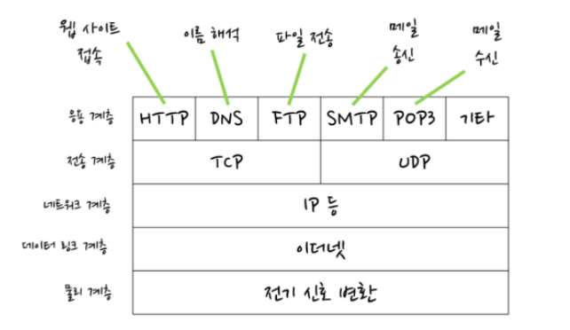
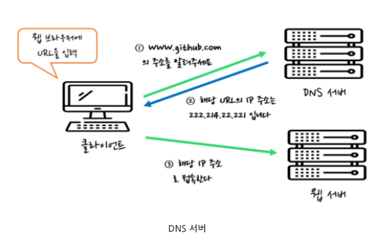

# 응용 계층 : 애플리케이션에 데이터 전송하기


### 응용 계층의 역할

* 애플리케이션
  * 서비스를 **요청하는 측 (클라이언트)**
    * 웹 브라우저, 메일 프로그램
  * 서비스를 **제공하는 측 (서버)**
    * 웹 서버 프로그램, 메일 서버 프로그램
    * **응용 계층**에서 동작함
* 응용 계층
  * 애플리케이션이 동작하는 계층으로, 애플리케이션과 데이터를 주고 받기 위해 필요함
  * 세션 계층과 표현 계층을 포함함
  * **클라이언트**의 요청을 전달하기 위해 **서버**가 이해할 수 있는 **데이터**로 변환하고 **전송 계층**으로 전달하는 역할
* 응용 계층의 프로토콜
  * 클라이언트 측 애플리케이션과 서버 측 애플리케이션이 통신하기 위해 필요
    * 웹 브라우저 <--- (웹 사이트를 보고싶어) ---> 웹 서버 프로그램
    * FTP 클라이언트 <--- (파일을 전송하고 싶어) ---> FTP 서버 프로그램
    * 메일 프로그램 <--- (메일을 보내고 싶어) ---> 메일 서버 프로그램

* 주요 응용 계층 프로토콜
  * HTTP : 웹 사이트 접속
  * DNS : 이름 해석 (네트워크에서 컴퓨터 또는 네트워크 장비에 붙여진 이름 기반으로 IP 주소를 알아내는 것, name resolution)
  * FTP : 파일 전송
  * SMTP : 메일 송신
  * POP3 : 메일 수신




### 웹 서버의 구조 (웹 사이트 접속)

* WWW (W3 or Web)
  * `HTML, URL, HTTP` 세 가지 기술이 사용됨
    * `HTML` : 웹 페이지에서 문장 구조나 문자를 꾸미는 태그를 사용하여 작성하는 **마크업 언어**
      * 제목, 목록 등 문장 구조를 지정하거나 이미지 파일을 보여줄 때 태그를 사용함
      * **하이퍼텍스트**를 작성하는 마크업 언어라고도 함
      * 문서와 이미지는 **각각 별도로 요청**함 --> 글이 먼저 보이고, 나중에 그림이 보이는 경우가 발생하는 이유!
* HTTP
  * 클라이언트는 웹 사이트를 보기 위해 서버의 80번 포트를 사용하여 HTTP 통신을 함
  * 클라이언트에서 **HTTP 요청 (request)**을 보내고 서버에서 **HTTP 응답 (response)**을 반환함
  * 클라이언트가 데이터를 **요청**할 때에는 "GET" 요청 정보, 파일 이름, 버전 정보 등을 서버에 전송
  * 서버는 **응답**으로 요청을 정상적으로 처리했다는 "OK"라는 정보를 반환하고, `index.html`을 클라이언트에게 보냄 
  * `HTTP/1.0`
    * 요청을 보낼 때마다 연결했다 끊는 방법을 반복
    * 웹 페이지가 느리게 보임
  * `HTTP/1.1`
    * 연결을 한 번 수립하면 데이터 교환을 마칠 때까지 유지하고, 데이터 교환을 모두 끝내면 연결 을 끊는 **keepalive** 기능 추가
    * 요청도 순서대로 끊는 특징을 가지므로 `1의 요청에 대해 1의 응답을 반환하고`, `2의 요청에 대해 2의 응답을 반환함`
    * 요청을 보낸 순서대로 응답을 반환하므로 요청을 처리하는 데 시간이 길어지면 다음 요청에 대한 처리가 늦어지는 단점이 발생
  * `HTTP/2`
    * 요청을 보낸 순서대로 응답을 반환하지 않으므로, 콘텐츠를 빠르게 표시할 수 있음


### DNS 서버의 구조 (이름 해석)

* 도메인 이름
  * DNS란, URL을 IP 주소로 변환하는 서비스(시스템)를 의미
    * 네이버에 접속할 때 IP 주소가 아닌 www.naver.com 과 같은 주소를 사용 하여 접속할 수 있도록 도와줌 (**DNS의 이름 해석**)
  * www.gilbut.co.kr과 같이 컴퓨터나 네트워크를 식별하기 위해 붙여진 이름을 **도메인 이름** 이라 하고, 도메인 이름 앞에 있는 `www`는 **호스트 이름(서버 이름)** 이라고 함
  * DNS 서버와의 통신 흐름
    * 단계 2에서 첫번째 DNS 서버가 도메인 IP 주소를 모르는 경우가 발생할 수 있음
      * DNS 서버 1이 DNS 서버 2에 요청하여 IP 주소를 알아냄
      * **DNS 서버는 전 세계에 흩어져 있고 모두 계층적으로 연결**되어 있음




### 메일 서버의 구조 (SMTP와 POP3)

* 메일의 송수신 구조
  * 클라이언트 측의 메일 프로그램과, 서버 측의 메일 서버 프로그램 간 통신을 위한 프로토콜 (2종류)
    * **SMTP** : 메일을 보내는 데 사용되는 프로토콜. 25번 포트 번호를 사용
    * **POP3** : 메일을 받는 데 사용되는 프로토콜. 110번 포트 번호를 사용
    * SMTP는 메일 서버 간의 메일 전송에도 이용됨
* SMTP에 의한 메일 송신과 메일 전송
  * `컴퓨터 1`의 메일 프로그램은 `SMTP`를 사용하여 `메일 서버 1`로 메일 보냄
  * `SMTP`를 사용하여 `메일 서버 1`에서 `메일 서버 2`로 메일을 전송
  * `메일 서버 2`는 `POP3`를 사용하여 `메일 서버 2의 메일 박스`에서 메일을 가져와서 `컴퓨터 2`로 전송함
    * 메일 박스 : 메일을 보관해 주는 메일 서버의 기능
  * `컴퓨터 2`가 `메일 서버 2`의 메일 박스에서 메일을 가져가기 위해서는 **사용자 인증**이 필요함


### ping 명령

* 목적지 컴퓨터와의 통신을 확인하기 위한 명령

* ICMP (Internet Control Message Protocol)을 사용하여 목적지 컴퓨터에 ICMP 패킷을 전송하고, 패킷에 대한 응답이 제대로 오는지 확인하는 명령

* 정산적으로 실행된다면 **네트워크 연결이 정상이라고 판단**할 수 있으므로 문제를 확인할 때 자주 사용함

  ```python
  ping 목적지 IP 주소
  ping 목적지 호스트 이름
  ```

  
