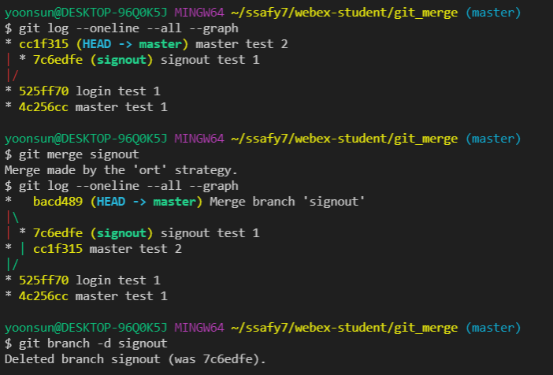
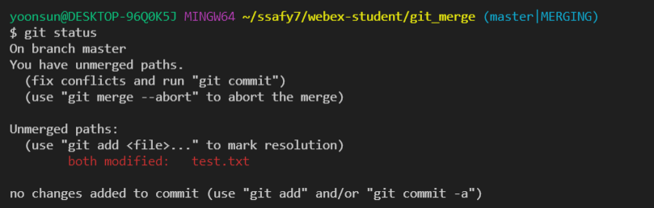

## GIT Branch

> master branch

* 상용되는 branch

* 빨간 부분 = master branch
* 노란 부분 = master branch와 별개의 부분. 조작을 해도 master branch에 영향이 가지 않는다.

> 명령어

* `git branch` : 브랜치 목록 확인
* `git branch <branch_name>` : 새로운 브랜치 생성
* `git branch -d <branch_name>` : 특정 브랜치 삭제 (병합된 브랜치만 삭제)
* `git brach -D <branch_name>` : 강제 삭제

* `git log`
* `git log --oneline`
* `git log --oneline --all`
* `git log --oneline --all --graph`
* `git switch <branch_name>` : 다른 브랜치로 이동
* `git switch -c <branch_name>` : 브랜치를 새로 생성과 동시에 이동 (`git branch <branch_name>` 과정 필요 없음)

* master-3 라는 가장 최신 commit에서 login이라는 branch를 만든 것

* 이후 master-4를 새로 만들어주면, (HEAD -> master) 는 master-4 를 가리키고 있다
* login 브랜치는 여전히 master-3를 가리킴

* `git switch login`을 통해 현재 브랜치 위치를 바꿀 수 있음

* branch가 login으로 바뀌면서 test.txt 또한 자동으로 바뀐다!

* 삭제하고 싶은데 not fully merged 병합되지 않아서 에러난다~

* 병합 상관 없이 삭제하고 싶은 경우: `git brach -D <branch_name>`

*********

## merge (병합)

* `git merge <병합할 브랜치 이름>`
  * merge 하기 전에 일단 다른 브랜치를 합치려고 하는, 즉 메인 브랜치로 switch 해야 함

> fast-forward

* merge가 완료 되었으면 그 branch의 역할이 끝났다
  * `git branch -d login`으로 삭제 해주자

> 3-way merge (merge commit)

> git conflict

* merge 하는 두 브랜치에서 같은 파일의 같은 부분을 동시에 수정하고 merge하면, git은 해당 부분을 자동으로 merge해주지 못함

* 반면 동일 파일이더라도 서로 다른 부분을 수정했다면, conflict 없이 자동으로 merge commit 된다

* git status를 통해 both modified 상태를 확인할 수 있다
* txt 파일에서 에러난 부분을 지워준 후 새로 작성한다
* `git add .` `git status` 정상적으로 되는지 확인 후 `git commit` enter!

* txt editer의 조상님인 vim이 등장 두두두둥

* vim 을 사용해서 commit 해주기