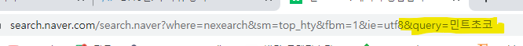

### 관통 프로젝트

#### 파이썬을 활용한 데이터수집 2

> 프로젝트 안내

* 외부 데이터를 수집하여 원하는 결과를 도출하기


> 웹 스크래핑 (웹 크롤링)

* **요청과 응답 (HTTP)**:star:
  * 요청(클라이언트): 정보를 원하는 사람 (url로 요청)
  * 응담(서버): 정보를 주는 사람(HTML, XML, JSON 등)




> **BeautifulSoup** :star:

파이썬 라이브러리 for pullind data out of HTML and XML files

```python
# 1-2. 요청
# https://docs.python-requests.org/en/latest/user/quickstart/#make-a-request
# response (200) : 성공적으로 가져옴 (404/500 실패)
response = requests.get(URL).text
# print(type(response)) # type :string

# 2-1. BeautifulSoup (text -> 다른 객체)
# BeautifulSoup is a Python Library for pulling data ot of HTML and XML files.
# HTML 파일에 있는 데이터를 가져오기 위해서 활용
data = BeautifulSoup(response, 'html.parser')
# print(type(data), type(response)) # <class 'bs4.BeautifulSoup'> <class 'str'>

# 2-2. 내가 원하는 정보를 가져온다!
# 선택자 (selector)
kospi = data.select_one('#KOSPI_now')
print(kospi.text)
```


> API (Application Programming Interface)

* chrome json viewer 설치
* 컴퓨터나 컴퓨터 프로그램 사이의 연결
* 일종의 소프트웨어 *인터페이스*이며 다른 종류의 소프트웨어에 서비스를 제공
  * tv 조작하기 위한 인터페이스 = 리모컨
* 사용하는 방법을 기술하는 문서나 표준은 *API 사양/명세 (specification)*
  * 주소(Url)와 문서(JSON)에 대한 문서 형태를 확인해야 함


> API 활용하는 법

* 요청하는 방식에 대한 이해
  * 인증방식
* 응답 결과에 대한 이해

```python
import requests

# 1. URL
# 요청 변수 : ?name=michael
# URL = 'https://api.agify.io?name=michael' 
name = 'Tom'
URL = 'https://api.agify.io'
params = {
    'name': name
}

# 2. 요청
response = requests.get(URL, params=params).json()
print(response.get('age')) #BeautifulSoup 안써도 된다 (지금은 JSON이니까)
```

