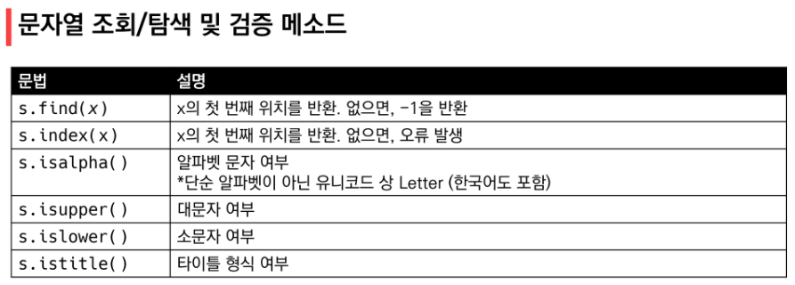
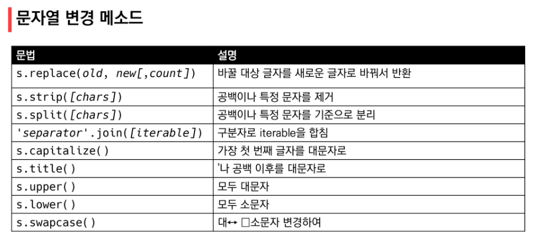
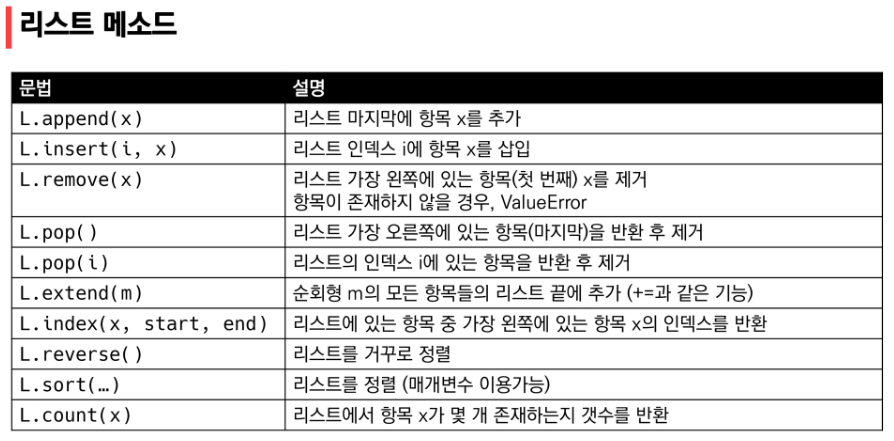
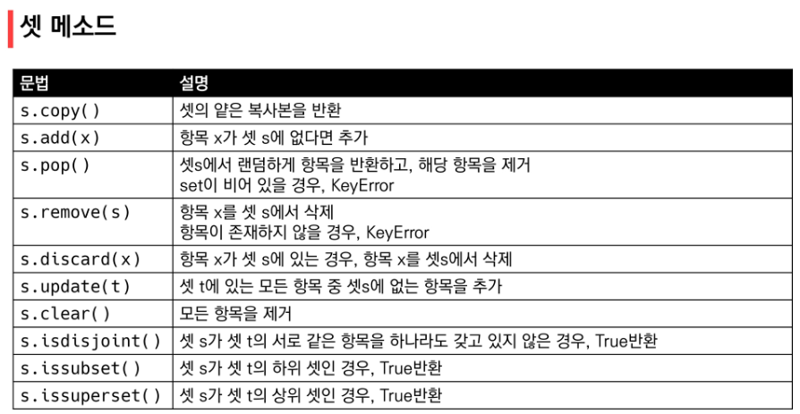
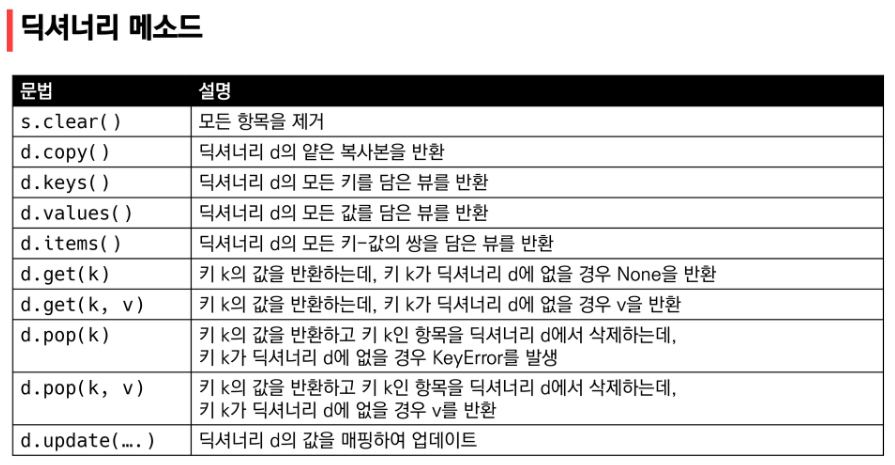

### 순서가 있는 데이터 구조

> 문자열(String): immutable



* *is*를 보게 되면 boolean 형태로 출력된다는 것을 알고 있자! (True/False)

* isdecimal(), isdigit(), isnumeric() 이런게 있다는것만 인지하고 있기




* s.replace(old, new[, count]): count는 optional -> 몇번 할 지 지정해주고 싶을 때 입력

* map(int, input().**split()**)

```python
numbers = [1, 2, 3]
#print(' '.join(numbers)) => TypeError!
print(' '.join(map(str, numbers)))
```


> 리스트(List)



```python
a = [100, 10, 1, 5]
b = [100, 10, 1, 5]

#원본 리스트를 정렬시키고, None을 return
print(a) #그대로 출력
print(a.sort()) #None 출력
print(a) #정렬된 리스트를 출력

#원본 리스트는 변경 x, 정렬된 리스트를 return
print(b) #그대로 출력
print(sorted(b)) #정렬된 리스트를 출력
print(b) #원상태 그대로 출력
```

* **.sort()** vs **sorted()**
* **sort()** vs **.reverse()** 


> 튜플(Tuple)


### 순서가 있는 데이터 구조

> 셋(Set):mutable



* s.pop() **임의의** 원소를 제거해 반환
  * l.pip() 순서가 있음!!


> 딕셔너리(Dictionary): mutable




### 얕은 복사(Shallow copy)와 깊은 복사(Deep copy)

> 할당(Assignment)

* 대입 연산자(=)

```python
original_list = [1, 2, 3]
copy_list = original_list #같은 list를 바라보게 됨

copy_list[0] = 'h'
print(copy_list, original_list) # copy_list 만 바꿔줘도 original_list의 요소도 함께 바뀜
```


> 얕은 복사(Shallow copy)

* 복사하는 리스트의 원소가 주소를 참조하는 경우

```python
original_list = [1, 2, 3]
copy_list = list(original_list) #서로 다른 list를 참조하게 됨

copy_list[0] = 'h'
print(copy_list, original_list) # copy_list 만 바꿔줘도 original_list의 요소도 함께 바뀜
```

* 얕은 복사 주의사항 
  * 리스트가 1차원인 경우: 얕은 복사 가능
  * 2차원같이 복잡한 경우: **깊은 복사** 필수!

```python
a = [1, 2, ['a', 'b']]
b = a[:] #slicing을 통해 리스트 안의 전체 값들을 넣은 것이지, 같은 list를 참조하는 것이 아님!
print(a, b)
b[2][0] = 0
print(a, b) #[1, 2, [0, 'b']]: a, b 모두 동일한 리스트로 출력
```

```python
original_list = [1, 2, [0, 1]]
copy_list = original_list[:]

copy_list[2] = 'h'
print(copy_list, original_list) #[1, 2, 'h']  [1, 2, [0, 1]] => list 대신 string을 던진 것이니 당연히 다르게 출력되는 것. shallow/deep 차이는 2차원 리스트 내부의 값을 변경해봐야 알 수 있음
```


> 깊은 복사(Deep copy)

```python
import copy
a = [1, 2, ['a', 'b']]
b = copy.deepcopy(a) 
print(a, b) # [1, 2, ['a', 'b']]  [1, 2, ['a', 'b']]
b[2][0] = 0
print(a, b) # [1, 2, ['a', 'b']]  [1, 2, [0, 'b']] => deep copy를 해야 각자 다르게 반환 가능
```