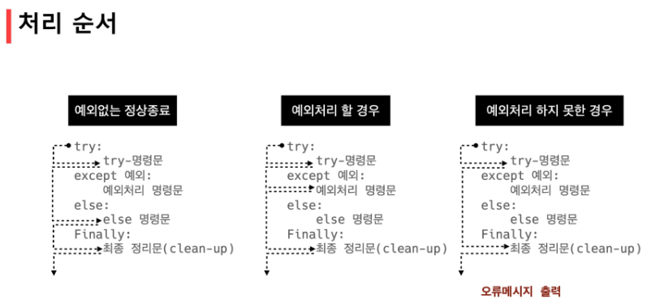

## 에러/예외 처리 (Error/Exception Handling)

> **디버깅**

* 어느 부분에서 디버깅을 해야 할까?
  * '제어가 되는 시점' => 조건/반복, 함수

* branches: 내가 작성한 코드가 *모든 조건을 cover하는지*가 중요

* for loops: 반복문 원하는 횟수? 반복문 값(진입 결과)
* while loops: for + 종료조건
* function: 호출, parameter를 제대로 넘겼는지, 결과가 제대로 출력되는지, type 확인 필수, function method

************

* print 함수 활용
  * 특정 함수 결과, 반복/조건 결과 등 나눠서 생각, 코드를 bisection으로 나눠서 생각

* 개발 환경(text editor, IDE)등에서 제공하는 기능 활용 => vs code에서 디버깅 기능 활용
  * breakpoint, 변수 조회 등

* Python tutor 활용(단순 파이썬 코드인 경우)

* 뇌컴파일, 눈디버깅 => 최대한 나의 뇌와 눈으로 실행 가능하도록 연습하자!


> **문법 에러(Syntax Error)**

* Syntax Error 발생 시, 프로그램 실행이 되지 않음
  * invalid syntax, cannot assign to literal, EOL(End of Line), EOF(End of File)


> **예외(Exception)**

* 실행 중 감지되는 에러를 의미
  * ZeroDivisionError : 0으로 나누고자 할 때 발생
  * NameError: namespace 상에 이름이 없는 경우
  * TypeError: 타입 불일치, argument 누락, argument type 불일치
  * ValueError: 타입은 올바르나 값이 적절하지 않거나 없는 경우


> **예외처리**



```python
try:
    num = input('숫자 입력: ') #user가 int가 아닌 다른 값을 입력하게 된다면
    print(int(num))
except ValueError:
    print('숫자가 입력되지 않았습니다.') #ValueError를 통해 이 문장을 출력하여 user에게 보여준다.
```

