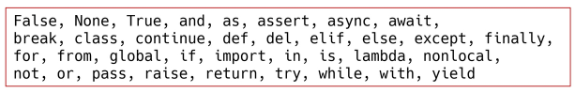
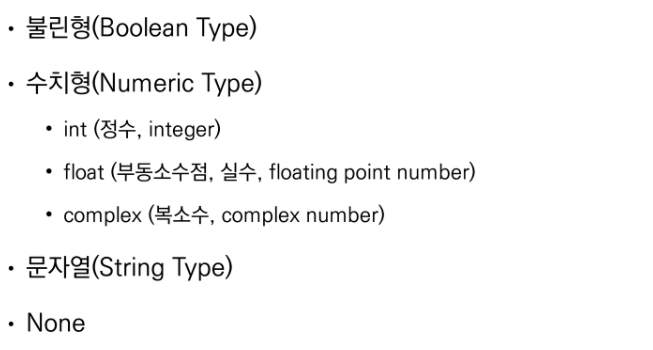
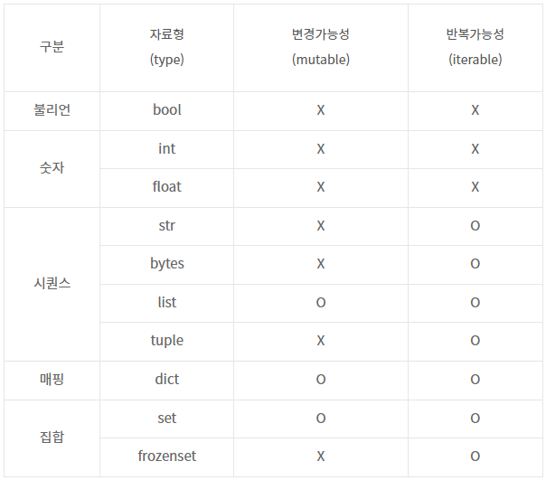

## Python 과목평가 대비

#### 총 30문제, 객관식 + 서술형 혼합형으로 출제

>  python 기초

* 파이썬의 특징
  * 인터프리터 언어 + 객체 지향 프로그래밍

* 변수(variable)은 할당 연산자(=)를 통해 값을 할당(assignment)
  * type() : 변수에 할당된 값의 타입
  * id(): 변수에 할당된 값의 고유한 identity 값 (shallow copy, deep copy시 중요)

* 식별자(Identifiers)

  * 파이썬 객체를 식별하는 데 사용하는 이름

  * reserved words로 사용할 수 없는 것들

    

* input()
  * 사용자로부터 값을 즉시 입력 받을 수 있는 내장함수
  * 반환값은 항상 **문자열 형태**로 반환

* 주석
  * 한 줄 주석: #
  * 여러줄 주석: ''' ''' 또는 """ """

* 자료형 분류 :star:

  

* bool형:star:
  * True/False 값을 가진 타입은 bool형
  * False인 것들: 0, 0.0, (), [], {}, '', None 
  * 특정 데이터가 True인지 False인지 검증

* numeric type
  * float type에서, 값 비교 시 정수가 아닌 실수인 경우 주의할 것!

* string type
  * escape sequence: 역슬래쉬 사용



* Container

  * sequence
    * string : immutable
    * list : 변경 가능함(mutable)
    * tuple : immutable => 단일 항목의 경우 생성 시 값 뒤에 쉼표 붙이기
    * range : immutable => range(n), range(n, m), range(n, m, s)
    * 모든 sequence형은 패킹/언패킹 연산자 *를 사용하여 객체의 패킹, 언패킹 가능

  * non sequence
    * set : mutable, 중복 가능한 값이 존재하지 않음 len(set()) 해서 중복값 제거한 개수 출력가능
    * dictionary : mutable, key-value 쌍으로 이루어진 객체를 참조하는 자료형
      * key를 통해 value 접근 가능
      * key는 변경 불가능한 데이터, value는 모든 값으로 설정 가능

* 형 변환

  * 자료형 변환

  * 암시적 형 변환: 사용자가 의도한 것이 아님

    ```python
    #bool
    True + 3 #=> 4
    #Numeric type(int, float, complex)
    3 + 5.0 #=> 8.0
    3 + 4j + 5 #=> (8+4j)
    ```

  * 명시적 형 변환: 사용자가 특정 함수 활용하여 의도적으로 자료형을 변환

    ```python
    # str, float => int
    # print('3'+4) TypeError: can only concatenate str (not "int") to str
    # print(int('3.5') + 4) ValueError: invalid literal for int() with base 10: '3.5'
    
    # str, int => float
    # int, float, list, tuple, dict => str
    ```

* 논리 연산자
  * A and B => A와 B 모두 T이면 T
  * A  or B => A 와 B 모두 F이면 F (하나라도 T이면 T)
  * Not => True를 False로, False를 True로

* 논리 연산자 단축평가: 결과가 확실한 경우 두번째 값은 확인하지 않음
  * and연산에서 첫번째 값이 False인 경우 무조건 False => 첫번째 값 반환
  * or 연산에서 첫번째 값이 True인 경우 무조건 True => 첫번째 값 반환

* Indexing: 시퀀스의 특정 인덱스 값에 접근 (해당 인덱스 없는 경우 IndexError)
* Slicing: 시퀀스를 특정 단위로 슬라이싱


> 제어문

* 조건문: 참/거짓 판단할 수 있는 조건식과 함께 사용 (if, elif, else)

* 조건 표현식 ```<true인 경우 값>if<expression>else<false인 경우 값>``` 왠지 이거 나올삘 :smile:

  ```python
  num = -5
  value = num if num >= 0 else 0
  print(value)
  ```

  ```python
  num = -5
  if num >= 0:
      value = num
  else:
      value = 0
  print(value)
  ```

  

* 반복문: 특정 조건을 도달할 때까지 계속 반복되는 일련의 문장 (for, while, 반복 제어)

  * while문

    * 종료 조건이 반드시 필요. 종료 조건이 없는 경우 무한 루프 생성

  * for문

    * 순회 가능한 객체(iterable)요소를 모두 순회함

    * 종료조건 필요 없음

    * enumerate() :star:

      ```python
      #(index, value) 형태의 tuple로 구성된 열거 객체를 반환
      members = ['a', 'b', 'c']
      for idx, member in enumerate(members):
          print(idx, member)
      '''0 a
         1 b
         2 c'''
      ```

      ```python
      print(enumerate(members)) # <enumerate object at 0x000001A423743340>
      print(list(enumerate(members))) # [(0, 'a'), (1, 'b'), (2, 'c')]
      print(list(enumerate(members, start=1))) # [(1, 'a'), (2, 'b'), (3, 'c')]
      ```

    * 문자열 순회 

      ```python
      chars = input()
      # 두 예시 모두 세로로 한글자씩 출력됨
      for char in chars:
      	print(char)
      ```

      ```python
      for idx in range(len(chars)):
          print(chars[idx])
      ```

    * dictionary 순회 : 기본적으로 key를 순회하며, key를 통해 값을 활용 :star:

      ```python
      grades = {'john': 80, 'eric': 90}
      for student in grades:
          print(student, grades[student]) # john 80 \n eric 90 출력
      ```

      ```python
      grades = {'john': 80, 'eric': 90}
      print(grades.keys()) #=> dict_keys(['john', 'eric'])
      print(grades.values()) #=> dict_values([80, 90])
      print(grades.items()) #=> dict_items([('john', 80), ('eric', 90)])
      ```

      ```python
      # items(): (key, value)의 튜플로 구성된 결과
      grades = {'john': 80, 'eric': 90}
      for name, grade in grades.items():
          print(name, grade)
      '''
      john 80
      eric 90
      '''    
      
      ```

    * list comprehension

      ```python
      # 일반 list for문 형식
      cubic_list = []
      for number in range(1, 4):
          cubic_list.append(number**3)
      # list comprehension
      [number**3 for number in range(1, 4)]
      
      # 둘은 동일한 결과가 나온다
      print(cubic_list)
      ```

    * dictionary comprehension

      ```python
      # 일반 dict for문 형식
      cubic_dict = {}
      for number in range(1, 4):
          cubic_dict[number] = number ** 3
      #dict comprehension
      {number: number ** 3 for number in range(1, 4)}
      ```

  * 반복문 제어

    * break: 반복문 종료

    * continue: 이후 코드 블록 수행하지 않고, 다음 반복을 수행

      ```python
      for i in range(6):
          if i % 2 == 0:
              continue
          print(i) #=> 1, 3, 5 출력!!!
      ```

    * pass: 아무것도 하지 않음! 그냥 특별히 할 일 없을 때 자리 채우는 용도

    * for-else: 끝까지 반복문을 실행한 이후 else문 실행

