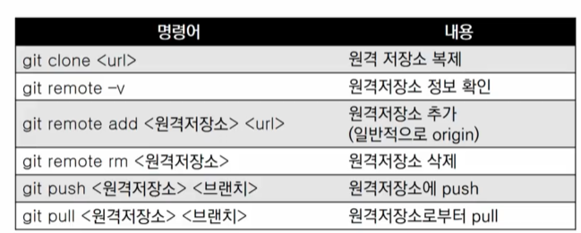

## 명세서 구조

* 목표
* 준비사항
  * 개발언어/프로그램, 라이브러리, 외부 데이터 등

* 요구사항
* 결과

> **What is GIT?**

* 분산 버전 관리 시스템!!!

* *made in 리눅스의 아버지*

* 버전관리

  * 버전관리, 소스코드 관리란 동일 정보에 대한 여러 버전을 관리하는 것

  * 오픈소스 사례 (크로미움)
  * 하나의 파일이지만 버전을 기록, 확인(google docs)

> CVCS vs DVCS

* 집중형 버전 관리 vs 분산형 버전 관리
* 공유 단위가 파일이 아닌 버전이다

> Command Line Interface

* GUI: 그래픽 사용자 기반 인터페이스 (폴더 아이콘)
* CLI: 명령 줄 기반 인터페이스 (cmd, git bash)

### Git 기초 흐름

> Git 저장소 생성

* git init 명령어를 통해 repository 생성 (.git folder)

* step
  1. 작업을 하고
  2. 변경된 파일을 모아 *(add)*;  **Working Directory => Staging Area**
  3. 버전으로 기록한다 *(commit)*; **Staging Area => Repository**

> 원격 저장소(Remote Repository)

* github, gitlab 등...
* 명령어

*********

### 파이썬을 활용한 데이터 수집

> **프로젝트 안내**

* **JSON** 데이터를 원하는 결과물로 변환
  * open(file, mode='r', encoding=None)
  * 문자 기반(텍스트) 데이터 포멧으로 다수의 프로그래밍 환경에서 쉽게 활용 가능