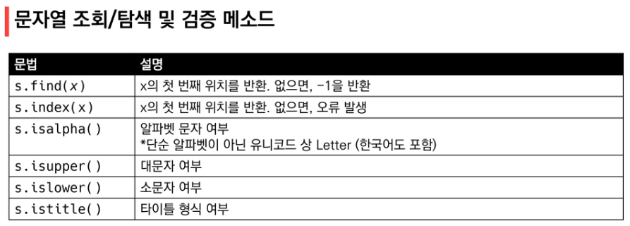
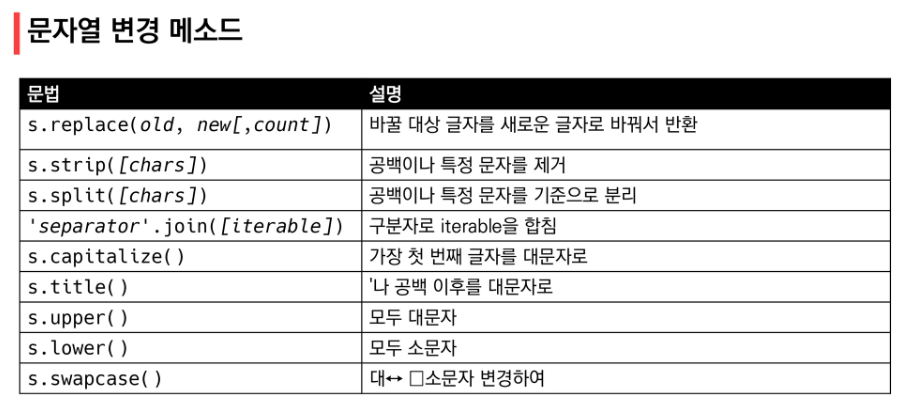
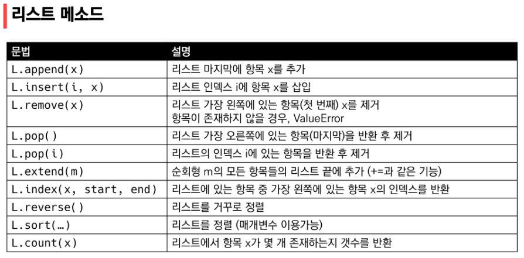
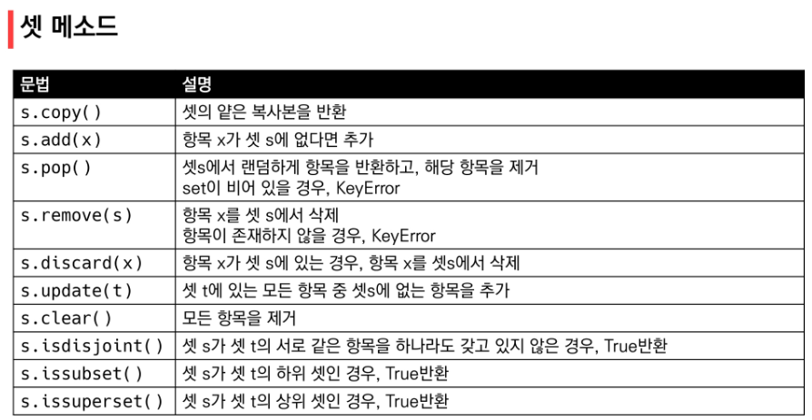
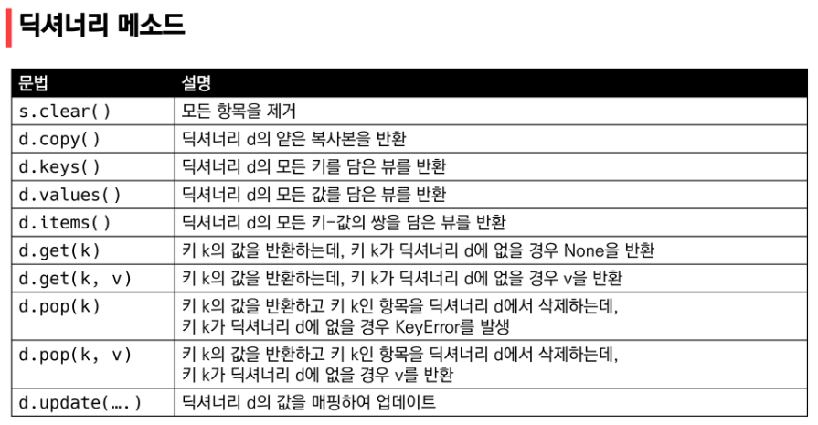

### 순서가 있는 데이터 구조

> 문자열(String): immutable



* *is*를 보게 되면 boolean 형태로 출력된다는 것을 알고 있자! (True/False)

* isdecimal(), isdigit(), isnumeric() 이런게 있다는것만 인지하고 있기




* s.replace(old, new[, count]): count는 optional -> 몇번 할 지 지정해주고 싶을 때 입력

* map(int, input().**split()**)

```python
numbers = [1, 2, 3]
#print(' '.join(numbers)) => TypeError!
print(' '.join(map(str, numbers)))
```


> 리스트(List)



```python
a = [100, 10, 1, 5]
b = [100, 10, 1, 5]

#원본 리스트를 정렬시키고, None을 return
print(a) #그대로 출력
print(a.sort()) #None 출력
print(a) #정렬된 리스트를 출력

#원본 리스트는 변경 x, 정렬된 리스트를 return
print(b) #그대로 출력
print(sorted(b)) #정렬된 리스트를 출력
print(b) #원상태 그대로 출력
```

* **.sort()** vs **sorted()**
* **sort()** vs **.reverse()** 


> 튜플(Tuple)


### 순서가 있는 데이터 구조

> 셋(Set):mutable



* s.pop() **임의의** 원소를 제거해 반환
  * l.pip() 순서가 있음!!


> 딕셔너리(Dictionary): mutable




### 얕은 복사(Shallow copy)와 깊은 복사(Deep copy)

