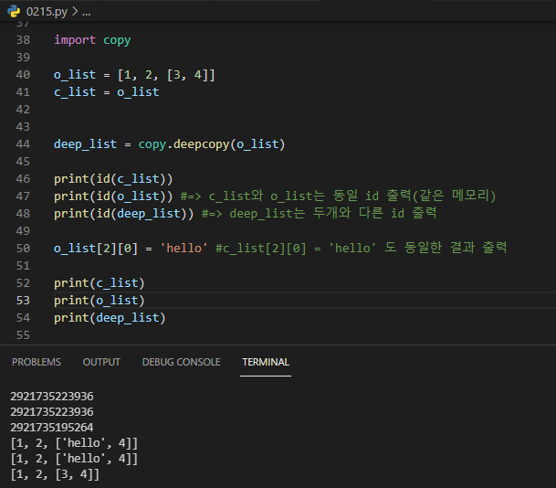
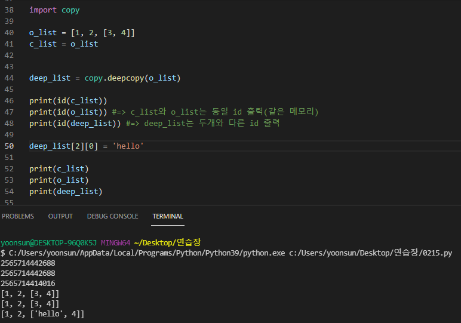

## Review

### 순서가 있는 데이터 구조 (string, list, tuple)

> function vs method ?

* function이 더 큰 개념, 객체 안에 변수와 함수를 정의하는데, 이 때 객체 안에 정의된 함수를 method라고 함


> String type

* s.find(x) 와 s.index(x) 차이점

* replace(old, new, [,count]) , strip([chars]), split
  * strip([chars]): 비어있으면 공백을 제거함
    * 비어있는 경우: ' ', '\t', '\n'


> List type

* l.append(x) vs l.extend(m)

  * ```python
    lst = [1, 2, 3, 4]
    lst.append(['a', 'b']) #=> [1, 2, 3, 4, ['a', 'b']]
    lst.extend(['a', 'b']) #=> [1, 2, 3, 4, 'a', 'b']
    ```

* .sort() vs sorted()

  * sort()

    ```python
    <list>.sort(key = <function>, reverse = <bool>
    ```

  * ```python
    my_list = [[1, -2], [9, 4], [5, -6]]
    
    #case 1)
    print(my_list.sort()) #=> None
    print(my_list) #=> [[1, -2], [5, -6], [9, 4]]
    
    #=> ()안에 아무 값도 안써주면 첫번째 요소값을 기준으로 정렬한다
    
    ==========
    
    #case 2)
    #2중 리스트에서 두번째 요소 기준으로 정렬하고 싶은 경우
    #lambda 함수 사용
    my_list.sort(key = lambda x: x[1])
    print(my_list) #=> [[5, -6], [1, -2], [9, 4]]
    ```


> Tuple type

* 리스트랑 대부분 동일한 메서드를 가짐

* ```python
  a = (1, 2, 3)
  a += 1, #=> 컴마를 찍어주면 원소 하나짜리 튜플로 반환
  print(a) #=> (1, 2, 3, 1)
  ```


> Set type

* 중복 제거
* set.add(elem)  => append 아님 주의


> Dictionary type


> Shallow copy vs Deep copy

* Shallow copy

```python
o_list = [1, 2, 3]
c_list = o_list

print(id(c_list))
print(id(o_list)) #동일한 id 출력

c_list[0] = 'hello'

print(id(c_list))
print(id(o_list)) #동일한 id 출력
```

* Deep copy
  * memory를 새롭게 할당해줌 (단점: 메모리 비효율)

```python
import copy

o_list = [1, 2, 3]
c_list = o_list

c_list[0] = 'hello'

deep_list = copy.deepcopy(o_list)

print(id(c_list))
print(id(o_list)) #=> c_list와 o_list는 동일 id 출력(같은 메모리) 
print(id(deep_list)) #=> deep_list는 두개와 다른 id 출력
```

**deep copy 직관적인 예시** *case 1) id가 동일한 o_list, c_list는 같이 변한다* 




**deep copy 직관적인 예시** *case 2) id가 다른 deep_list는 혼자 변한다*




******

> 디버깅

> assert

* assert<표현식>, <메세지>
* 일반적으로 디버깅 용도로 사용
* <표현식>이 False이면; 항상 **AssertionError** 가 난다!!
