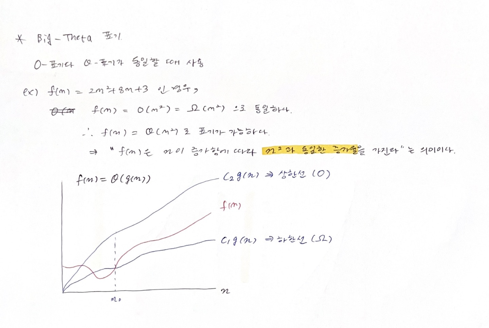

> 복잡도 분석 :star2:

* 알고리즘 효율
  * 공간적 효율성 : 메모리 차지량
  * 시간적 효율성 : 코드 처리 소요 시간

* 복잡도(complexity) 높을수록 효율성 낮아진다

* **내가 짠 알고리즘이 O(n^2)을 따르고 있는지를 알아야 한다!!**
  * 따르고 있다면 얼른 다른 코드로 바꿔야한다!!!

> 복잡도의 점근적 표기

* n이 무한대로 접근할 때 복잡도를 간단히 표기하는 방식
* 3가지 방식 **Big-Oh, Big-Omega, Big-Theta** 

> 비트 연산

