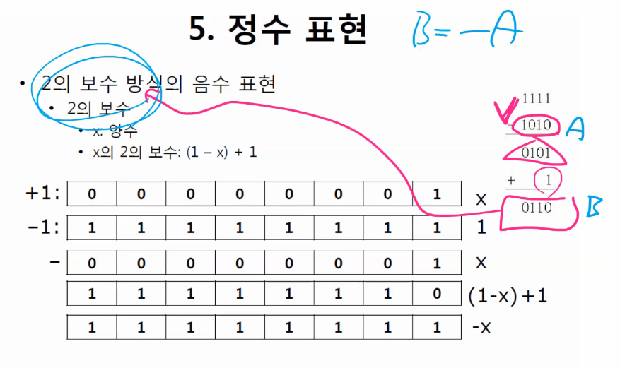
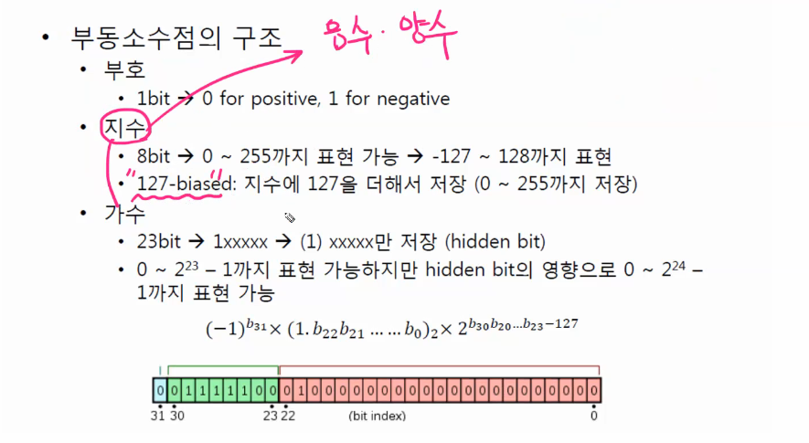

> **진수의 종류** :star2: 외우자!

* 2진법
* 8진법
* 10진법
* 16진법

> 10진수를 2진수, 8진수, 16진수로 바꾸는 경우

* case 1) 정수인 경우 ; **거꾸로**
* case 2) 소수인 경우 ; **순서대로** 

> 정보의 표현

* 디지털 컴퓨터는 2진법을 사용
* 컴퓨터에서 정보를 처리하는 단위
  * Bit
  * Byte = 8 bit
  * Word

* 컴퓨터의 기억 용량의 단위는 byte

  

> 정수 표현

* 정수: integer

* 정수의 표현 범위
  * 2byte를 이용하는 경우: 16개의 2진수로 표현
* 정수의 표현 범위는 2byte에서 4byte로 확장됨
* Sign bit 방식의 음수 표현 (부호화 방식의 표현)
  * 첫번째 bit (MSB: most signigicant bit)를 이용해서 기호 표현
  * 0 = 양수, 1 = 음수
  * LSB를 통해 짝수 홀수 판별 가능함

* Sign bit 방식 음수표현의 문제점!! -1 + 1 = 0 계산이 불가!

* 해결책! (1의 보수 방식의 음수 표현)

> 실수 표현

* 부동소수점 표현 (floating point)
  * 부동소수점의 반대는? 고정소수점 (fixed point)
* 부동소수점 표현의 특징
  * 소수점의 위치가 변함
  * 부호, 지수, 가수로 구성됨

