# 완전 검색 & 그리디

> 반복과 재귀

* 반복과 재귀는 유사한 작업 수행 가능

* 반복은 수행하는 작업이 완료될 때까지 계속 반복

  * 루프 (for, while 구조)

* 재귀는 주어진 문제의 해를 구하기 위해 동일하면서 더 작은 문제의 해를 이용하는 방법

  * 하나의 큰 문제를 해결할 수 있는 (해결하기 쉬운) 더 작은 문제로 쪼개고 결과들을 결합한다
  * **재귀 함수로 구현**

  

> 반복을 이용한 선택 정렬

* 재귀함수로 만들어보기!


> 팩토리얼 재귀 함수의 호출

* 메모리 상에 n이 어떻게 저장이 되는지 손으로 그려보기!!

```python
fact(n)
   if n <= 1
        return 1
   else
		return n*fact(n-1)
```

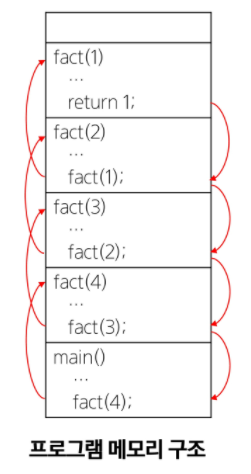

> 반복 vs 재귀?

* 일반적으로 **재귀적 알고리즘**은 반복 알고리즘보다 **더 많은 메모리와 연산을 필요**로 한다
  * 입력 값 n이 커질수록 재귀 알고리즘은 반복에 비해 비효율적일 수 있다

* 기본적으로 파이썬의 재귀 limit은 1000으로 얕게 설정되어있기 때문에 `sys.setrecursionlimit` 설정해주고 사용하는 것이 좋다


> 반복과 재귀의 비교

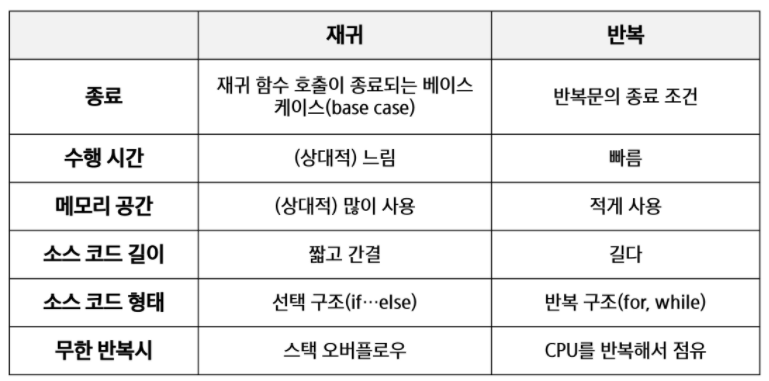


> 2^k 연산에 대한 재귀와 반복

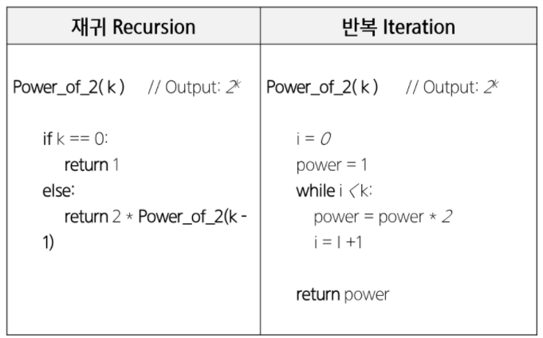


> Baby Gin game

* Brute-force 탐색 (sequential search)
  * 자료들의 리스트에서 키 값을 찾기 위해 첫 번째 자료부터 비교하면서 진행한다
  * 결과: 탐색 성공 or 탐색 실패

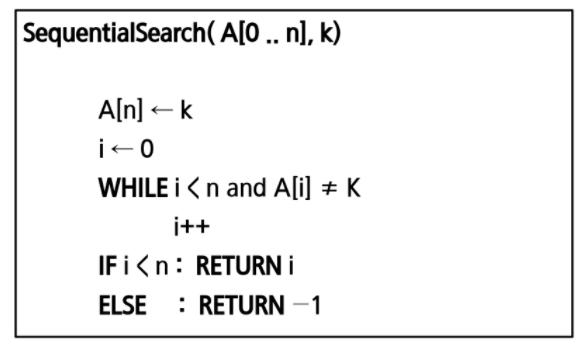

* 모든 경우의 수를 테스트하기 때문에 수행 속도는 느리지만, 해답을 찾지 못할 확률은 줄어든다

* **우선 완전 검색**으로 접근하여 해답을 도출한 후, 성능 개선을 위해 다른 알고리즘을 사용하고 해답을 확인하는 것이 바람직하다

```python
# 완전 검색을 통한 baby-gin 접근
# 고려할 수 있는 모든 경우의 수 생성하기
```


> 완전 검색

* permutation(순열), combination(조합), subsets(부분집합)과 같은 combinatorial problems(조합적 문제들)과 연관된다
* 완전 검색은 조합적 문제에 대한 brute-force 방법이다

> 순열 (Permutation)

* 서로 다른 것들 중 몇 개를 뽑아서 한 줄로 나열하는 것
* `n! = n * (n-1) * (n-2) * ... * 2 * 1`
* n > 12인 경우, 시간 복잡도가 폭발적으로 증가하게 됨 :sweat:

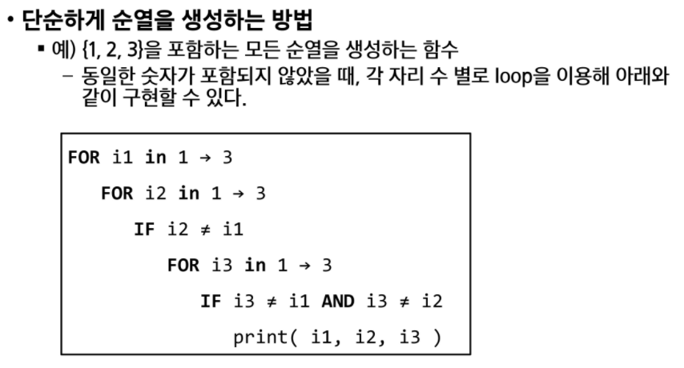

* 재귀 호출을 통한 순열 생성

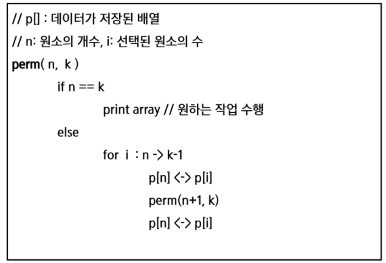


```python
# 3개의 숫자 수열을 출력하는 함수 구현하기 

def f(n, k):  # 순열 p[n]을 채우는 함수. k는 배열의 크기
    if n == k:
        print(p)
    else:
        for i in range(k):  # use에서 사용하지 않은 숫자 검색
            if used[i] == 0:
                used[i] = 1  # 사용함으로 표시
                p[n] = a[i]  # p[n] 결정
                f(n+1, k)
                used[i] = 0  # a[i]를 다른 위치에서 사용할 수 있도록 함
    
    return


a = [1, 2, 3]
p = [0]*3
used = [0]*3
f(0, 3)
```


```python
# 5개의 숫자 중 3개의 숫자를 뽑아 수열 출력하는 함수 구현하기

def f(n, k, m):  # 순열 p[n]을 채우는 함수, k 고를 개수, m 주어진 숫자 개수
    if n == k:
        print(p)
    else:
        for i in range(m):  # use에서 사용하지 않은 숫자 검색
            if used[i] == 0:  
                used[i] = 1  # 사용함으로 표시
                p[n] = a[i]  # p[n] 결정
                f(n+1, k, m)
                used[i] = 0  # a[i]를 다른 위치에서 사용할 수 있도록 함
    
    return

a = [1, 2, 3, 4, 5]
p = [0]*3
used = [0]*5
f(0, 3, 5)
```


> 부분 집합

* 집합에 포함된 원소들을 선택하는 것
* N개의 원소를 포함한 집합
  * 자기 자신과 공집합을 포함한 모든 부분집합의 개수는 2^n개
  * 원소의 수가 증가하면 부분집합 개수는 지수적으로 증가

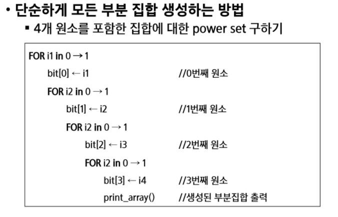

* 바이너리 카운팅을 통한 사전적 순서(Lexicographic Order)
  * 부분집합을 생성하기 위한 가장 자연스러운 방법
  * **바이너리 카운팅**은 사전적 순서로 생성하기 위한 가장 간단한 방법이다

* 바이너리 카운팅 (Binary counting)
  * 원소 수에 해당하는 N개의 비트열을 이용한다
  * n번째 비트값이 1이면 n번째 원소가 포함되었음을 의미한다

* 바이너리 카운팅을 통한 부분집합 생성 코드 예시

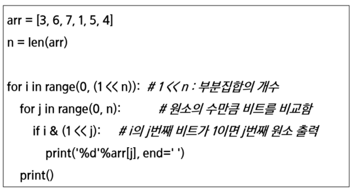


> 조합 (Combination)

* 서로 다른 n개의 원소 중 r개를 순서 없이 골라낸 것을 조합(combination)이라고 부른다
* 조합의 수식

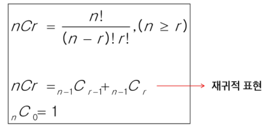

* 재귀 호출을 이용한 조합 생성 알고리즘

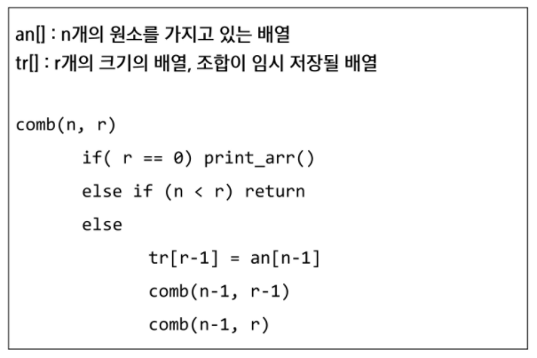


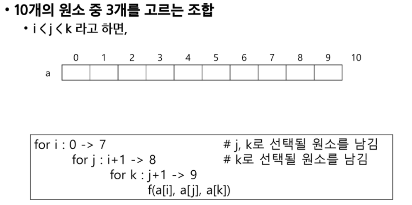

* n개에서 r개를 고르는 조합 (재귀)

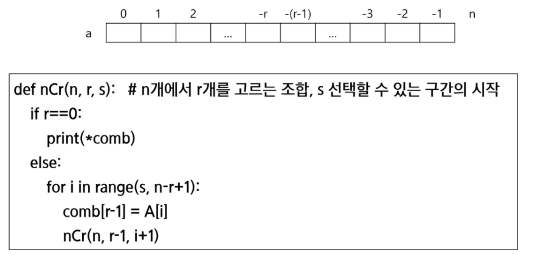