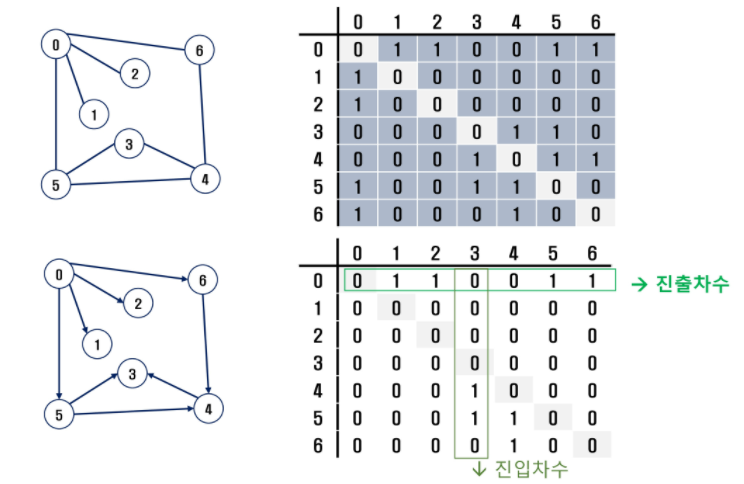

# 그래프

> 그래프

* 아이템(사물 또는 추상적 개념)들과 이들 사이의 연결 관계를 표현하는 것
* 그래프 정점(vertex) 들의 집합과 이들을 연결하는 간선(edge)들의 집합으로 구성된 자료 구조
  * v개의 정점을 가지는 그래프는 최대 v*(v-1)/2 간선이 가능함
* 선형 자료구조나 트리 자료구조로 표현하기 어려운 N:N 관계를 가지는 원소들을 표현하기에 용이함

> 그래프 유형

* 무향 그래프 (Undirected Graph)
* 유향 그래프 (Directed Graph)
* 가중치 그래프 (Weighted Graph)
* 사이클 없는 방향 그래프 (DAG, Directed Acyclic Graph)

* 완전 그래프 : 정점들에 대해 가능한 모든 간선들을 가진 그래프
* 부분 그래프 : 원래 그래프에서 일부의 정점이나 간선을 제외한 그래프

> 인접 정점

* 인접(Adjacency)

  * 두 개의 정점에 간선이 존재(연결됨) 하면 서로 인접해 있다고 한다

  

> 그래프 경로

* 경로 중 한 정점을 최대 한번만 지나는 경로를 **단순 경로**라고 함
* 시작 정점에서 끝나는 경로를 **사이클(Cycle)**이라고 함

> 그래프 표현

* 인접 행렬 (Adjacent matrix)
  * 2차원 배열을 이용하여 간선 정보를 저장
  * 배열의 배열 (포인터 배열)
* 인접 리스트 (Adjacent list)
  * 각 정점마다 해당 정점으로 나가는 간선의 정보를 저장
* 간선의 배열
  * 간선(시작 정점, 끝 정점)을 배열에 연속적으로 저장

