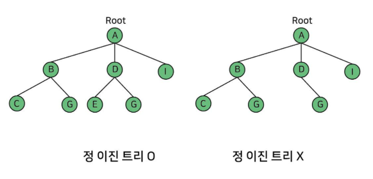
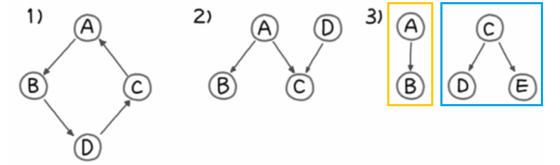
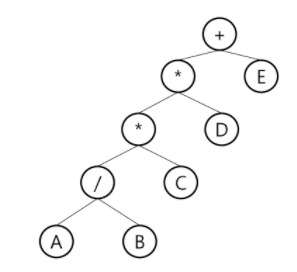
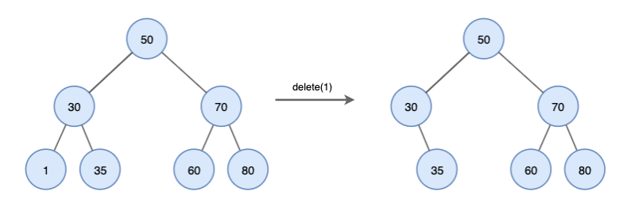
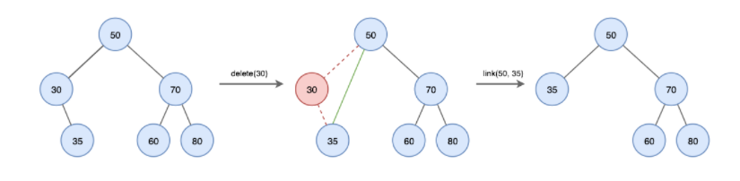
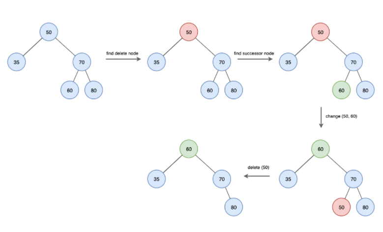

## 트리

> 트리의 개념

* 비선형 구조
* 원소들 간에 1 : n 관계를 가지는 자료 구조
* 원소들 간에 계층관계를 가지는 계층형 자료구조
* 한 개 이상의 노드로 이루어진 유한 집합
  * 노드 중 최상위 노드 = root 

> 트리 - 용어정리

* 노드(node) - 트리의 원소
  * 트리 T의 노드 - A, B, C, D, E, F, G, H, I, J, K
* 간선(edge) - 노드를 연결하는 선. 부모 노드와 자식 노드를 연결
* 루트 노드(root node) - 트리의 시작 노드 (트리T - A)
* 형제 노드(sibling node) - 같은 부모 노드의 자식 노드들
  * B, C, D는 형제 노드
* 조상 노드 - 간선을 따라 루트 노드까지 이르는 경로에 있는 모든 노드들
  * K의 조상 노드 : F, B, A
* 서브 트리(subtree) - 부모 노드와 연결된 간선을 끊었을 때 생성되는 트리 (뭉텅이로 자르는 것이 아님)
* 자손 노드 - 서브 트리에 있는 하위 레벨의 노드들
  * B의 자손 노드 - E, F, K

* 차수(degree)
  * 노드의 차수 : 노드에 연결된 자식 노드의 수
    * B의 차수 = 2, C의 차수 = 1
  * 트리의 차수 : 트리에 있는 노드의 차수 중에서 가장 큰 값
    * 트리 T의 차수 = 3
  * 단말 노드(리프 노드) : 차수가 0인 노드. 자식 노드가 없는 노드

* 높이
  * 노드의 높이 : 루트에서 노드에 이르는 간선의 수. 노드의 레벨
    * B의 높이 = 1, F의 높이 = 2
  * 트리의 높이 : 트리에 있는 노드의 높이 중에서 가장 큰 값. 최대 레벨
    * 트리 T의 높이 = 3 (절대적인 것이 아님,, 0부터 시작하기도 하고 1부터 시작하기도 함!)

> 이진트리

* 모든 노드들이 2개의 서브트리를 갖는 특별한 형태의 트리
* 각 노드가 자식 노드를 **최대한 2개**까지만 가질 수 있는 트리 (없거나 1개일 수 있음)
  * 왼쪽 자식 노드(left child node)
  * 오른쪽 자식 노드(right child node)

* 이진트리의 특성
  * 레벨 i에서의 노드의 최대 개수는 2^i개
    * 레벨 1부터 시작하는 책이라면 2^(i-1)임.. 그니까 외우지 말고 이해하자!
  * 높이가 h인 이진 트리가 가질 수 있는 노드의 최소 개수는 (h+1)개가 되며, 최대 개수는 (2^(h+1)-1)개가 된다

> 포화 이진 트리 (Full Binary Tree)

* 모든 레벨에 노드가 포화상태로 차 있는 이진 트리
* 높이가 h일 때, 최대의 노드 개수를 가진 이진 트리
* 루트를 1번으로 하여 최대 노드 개수까지 정해진 위치에 대한 노드 번호를 가짐
  * 왼쪽에서 오른쪽으로, 내려가는 순서로 순차적으로 번호가 부여되어있음

> 완전 이진 트리 (Complete Binary Tree)

* 높이가 h이고 노드 수가 n개일 때, 포화 이진 트리의 노드 번호 1번부터 n번까지 빈 자리가 없는 이진 트리

> 정 이진 트리(Full Binary Tree)

* 0개 또는 2개만의 자식 노드를 가지는 트리

> 편향 이진 트리(Skewed Binary Tree)

* 높이 h에 대한 최소 개수를 노드를 가지면서 한쪽 방향의 자식 노드만을 가진 이진 트리
  * 왼쪽 편향 이진 트리
  * 오른쪽 편향 이진 트리
* 트리의 장점들이 사라진다 :disappointed:

> 이진트리 - 순회(traversal)

* **트리에 특화된** 탐색 방법
* **순회(traversal)**란 트리의 **각 노드를 중복되지 않게 전부 방문(visit) 하는 것**을 말하는데 트리는 비선형 구조이기 때문에 선형구조에서와 같이 선후 연결 관계를 알 수 없다.
* 3가지의 기본적인 순회 방법
  * 전위순회(preorder traversal) : VLR
    * 부모노드 **방문 및 처리** 후, 자식 노드를 좌, 우 순서로 방문 및 처리한다
  * 중위순회(inorder traversal) : LVR
    * 부모를 거쳐 왼쪽 자식노드, 부모님, 오른쪽 자식노드 순으로 처리한다
  * 후위순회(postorder traversal) : LRV
    * 자식노드를 좌우 순서로 방문 및 처리 후, 부모노드를 처리한다

> 전위순회 (preorder traversal)

* 수행 방법 : **VLR** 

> 중위순회 (inorder traversal)

* 수행 방법 : **LVR**

> 후위순회 (postorder traversal)

* 수행 방법 : **LRV** (루트가 가장 마지막에 처리됨)

> 그래프 vs 트리 :star:**반드시 알고있자**

* 트리
  * 순환 구조를 가지지 않는 그래프이다 = **한붓그리기가 가능하지 않다**
  * 각 노드의 부모 노드는 하나여야 한다
  * 루트 노드가 하나여야 한다

* 아래의 예시들이 트리가 **아닌 이유**

  1. 순환구조이다 (한붓그리기 가능)

  2. C 노드의 부모가 A, D 2개이다

  3. 서로 연결되어 있지 않고, 루트가 A, C 두개이므로 트리가 아니다

     (노란색, 파란색 박스로는 각각 트리로 볼 수 있다)

> 수식 트리

* 수식을 표현하는 이진 트리
* 수식 이진 트리(Expression Binary Tree) 라고도 함
* **연산자**는 **루트 노드이거나 가지 노드**이고, **피연산자**는 **모두 잎 노드**이다

> 수식 트리의 순회

* 중위 순회 : **A/B\*C\*D+E**
* 후위 순회 : **AB/C\*D\*E+**
* 전위 순회 : **+\*\*/ABCDE**

> 이진 탐색 트리

* key(왼쪽 서브트리) < key(루트 노드) < key(오른쪽 서브트리)
* 중위순회를 사용

> 탐색연산 (Search)

* 이진 탐색 트리에서 특정 요소의 위치를 찾음

  1. 루트에서 시작한다.

  1. 검색 값을 루트와 비교한다. 루트보다 작으면 왼쪽에 대해 재귀하고, 크다면 오른쪽으로 재귀한다.

  1. 일치하는 값을 찾을 때까지 절차를 반복한다.

  1. 검색값이 없다면  null을 반환한다.

> 삽입연산 (Insert)

* 이진 탐색 트리에 데이터를 삽입하는 작업을 함 (중복 허용하지 않음)

  * 새 키는 항상 리프 노드에 삽입된다

  1. 루트에서 시작한다.
  2. 삽입값을 루트와 비교한다. 루트보다 작으면 왼쪽으로 재귀하고, 크다면 오른쪽으로 재귀한다.
  3. 리프 노드에 도달한 후 노드보다 크다면 오른쪽에, 작다면 왼쪽에 삽입한다.

> 삭제연산 (Delete)

* 이진 검색 트리에서 특정 노드를 삭제한다.

* case 1. 삭제할 노드가 리프노드인 경우
  * 노드를 삭제하기만 하면 된다

* case 2. 삭제할 노드에 자식이 하나만 있는 겨우
  * 노드를 삭제하고 자식 노드를 삭제된 노드의 부모에 직접 연결한다

* case 3. 삭제할 노드에 자식이 둘 있는 경우
  * successor 노드를 찾는 과정이 추가된다
    * successor 노드란?
      * 오른쪽 서브트리의 최소값

> 힙(heap)

* **완전 이진 트리**에 있는 노드 중에서 **키값이 가장 큰 노드나 키값이 가장 작은 노드**를 찾기 위해 만든 자료구조
  * 큰걸 찾았다가 작은걸 찾았다가 왔다갔다 하는거 아님! 최댓값, 최솟값 따로 구하는 것
* 최대 힙(max heap)
  * 키값이 가장 큰 노드를 찾기 위한 **완전 이진 트리**
  * {부모노드의 키값 > 자식노드의 키값}
  * 루트 노드 : 키값이 가장 큰 노드

* 최소 힙(min heap)
  * 키값이 가장 작은 노드를 찾기 위한 **완전 이진 트리**
  * {부모노드의 키값 < 자식노드의 키값}
  * 루트 노드 : 키값이 가장 작은 노드

> 힙 연산

* 삽입
  * case 1. (삽입 노드 < 부모 노드)
  * case 2. (삽입 노드 > 부모 노드)
* 삭제
  * 힙에서는 **루트 노드의 원소만을 삭제**할 수 있다.
  * 루트 노드의 원소를 삭제하여 반환한다.
  * 힙의 종류에 따라 최대값 또는 최소값을 구할 수 있다.
