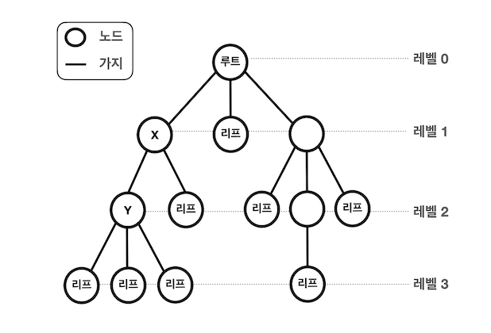
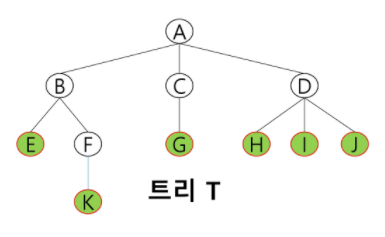
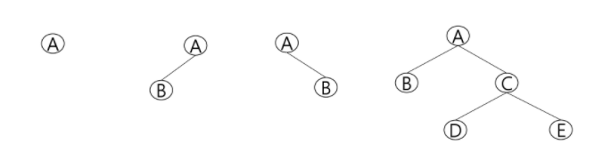
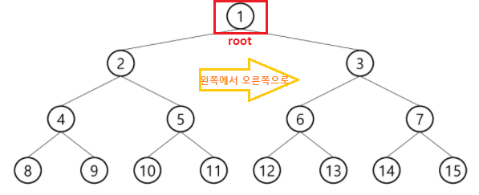
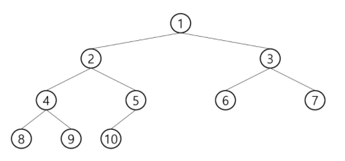
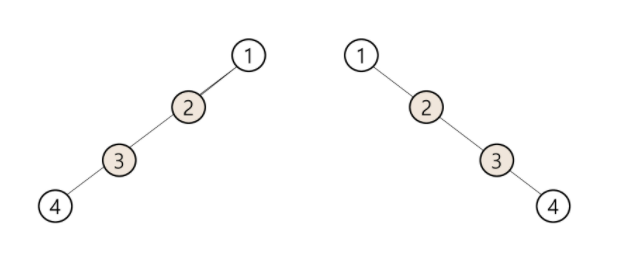
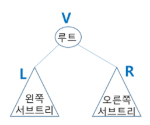
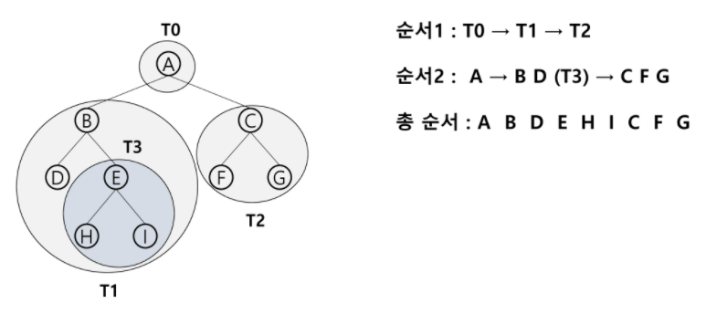
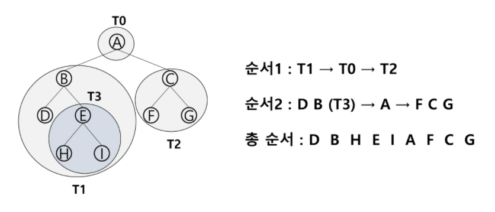
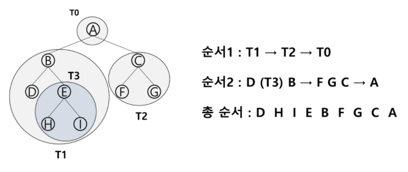

## 트리

> 트리의 개념

* 비선형 구조
* 원소들 간에 1 : n 관계를 가지는 자료 구조
* 원소들 간에 계층관계를 가지는 계층형 자료구조
* 한 개 이상의 노드로 이루어진 유한 집합
  * 노드 중 최상위 노드 = root 

> 트리 - 용어정리

* 노드(node) - 트리의 원소
  * 트리 T의 노드 - A, B, C, D, E, F, G, H, I, J, K
* 간선(edge) - 노드를 연결하는 선. 부모 노드와 자식 노드를 연결
* 루트 노드(root node) - 트리의 시작 노드 (트리T - A)
* 형제 노드(sibling node) - 같은 부모 노드의 자식 노드들
  * B, C, D는 형제 노드
* 조상 노드 - 간선을 따라 루트 노드까지 이르는 경로에 있는 모든 노드들
  * K의 조상 노드 : F, B, A
* 서브 트리(subtree) - 부모 노드와 연결된 간선을 끊었을 때 생성되는 트리 (뭉텅이로 자르는 것이 아님)
* 자손 노드 - 서브 트리에 있는 하위 레벨의 노드들
  * B의 자손 노드 - E, F, K

* 차수(degree)
  * 노드의 차수 : 노드에 연결된 자식 노드의 수
    * B의 차수 = 2, C의 차수 = 1
  * 트리의 차수 : 트리에 있는 노드의 차수 중에서 가장 큰 값
    * 트리 T의 차수 = 3
  * 단말 노드(리프 노드) : 차수가 0인 노드. 자식 노드가 없는 노드

* 높이
  * 노드의 높이 : 루트에서 노드에 이르는 간선의 수. 노드의 레벨
    * B의 높이 = 1, F의 높이 = 2
  * 트리의 높이 : 트리에 있는 노드의 높이 중에서 가장 큰 값. 최대 레벨
    * 트리 T의 높이 = 3 (절대적인 것이 아님,, 0부터 시작하기도 하고 1부터 시작하기도 함!)

> 이진트리

* 모든 노드들이 2개의 서브트리를 갖는 특별한 형태의 트리
* 각 노드가 자식 노드를 **최대한 2개**까지만 가질 수 있는 트리 (없거나 1개일 수 있음)
  * 왼쪽 자식 노드(left child node)
  * 오른쪽 자식 노드(right child node)

* 이진트리의 특성
  * 레벨 i에서의 노드의 최대 개수는 2^i개
    * 레벨 1부터 시작하는 책이라면 2^(i-1)임.. 그니까 외우지 말고 이해하자!
  * 높이가 h인 이진 트리가 가질 수 있는 노드의 최소 개수는 (h+1)개가 되며, 최대 개수는 (2^(h+1)-1)개가 된다

> 포화 이진 트리 (Full Binary Tree)

* 모든 레벨에 노드가 포화상태로 차 있는 이진 트리
* 높이가 h일 때, 최대의 노드 개수를 가진 이진 트리
* 루트를 1번으로 하여 최대 노드 개수까지 정해진 위치에 대한 노드 번호를 가짐
  * 왼쪽에서 오른쪽으로, 내려가는 순서로 순차적으로 번호가 부여되어있음

> 완전 이진 트리 (Complete Binary Tree)

* 높이가 h이고 노드 수가 n개일 때, 포화 이진 트리의 노드 번호 1번부터 n번까지 빈 자리가 없는 이진 트리

> 편향 이진 트리(Skewed Binary Tree)

* 높이 h에 대한 최소 개수를 노드를 가지면서 한쪽 방향의 자식 노드만을 가진 이진 트리
  * 왼쪽 편향 이진 트리
  * 오른쪽 편향 이진 트리
* 트리의 장점들이 사라진다 :disappointed:

> 이진트리 - 순회(traversal)

* **트리에 특화된** 탐색 방법
* **순회(traversal)**란 트리의 **각 노드를 중복되지 않게 전부 방문(visit) 하는 것**을 말하는데 트리는 비선형 구조이기 때문에 선형구조에서와 같이 선후 연결 관계를 알 수 없다.
* 3가지의 기본적인 순회 방법
  * 전위순회(preorder traversal) : VLR
    * 부모노드 **방문 및 처리** 후, 자식 노드를 좌, 우 순서로 방문 및 처리한다
  * 중위순회(inorder traversal) : LVR
    * 부모를 거쳐 왼쪽 자식노드, 부모님, 오른쪽 자식노드 순으로 처리한다
  * 후위순회(postorder traversal) : LRV
    * 자식노드를 좌우 순서로 방문 및 처리 후, 부모노드를 처리한다

> 전위순회 (preorder traversal)

* 수행 방법 : **VLR** 

> 중위순회 (inorder traversal)

* 수행 방법 : **LVR**

> 후위순회 (postorder traversal)

* 수행 방법 : **LRV** (루트가 가장 마지막에 처리됨)

