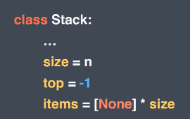

> Abstract Data Type

* Abstract Data Type = Structured data + Operation


> 스택 (stack)

* 물건을 쌓아 올린 듯 **자료를 쌓아 올린** 형태의 자료 구조

  * 가장 마지막에 들어간 것이 가장 처음에 나온다

    **후입선출 LIFO (Last-In-First-Out)**

  * 가장 위에서만 **데이터의 삽입 및 삭제**가 일어난다
  * 데이터 삭제 `pop`
  * 데이터 삽입 `push`

* 재귀함수 => stack 사용 (재귀함수 처리할려고 처음 만들어진 것이긴 함)

```python
# 함수 콜 스택
def factorial(n):
    if n == 1:
        return 1
    else:
        return n * factorial(n-1)
    
# 3! => factorial(3) -> factorial(2) -> factorial(1)
# 가장 나중에 불러온 함수(factorial(1))를 가장 먼저 처리한다
```

* `stackoverflow`
  * 전 세계 개발자들이 개발 관련해서 검색할 때 많이 이용하는 곳

> ADT로 표현한 stack

* 스택의 연산 (Operations of stack)
  * `createstack`; 스택을 생성하는 연산, size 필요
  * `isEmpty`; 스택이 현재 비어있는지를 확인하는 연산, T/F 리턴
  * `isFull`; 스택이 현재 꽉 차있는지를 확인하는 연산, T/F 리턴
  * `push`; 스택에 새로운 데이터 요소를 삽입하는 연산
  * `pop`; 스택에서 가장 위에 있는 요소를 제거하는 연산, 데이터 반환
  * `peek`; 스택에서 가장 위에 있는 요소를 반환하는 연산 (제거 아님)
* 스택의 데이터 구조
  * `top`; 스택의 가장 위에 있는 위치를 저장하고 있는 데이터
  * `size`; 스택의 크기를 저장하고 있는 데이터
  * `items`; 스택에 담길 데이터를 저장 할 데이터 구조



```python
# 스택의 자료구조
class Stack:
    def __init__(self, size):
        self.size = size # 스택의 사이즈
        self.top = -1
        self.items = [None] * self.size

    # 스택의 연산 구현하기
    def is_empty(self):
        return True if self.top == -1 else False

    def is_full(self):
        return True if self.top == self.size else False

    def push(self, item):
        if self.is_full():
            # 에러 (꽉찼는데 넣으려고 하는 것이니까)
            raise Exception("It is full!")
        else:
            self.top += 1
            self.items[self.top] = item

    def peek(self):
        if self.is_empty():
            raise Exception("It is empty!")
        return self.items[self.top]

    def pop(self):
        if self.is_empty():
            raise Exception("It is empty!")
        else:
            value = self.items[self.top] # 가장 위에 있는 데이터를 가져와
            self.items[self.top] = None # 아이템 삭제
            self.top -= 1 # top 위치 변경
            return value
```

**파이썬에서는 리스트를 사용하여 stack을 구현하면 된다**

```python
stack = [] # 스택 생성
stack.append(1)
stack.append(2)
stack.append(3)
print(stack)
stack.pop()
print(stack)
peek = stack[-1] # peek 스택의 가장 마지막에 있는거 가져와
len(stack) == 0 # is_empty (python에는 is_full 개념이 없다! 알아서 늘려주고, 알아서 줄여주므로)
```


