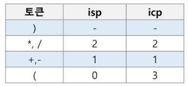

> 계산기

* 문자열로 된 계산식이 주어질 때, 스택을 이용하여 이 계산식의 값을 계산할 수 있다

* eval(str_clc) => 쓰지 말것

* step 1. 중위표기식의 후위표기식 변환 방법 1

  * 우선순위에 따라 괄호를 사용하여 표현
  * 각 연산자를 그에 대응하는 오른쪽 괄호의 뒤로 이동시킴
  * 괄호를 제거

  ```python
  A*B-C/D
  #1. ((A*B)-(C/D))
  #2. ((AB)*(CD)/)-
  #3. AB*CD/-
  ```

* step 2. 스택 이용

  ```python
  icp(in-coming priority) #=> stack으로 들어올 녀석의 우선순위
  isp(in-stack priority) #=> stack 안에 있는 녀석의 우선순위
  
  if (icp > isp) push()
  else pop()
  ```

  



* 나중에 꺼낸 것이 앞쪽으로...!!


> 백트래킹

* 해를 찾는 도중에 **막히면** (해가 아니면) 되돌아가서 다시 해를 찾아 가는 기법
* 최적화(Optimization) 문제와 결정(Decision) 문제로 해결 가능
* 결정 문제 => 해가 존재하는지의 여부를 yes or no로 답하는 문제
  * 미로찾기, n-Queen, Map coloring, Subset sum ...

* 미로찾기

* **백트래킹과 깊이우선탐색의 차이!**
  * 백트래킹의 경우, 출발하는 경로가 해결책으로 이어질 것 같지 않으면 더이상 경로를 따라가지 않음으로써 **시도 횟수를 줄임**
    * DFS에서 `if 문` 을 사용하여 특정 조건이 성립이 되지 않으면 중단
  * DFS는 모든 경로를 추적하는 데에 비해 백트래킹은 불필요한 경로를 조기에 차단
    * n-Queen 문제의 경우
    * 순수한 깊이 우선 검색 = 155 노드
    * 백트래킹 = 27 노드
    * => **재귀구조**로 만들어 놔야 백트래킹을 하는 데에 유리하겠구나!!

* 상태 공간 트리
  * 상태를 트리 모양으로 정리해둔 것 (cycle이 아님)
* 부분집합 구하기
  * 공집합과 자기 자신을 포함한 모든 부분집합 = `powerset`
  * 백트래킹 기법으로 powerset 구할 수 있음 