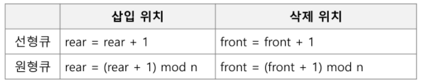

### 스택2 review

> 계산기

* 중위표기법 => 후위표기법으로 바꾸어 컴퓨터가 알아볼 수 있도록 표현
* 후위표기법으로 표현된 수식을 계산
* `icp(in-coming priority)` `isp(in-stack priority)`
  * icp : 스택으로 들어올 때 우선순위
  * isp : 스택에 들어있을 때 우선순위
  * icp가 top에 존재하는 token의 isp보다 더 큰 경우에만 stack에 넣는다!
    * icp > isp => **push**
    * `)` 을 만나면, `(`을 만날 때까지 연산자들을 pop 해준다

> 백트래킹

* powerset
* perm

* What is the difference btw DFS and backtracking?

> Quick sort

* 분할 정복 알고리즘
  * 분할(divide) + 정복(conquer) + 통합(combine)

* O(nlogn)을 따른다 (quick sort, merge sort 모두 ,,)

* **pivot** => 기준점을 정하자!!!! :star:
* pivot을 꼭 중간으로 정할 필요는 없다

* front 변수: 공백 상태와 포화 상태 구분을 쉽게 하기 위해 front가 있는 자리는 사용하지 않고 항상 빈자리로 둠

