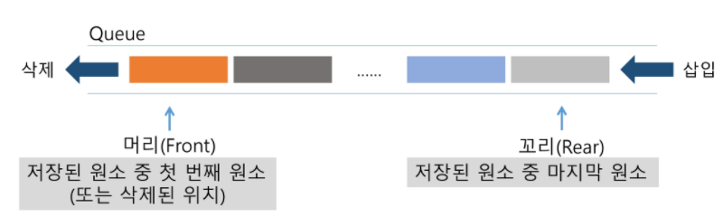

### Queue

> 큐의 특성

* 삽입과 삭제의 위치가 제한적인 자료구조
* **선입선출** (FIFO: First In First Out)

* 큐의 기본 연산

  | 연산          | 기능                                      |
  | ------------- | ----------------------------------------- |
  | enQueue(item) | 큐의 뒤쪽(rear 다음)에 원소 삽입          |
  | deQueue()     | 큐의 앞쪽(front)에서 원소 삭제 및 반환    |
  | createQueue() | 공백 상태의 큐를 생성                     |
  | isEmpty()     | 큐가 공백상태인지를 확인                  |
  | isFull()      | 큐가 포화상태인지를 확인                  |
  | Qpeek()       | 큐의 앞쪽(front)에서 원소를 삭제없이 반환 |

* 선형큐
  * 1차원 배열을 이용한 큐
    * 큐의 크기 = 배열의 크기
    * 상태 표현
      * 초기 상태: front = rear = -1
      * 공백 상태: front == rear
      * 포화 상태: rear == n-1 (n-1: 배열의 마지막 인덱스)

> 삽입 enQueue(item)

* 마지막 원소 뒤에 새로운 원소를 삽입하기 위해
  * **rear값을 하나 증가**시켜 새로운 원소를 삽입할 자리 마련
  * 그 인덱스에 해당하는 배열원소 **Q[rear]에 item을 저장**

> 삭제 deQueue()

* 가장 앞에 있는 원소를 삭제하기 위해
  * front 값을 하나 증가시켜 큐에 남아있게 될 첫 번째 원소 이동
  * 새로운 첫 번째 원소를 리턴함으로써 삭제와 동일한 기능을 함
  * **실제로 삭제되는 것은 아니고, front만 옮겨가는 것**

> 공백상태 및 포화상태 검사 isEmpty(), isFull()

* 공백상태: front == rear
* 포화상태: rear == n-1

> 검색 Qpeek()

* 가장 앞에 있는 원소를 검색하여 반환하는 연산
* 현재 front의 한자리 뒤(front+1)에 있는 원소, 즉 큐의 첫 번째에 있는 원소를 반환

> 원형 큐

* 초기 공백 상태
  * front = rear = 0
* idx의 순환
  * front와 rear의 위치가 배열의 마지막 인덱스인 n-1을 가리킨 후, 그 다음에는 논리적 순환을 이루어 배열의 처음 인덱스인 0으로 이동해야 함
  * 이를 위해 나머지 연산자 mod 사용